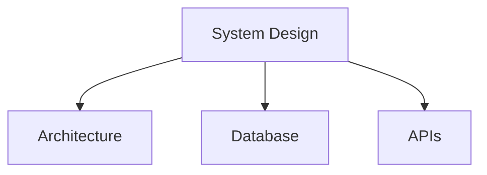

# System Design

System architecture and design documentation templates.

## Templates

| Template                                     | Description        |
| -------------------------------------------- | ------------------ |
| [architecture_spec.md](architecture_spec.md) | Architecture specs |
| [database_schema.md](database_schema.md)     | Database schemas   |
| [api_design.md](api_design.md)               | API design         |
| [rfc_template.md](rfc_template.md)           | RFC templates      |

## Structure

See [Parent](../SKILL.md) for all categories.
