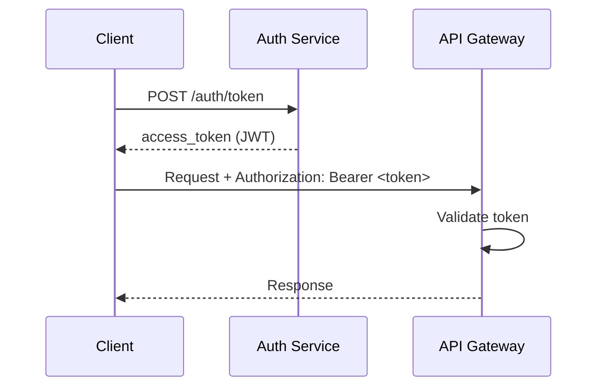

# API Design: [Service Name]

> [!NOTE]
> This spec follows OpenAPI 3.0 conventions. All endpoints are versioned under `/v1`. Breaking changes require a new major version.

| Field            | Value                        |
| ---------------- | ---------------------------- |
| **Base URL**     | `https://api.example.com/v1` |
| **Version**      | `v1`                         |
| **Auth**         | Bearer token (JWT)           |
| **Content-Type** | `application/json`           |
| **Status**       | Draft / Stable / Deprecated  |
| **Owner**        | [Team name]                  |

---

## Authentication



### Token Request

```http
POST /auth/token
Content-Type: application/json

{
  "client_id": "app_prod_abc123",
  "client_secret": "sk_prod_...",
  "grant_type": "client_credentials"
}
```

**Response:**

```json
{
  "access_token": "eyJhbGciOiJSUzI1NiIsInR5cCI6IkpXVCJ9...",
  "token_type": "Bearer",
  "expires_in": 3600,
  "scope": "read:users write:orders"
}
```

> [!WARNING]
> Never log or expose access tokens. Tokens are valid for 1 hour. Implement token refresh before expiry.

---

## Endpoints

### Resource: Users

#### `GET /users`

List users with filtering and pagination.

**Query Parameters:**

| Parameter | Type    | Required | Description                             |
| --------- | ------- | -------- | --------------------------------------- |
| `limit`   | integer | No       | Max results (default: 20, max: 100)     |
| `offset`  | integer | No       | Pagination offset (default: 0)          |
| `status`  | string  | No       | Filter: `active`, `inactive`, `pending` |
| `role`    | string  | No       | Filter: `admin`, `member`, `viewer`     |

**Response `200 OK`:**

```json
{
  "data": [
    {
      "id": "usr_01HXYZ123ABC",
      "email": "alice@example.com",
      "name": "Alice Chen",
      "role": "admin",
      "status": "active",
      "created_at": "2024-01-15T09:30:00Z",
      "updated_at": "2024-03-20T14:22:00Z"
    }
  ],
  "meta": {
    "total": 142,
    "limit": 20,
    "offset": 0,
    "has_more": true
  }
}
```

---

#### `POST /users`

Create a new user. Requires `write:users` scope.

**Request Body:**

```json
{
  "email": "bob@example.com",
  "name": "Bob Smith",
  "role": "member",
  "send_invite": true
}
```

| Field   | Type   | Required | Validation                            |
| ------- | ------ | -------- | ------------------------------------- |
| `email` | string | ✅       | Valid email; unique in workspace      |
| `name`  | string | ✅       | 1–100 characters                      |
| `role`  | string | No       | `admin`, `member` (default), `viewer` |

**Response `201 Created`:** Returns the created user object.

---

#### `GET /users/{id}`

Retrieve a single user by ID.

**Path Parameters:** `id` — User ID (format: `usr_[ULID]`)

**Response `200 OK`:** User object with additional `last_login_at` field.

---

#### `PATCH /users/{id}`

Partial update of a user. Only provided fields are updated.

**Request Body:** Any subset of POST fields except `email`.

**Response `200 OK`:** Updated user object.

---

#### `DELETE /users/{id}`

Deactivate a user. Soft-delete — sets `status: "inactive"`.

> [!IMPORTANT]
> Deletion is soft. Data is retained for 90 days for audit purposes. Permanent deletion requires `admin:purge` scope.

**Response `204 No Content`:** Empty body.

---

## Error Responses

> [!IMPORTANT]
> All errors follow a consistent envelope. Check `error.code` for programmatic handling — do not parse `error.message`.

```json
{
  "error": {
    "code": "VALIDATION_ERROR",
    "message": "The request body contains invalid fields.",
    "details": [
      {
        "field": "email",
        "issue": "Invalid email format",
        "value": "not-an-email"
      }
    ],
    "request_id": "req_01HXYZ000AAA",
    "docs_url": "https://docs.example.com/errors/VALIDATION_ERROR"
  }
}
```

| HTTP Status | Code               | When                                                 |
| ----------- | ------------------ | ---------------------------------------------------- |
| `400`       | `VALIDATION_ERROR` | Request body fails validation                        |
| `401`       | `UNAUTHORIZED`     | Missing or invalid token                             |
| `403`       | `FORBIDDEN`        | Token lacks required scope                           |
| `404`       | `NOT_FOUND`        | Resource does not exist                              |
| `409`       | `CONFLICT`         | Duplicate resource (e.g., email already used)        |
| `429`       | `RATE_LIMITED`     | Too many requests — retry after `Retry-After` header |
| `500`       | `INTERNAL_ERROR`   | Unexpected server error                              |

---

## Rate Limits

- 100 requests/minute per token
- Headers returned: `X-RateLimit-Limit`, `X-RateLimit-Remaining`, `X-RateLimit-Reset`

---

## Changelog

| Version | Date       | Changes                                    |
| ------- | ---------- | ------------------------------------------ |
| `v1.1`  | 2024-03-01 | Added `q` search parameter to `GET /users` |
| `v1.0`  | 2024-01-15 | Initial release                            |

---

_Last updated: [Date]_

---

## See Also

- [API Specification](../software/api_spec.md) — For complete REST API documentation
- [RFC Template](./rfc_template.md) — For proposing API changes
- [Architecture Specification](./architecture_spec.md) — For service architecture
- [Database Schema](./database_schema.md) — For data models backing this API
