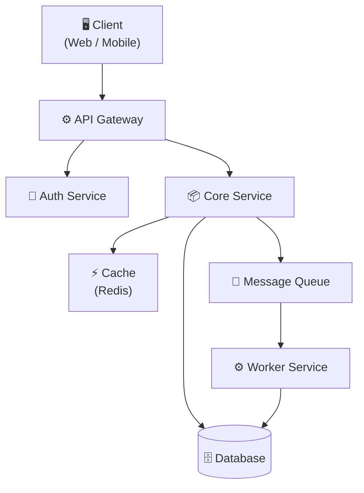
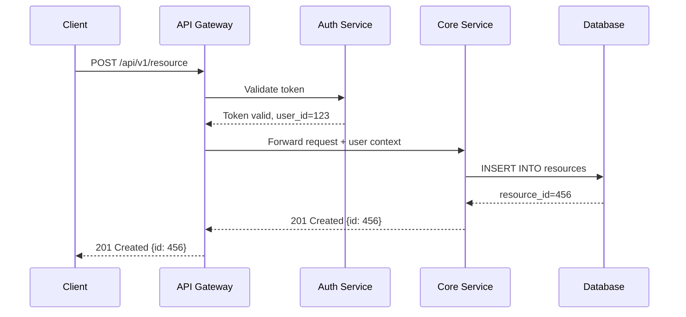
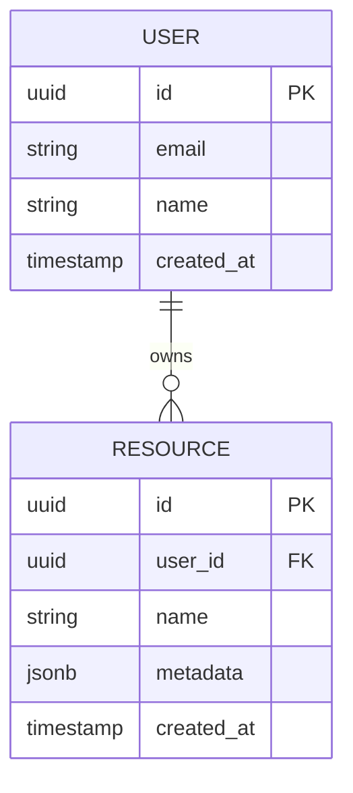
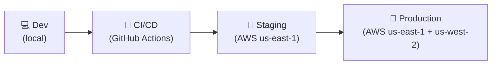

# Architecture Specification: [System Name]

| Field         | Value                                     |
| ------------- | ----------------------------------------- |
| **Status**    | Draft / In Review / Approved / Superseded |
| **Author**    | [Name]                                    |
| **Date**      | [YYYY-MM-DD]                              |
| **Version**   | [1.0]                                     |
| **Reviewers** | [Names or teams]                          |

---

## ## 1. Executive Summary

[2–4 sentences. What is this system? What problem does it solve? What are the key architectural decisions?]

---

## ## 2. Context and Problem Statement

### 2.1 Background

[What is the current state? What pain points or opportunities motivate this system?]

### 2.2 Goals

| Goal     | Priority     | Success metric      |
| -------- | ------------ | ------------------- |
| [Goal 1] | Must have    | [Measurable metric] |
| [Goal 2] | Should have  | [Measurable metric] |
| [Goal 3] | Nice to have | [Measurable metric] |

### 2.3 Non-Goals

[Explicitly state what this system does NOT do. This prevents scope creep.]

- [Non-goal 1]
- [Non-goal 2]

---

## ## 3. System Overview

### Component Responsibilities

| Component     | Responsibility                       | Technology               |
| ------------- | ------------------------------------ | ------------------------ |
| API Gateway   | Request routing, rate limiting, auth | [e.g., Kong, AWS API GW] |
| Auth Service  | Authentication, token issuance       | [e.g., Keycloak, Auth0]  |
| Core Service  | Business logic                       | [e.g., Node.js, Go]      |
| Database      | Persistent storage                   | [e.g., PostgreSQL]       |
| Cache         | Session data, hot reads              | [e.g., Redis]            |
| Message Queue | Async task dispatch                  | [e.g., RabbitMQ, SQS]    |

---

## ## 4. Detailed Design

### 4.1 Data Flow

### 4.2 Data Model

[Describe the core data entities and their relationships. See [database-schema.md](database-schema.md) for the full schema.]

### 4.3 API Design

[High-level API surface. See [api-design.md](api-design.md) for full specification.]

| Method | Path                | Description     |
| ------ | ------------------- | --------------- |
| GET    | `/v1/resources`     | List resources  |
| POST   | `/v1/resources`     | Create resource |
| GET    | `/v1/resources/:id` | Get resource    |
| PUT    | `/v1/resources/:id` | Update resource |
| DELETE | `/v1/resources/:id` | Delete resource |

---

## ## 5. Quality Attributes

### 5.1 Performance

| Metric             | Target    | Measurement    |
| ------------------ | --------- | -------------- |
| API p50 latency    | < 50 ms   | APM (Datadog)  |
| API p99 latency    | < 200 ms  | APM            |
| Throughput         | 1,000 RPS | Load test      |
| Database query p99 | < 20 ms   | Slow query log |

### 5.2 Availability

| Requirement                    | Target                        |
| ------------------------------ | ----------------------------- |
| Uptime SLA                     | 99.9% (< 8.7 h/year downtime) |
| RTO (Recovery Time Objective)  | < 1 hour                      |
| RPO (Recovery Point Objective) | < 5 minutes                   |

### 5.3 Scalability

[How does the system scale? Horizontal scaling, sharding, caching strategy.]

- **Stateless services:** All services are stateless; scale horizontally behind load balancer
- **Database:** Read replicas for read-heavy workloads; connection pooling via PgBouncer
- **Cache:** Redis cluster with consistent hashing

### 5.4 Security

| Concern         | Mitigation                             |
| --------------- | -------------------------------------- |
| Authentication  | JWT with 1-hour expiry; refresh tokens |
| Authorization   | RBAC with least-privilege principle    |
| Data in transit | TLS 1.3 everywhere                     |
| Data at rest    | AES-256 encryption for PII fields      |
| SQL injection   | Parameterized queries; ORM             |
| Rate limiting   | 100 req/min per IP at API Gateway      |

---

## ## 6. Deployment

| Environment | Purpose                | Infrastructure          |
| ----------- | ---------------------- | ----------------------- |
| Development | Local development      | Docker Compose          |
| Staging     | Pre-production testing | AWS ECS (single region) |
| Production  | Live traffic           | AWS ECS (multi-region)  |

---

## ## 7. Alternatives Considered

| Alternative         | Pros   | Cons   | Decision           |
| ------------------- | ------ | ------ | ------------------ |
| [Option A]          | [Pros] | [Cons] | Rejected: [reason] |
| [Option B]          | [Pros] | [Cons] | Rejected: [reason] |
| **Chosen approach** | [Pros] | [Cons] | **Selected**       |

---

## ## 8. Open Questions

| Question     | Owner  | Due date |
| ------------ | ------ | -------- |
| [Question 1] | [Name] | [Date]   |
| [Question 2] | [Name] | [Date]   |

---

## ## 9. References

- [RFC-NNN: Related RFC](../software/rfc.md)
- [ADR-NNN: Key decision](../software/adr.md)
- [API Design](api-design.md)
- [Database Schema](database-schema.md)

---

## ## See Also

- [rfc-template.md](rfc-template.md) — RFC for proposing changes
- [api-design.md](api-design.md) — API design document
- [database-schema.md](database-schema.md) — Database schema
- [../../templates/software/adr.md](../../templates/software/adr.md) — Architecture Decision Records
