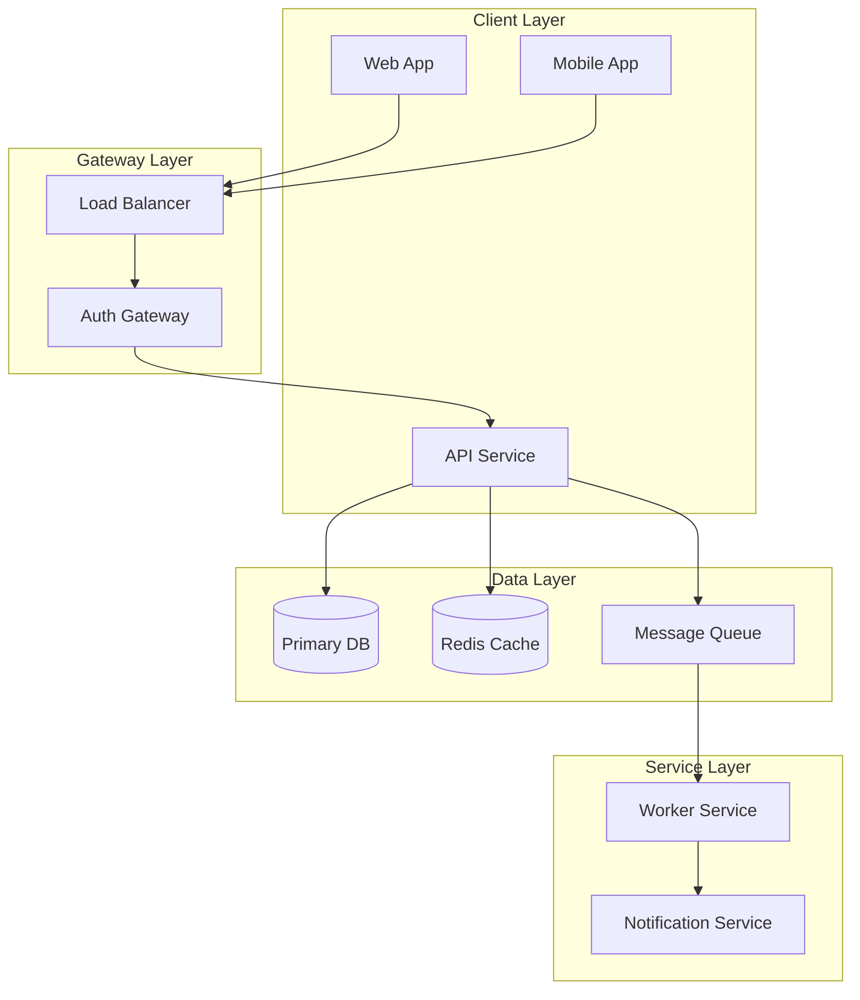
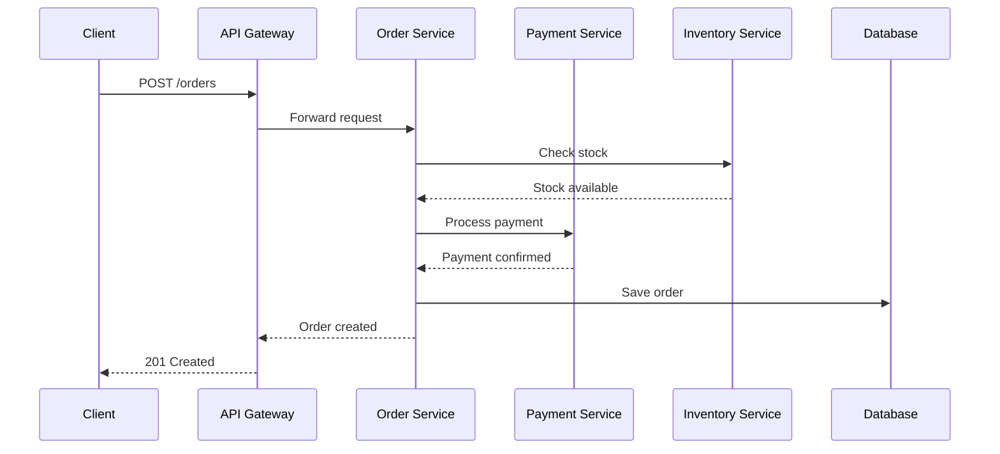
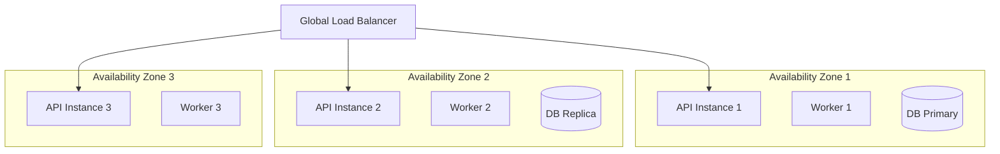

# Architecture Spec: [System Name]

> [!NOTE]
> This document describes the complete architecture of the system. It serves as the authoritative reference for developers, operators, and stakeholders. Keep it current as the system evolves.

| Field             | Value                         |
| ----------------- | ----------------------------- |
| **System**        | [System name]                 |
| **Version**       | [vN.N]                        |
| **Status**        | Draft / Approved / Deprecated |
| **Owner**         | [Team name]                   |
| **Last reviewed** | [YYYY-MM-DD]                  |

---

## System Overview

> [!IMPORTANT]
> Describe what the system does in 2-3 sentences. Focus on capabilities, not implementation details. Include scale metrics if relevant.

**Example:** The Order Processing Service handles checkout flows for the e-commerce platform. It orchestrates payment, inventory, and fulfillment services to complete customer orders. Currently processes 50,000 orders daily with peaks of 2,000 orders per minute.

---

## Component Diagram

---

## Data Flow

> [!TIP]
> Show the end-to-end flow for the primary use case. This helps identify coupling points and failure modes.

### Primary Flow: [Use Case Name]

---

## Component Details

| Component      | Technology        | Purpose                   | Scaling                     |
| -------------- | ----------------- | ------------------------- | --------------------------- |
| API Service    | Node.js / Express | HTTP request handling     | Horizontal (3-10 instances) |
| Worker Service | Python / Celery   | Background job processing | Horizontal (2-8 workers)    |
| Primary DB     | PostgreSQL 15     | Transactional data        | Vertical + Read replicas    |
| Cache          | Redis 7           | Session + query caching   | Cluster mode                |
| Message Queue  | RabbitMQ          | Async job distribution    | 3-node cluster              |

---

## Deployment Topology

---

## Security Boundaries

> [!WARNING]
> Document trust boundaries and authentication requirements. This is critical for security reviews.

| Boundary            | Authentication | Authorization           |
| ------------------- | -------------- | ----------------------- |
| Client to Gateway   | JWT (Bearer)   | N/A                     |
| Gateway to Services | mTLS           | Role-based              |
| Service to Database | IAM / Password | Row-level security      |
| Service to Cache    | Password       | None (isolated per env) |

---

## Performance Characteristics

| Metric       | Target      | Current     |
| ------------ | ----------- | ----------- |
| p99 Latency  | < 200ms     | 180ms       |
| Throughput   | 2,000 req/s | 1,800 req/s |
| Availability | 99.99%      | 99.97%      |
| Error rate   | < 0.1%      | 0.05%       |

---

## Failure Modes

| Component | Failure Scenario  | Mitigation                                   |
| --------- | ----------------- | -------------------------------------------- |
| Database  | Primary outage    | Automatic failover to replica (< 30s)        |
| Cache     | Redis unavailable | Fallback to database (slower but functional) |
| Queue     | Message backlog   | Alert at 10k messages; scale workers         |
| Service   | Instance crash    | Health checks remove from LB; auto-restart   |

---

## References

- [ADR-012 — Database Selection](../adr/ADR-012.md)
- [API Specification](../software/api_spec.md)
- [Runbook: Database Failover](../../runbooks/db-failover.md)
- [Monitoring Dashboard](https://grafana.example.com/d/system)

---

_Last updated: [Date]_

---

## See Also

- [Request for Comments (RFC)](./rfc_template.md) — For proposing architectural changes
- [Database Schema](./database_schema.md) — For detailed data model documentation
- [API Design](./api_design.md) — For service interface specifications
- [ADR Template](../software/adr.md) — For documenting architectural decisions
