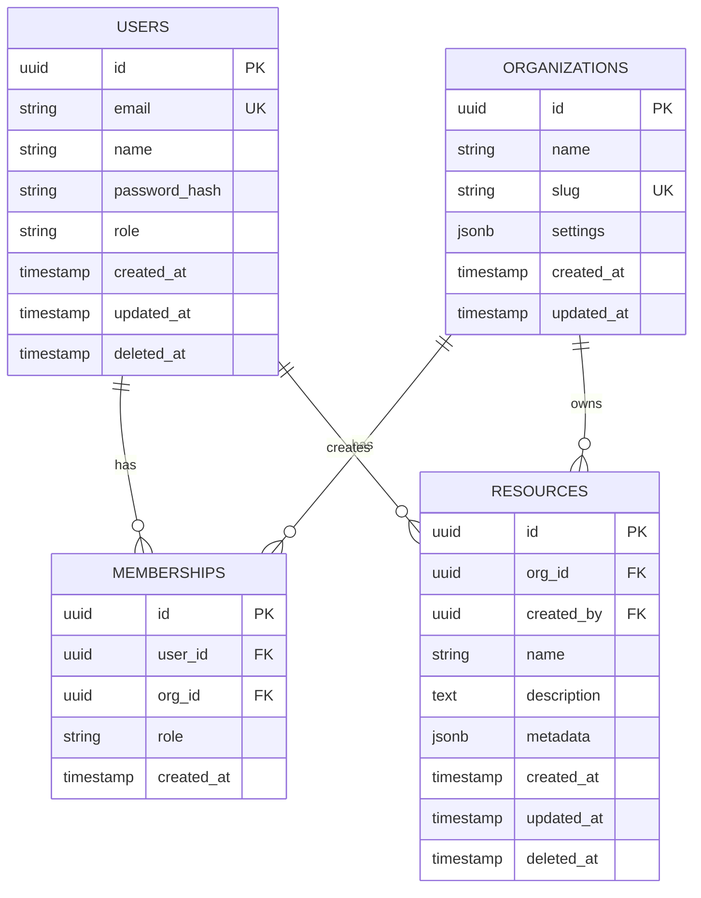

# Database Schema: [System Name]

| Field        | Value                             |
| ------------ | --------------------------------- |
| **Database** | PostgreSQL 15 / MySQL 8 / [other] |
| **Version**  | [Schema version]                  |
| **Author**   | [Name]                            |
| **Date**     | [YYYY-MM-DD]                      |

---

## ## Entity-Relationship Diagram



---

## ## Table Definitions

### `users`

| Column          | Type           | Nullable | Default             | Description                   |
| --------------- | -------------- | -------- | ------------------- | ----------------------------- |
| `id`            | `uuid`         | No       | `gen_random_uuid()` | Primary key                   |
| `email`         | `varchar(255)` | No       | —                   | Unique email address          |
| `name`          | `varchar(255)` | No       | —                   | Display name                  |
| `password_hash` | `varchar(255)` | No       | —                   | bcrypt hash                   |
| `role`          | `varchar(50)`  | No       | `'user'`            | `user`, `admin`, `superadmin` |
| `created_at`    | `timestamptz`  | No       | `now()`             | Creation timestamp            |
| `updated_at`    | `timestamptz`  | No       | `now()`             | Last update timestamp         |
| `deleted_at`    | `timestamptz`  | Yes      | `null`              | Soft delete timestamp         |

**Indexes:**

```sql
CREATE UNIQUE INDEX users_email_idx ON users(email) WHERE deleted_at IS NULL;
CREATE INDEX users_created_at_idx ON users(created_at DESC);
```

**Constraints:**

```sql
ALTER TABLE users ADD CONSTRAINT users_email_format
  CHECK (email ~* '^[A-Za-z0-9._%+-]+@[A-Za-z0-9.-]+\.[A-Za-z]{2,}$');
ALTER TABLE users ADD CONSTRAINT users_role_valid
  CHECK (role IN ('user', 'admin', 'superadmin'));
```

---

### `organizations`

| Column       | Type           | Nullable | Default             | Description           |
| ------------ | -------------- | -------- | ------------------- | --------------------- |
| `id`         | `uuid`         | No       | `gen_random_uuid()` | Primary key           |
| `name`       | `varchar(255)` | No       | —                   | Organization name     |
| `slug`       | `varchar(100)` | No       | —                   | URL-safe identifier   |
| `settings`   | `jsonb`        | No       | `'{}'`              | Configuration JSON    |
| `created_at` | `timestamptz`  | No       | `now()`             | Creation timestamp    |
| `updated_at` | `timestamptz`  | No       | `now()`             | Last update timestamp |

**Indexes:**

```sql
CREATE UNIQUE INDEX organizations_slug_idx ON organizations(slug);
```

---

### `memberships`

| Column       | Type          | Nullable | Default             | Description                          |
| ------------ | ------------- | -------- | ------------------- | ------------------------------------ |
| `id`         | `uuid`        | No       | `gen_random_uuid()` | Primary key                          |
| `user_id`    | `uuid`        | No       | —                   | FK → users.id                        |
| `org_id`     | `uuid`        | No       | —                   | FK → organizations.id                |
| `role`       | `varchar(50)` | No       | `'member'`          | `owner`, `admin`, `member`, `viewer` |
| `created_at` | `timestamptz` | No       | `now()`             | Creation timestamp                   |

**Indexes:**

```sql
CREATE UNIQUE INDEX memberships_user_org_idx ON memberships(user_id, org_id);
CREATE INDEX memberships_org_id_idx ON memberships(org_id);
```

**Foreign keys:**

```sql
ALTER TABLE memberships ADD CONSTRAINT memberships_user_id_fk
  FOREIGN KEY (user_id) REFERENCES users(id) ON DELETE CASCADE;
ALTER TABLE memberships ADD CONSTRAINT memberships_org_id_fk
  FOREIGN KEY (org_id) REFERENCES organizations(id) ON DELETE CASCADE;
```

---

## ## Naming Conventions

| Element      | Convention                               | Example              |
| ------------ | ---------------------------------------- | -------------------- |
| Tables       | `snake_case`, plural                     | `user_sessions`      |
| Columns      | `snake_case`                             | `created_at`         |
| Primary keys | `id` (uuid)                              | `id`                 |
| Foreign keys | `{table_singular}_id`                    | `user_id`            |
| Indexes      | `{table}_{columns}_idx`                  | `users_email_idx`    |
| Constraints  | `{table}_{column}_{type}`                | `users_email_format` |
| Timestamps   | `created_at`, `updated_at`, `deleted_at` | —                    |

---

## ## Design Decisions

### UUIDs vs. auto-increment IDs

**Decision:** Use UUIDs (`gen_random_uuid()`) for all primary keys.

**Rationale:**

- Enables distributed ID generation without coordination
- Prevents enumeration attacks
- Simplifies data migration between environments

**Trade-off:** Slightly larger storage (16 bytes vs. 4–8 bytes); random UUIDs cause index fragmentation (mitigated by UUIDv7 or `uuid_generate_v1mc()`).

### Soft deletes

**Decision:** Use `deleted_at` timestamp for soft deletes on `users` and `resources`.

**Rationale:** Preserves audit trail; enables recovery; maintains referential integrity.

**Implementation:** All queries must filter `WHERE deleted_at IS NULL`. Use a view or row-level security policy to enforce this.

### JSONB for flexible metadata

**Decision:** Use `jsonb` for `settings` and `metadata` columns.

**Rationale:** Avoids schema migrations for configuration changes; supports GIN indexing for JSON queries.

**Trade-off:** Loses type safety; harder to query than normalized columns. Use only for genuinely variable data.

---

## ## Migration Strategy

### Migration tool

[Flyway / Liquibase / Alembic / Prisma Migrate / custom]

### Migration naming convention

```
V{version}__{description}.sql
V001__create_users_table.sql
V002__add_organizations.sql
V003__add_memberships.sql
```

### Migration checklist

- [ ] Migration is idempotent (can be run multiple times safely)
- [ ] Backward compatible (old code works with new schema)
- [ ] Tested on staging with production-size data
- [ ] Rollback script written and tested
- [ ] Index creation uses `CONCURRENTLY` to avoid table locks

---

## ## Performance Considerations

| Query pattern         | Index strategy                                |
| --------------------- | --------------------------------------------- |
| Lookup by email       | Unique index on `users(email)`                |
| List resources by org | Index on `resources(org_id, created_at DESC)` |
| Soft-delete filtering | Partial index: `WHERE deleted_at IS NULL`     |
| Full-text search      | GIN index on `tsvector` column                |
| JSON field queries    | GIN index on `jsonb` column                   |

---

## ## See Also

- [architecture-spec.md](architecture-spec.md) — System architecture
- [api-design.md](api-design.md) — API design
- [../../templates/software/adr.md](../../templates/software/adr.md) — Architecture Decision Records
