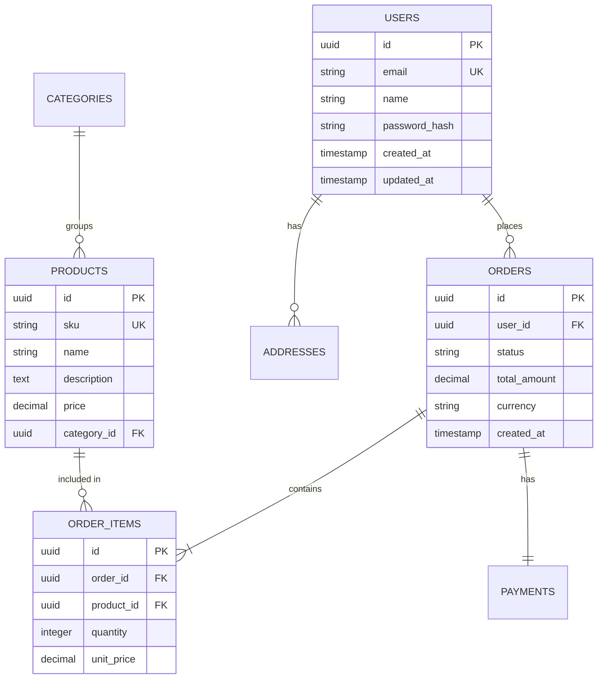
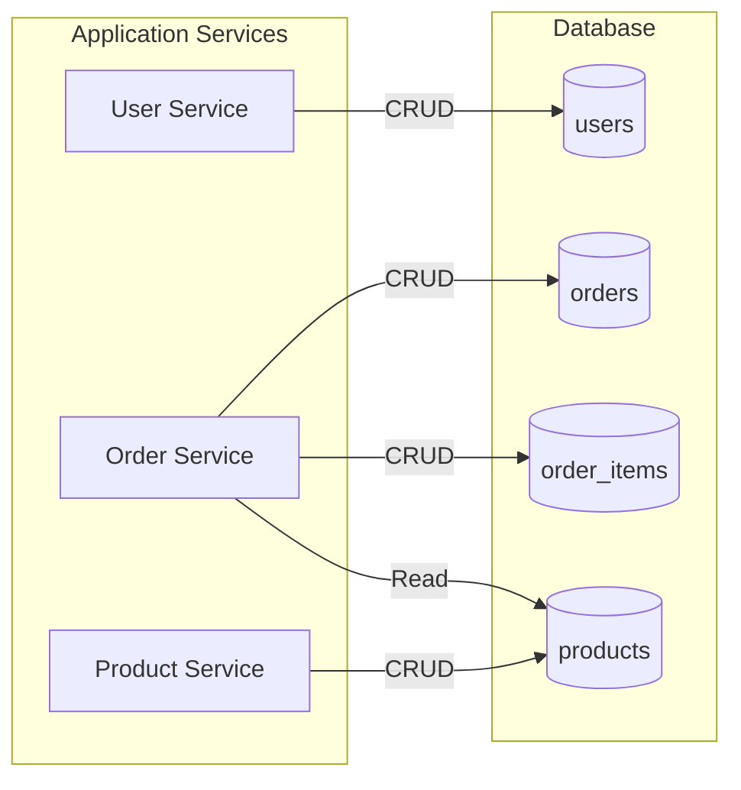

# Database Schema: [Database Name]

> [!NOTE]
> This document describes the complete database schema. It is the source of truth for table structures, relationships, and constraints. Update it when schema changes occur.

| Field              | Value                                 |
| ------------------ | ------------------------------------- |
| **Database**       | [PostgreSQL / MySQL / MongoDB / etc.] |
| **Version**        | [vN.N]                                |
| **Environment**    | Production / Staging / Development    |
| **Owner**          | [Team name]                           |
| **Last migration** | [YYYY-MM-DD]                          |

---

## Entity Relationship Diagram



---

## Table Specifications

### users

Stores customer account information.

| Column        | Type         | Constraints      | Description            |
| ------------- | ------------ | ---------------- | ---------------------- |
| id            | UUID         | PRIMARY KEY      | Unique identifier      |
| email         | VARCHAR(255) | UNIQUE, NOT NULL | User email address     |
| name          | VARCHAR(100) | NOT NULL         | Display name           |
| password_hash | VARCHAR(255) | NOT NULL         | Bcrypt hashed password |
| created_at    | TIMESTAMP    | DEFAULT NOW()    | Account creation time  |
| updated_at    | TIMESTAMP    | DEFAULT NOW()    | Last update time       |

**Indexes:**

- `idx_users_email` on `email` (unique)
- `idx_users_created_at` on `created_at`

---

### orders

Stores order transactions.

| Column       | Type          | Constraints   | Description                                        |
| ------------ | ------------- | ------------- | -------------------------------------------------- |
| id           | UUID          | PRIMARY KEY   | Unique identifier                                  |
| user_id      | UUID          | FOREIGN KEY   | Reference to users                                 |
| status       | VARCHAR(20)   | NOT NULL      | pending, processing, shipped, delivered, cancelled |
| total_amount | DECIMAL(10,2) | NOT NULL      | Order total in cents                               |
| currency     | CHAR(3)       | DEFAULT 'USD' | ISO currency code                                  |
| created_at   | TIMESTAMP     | DEFAULT NOW() | Order creation time                                |

**Indexes:**

- `idx_orders_user_id` on `user_id`
- `idx_orders_status` on `status`
- `idx_orders_created_at` on `created_at`

---

### order_items

Line items within an order.

| Column     | Type          | Constraints         | Description            |
| ---------- | ------------- | ------------------- | ---------------------- |
| id         | UUID          | PRIMARY KEY         | Unique identifier      |
| order_id   | UUID          | FOREIGN KEY         | Reference to orders    |
| product_id | UUID          | FOREIGN KEY         | Reference to products  |
| quantity   | INTEGER       | NOT NULL, CHECK > 0 | Number of units        |
| unit_price | DECIMAL(10,2) | NOT NULL            | Price at time of order |

**Indexes:**

- `idx_order_items_order_id` on `order_id`
- `idx_order_items_product_id` on `product_id`

---

## Relationships

> [!IMPORTANT]
> Document foreign key relationships and cascade behaviors. This is critical for understanding data integrity rules.

| Table       | Column      | References     | On Delete | On Update |
| ----------- | ----------- | -------------- | --------- | --------- |
| orders      | user_id     | users(id)      | RESTRICT  | CASCADE   |
| order_items | order_id    | orders(id)     | CASCADE   | CASCADE   |
| order_items | product_id  | products(id)   | RESTRICT  | CASCADE   |
| products    | category_id | categories(id) | SET NULL  | CASCADE   |

---

## Data Flow Diagram



---

## Migration Guidelines

> [!TIP]
> Follow these patterns for safe schema changes in production.

### Adding a Column

1. Add as nullable or with default
2. Backfill existing rows
3. Add constraints (NOT NULL, etc.) in separate migration
4. Update application code

### Removing a Column

1. Stop writing to column (application change)
2. Mark as deprecated in documentation
3. Wait one release cycle
4. Drop column

### Adding an Index

```sql
-- Use CONCURRENTLY to avoid locking table (PostgreSQL)
CREATE INDEX CONCURRENTLY idx_orders_status ON orders(status);
```

---

## Performance Considerations

| Table       | Row Estimate | Growth Rate | Partitioning Strategy                    |
| ----------- | ------------ | ----------- | ---------------------------------------- |
| users       | 1M           | 10K/month   | None needed                              |
| orders      | 10M          | 100K/month  | Range by created_at (monthly)            |
| order_items | 50M          | 500K/month  | Range by order_id (inherits from orders) |

---

## References

- [Migration Scripts](../../migrations/)
- [Database Runbook](../../runbooks/database-ops.md)
- [Architecture Spec](./architecture_spec.md)

---

_Last updated: [Date]_

---

## See Also

- [Architecture Specification](./architecture_spec.md) — For system-level architecture
- [API Design](./api_design.md) — For API endpoints that use this schema
- [RFC Template](./rfc_template.md) — For proposing schema changes
- [ADR Template](../software/adr.md) — For documenting schema decisions
