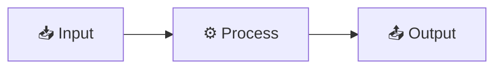

# RFC-[NUMBER]: [Title — Specific and Outcome-Oriented]

| Field               | Value                                               |
| ------------------- | --------------------------------------------------- |
| **Status**          | Draft / In Review / Accepted / Rejected / Withdrawn |
| **Author**          | [Name]                                              |
| **Date**            | [YYYY-MM-DD]                                        |
| **Review deadline** | [YYYY-MM-DD]                                        |
| **Stakeholders**    | [Names or teams who must respond]                   |
| **Related**         | [RFC-NNN, ADR-NNN, or issue links]                  |

---

## ## Problem Statement

### What problem are we solving?

[2–4 sentences. Describe the pain point, gap, or opportunity. Be concrete — include metrics, incident counts, or user feedback that quantifies the problem.]

### Who is affected?

- **Users:** [How many, which segments, what impact]
- **Engineers:** [Which teams, what friction]
- **Systems:** [Which services, what load or risk]

### Why now?

[What makes this urgent or timely? What happens if we don't act?]

---

## ## Proposed Solution

### Overview

[1–3 sentences describing the proposed approach at a high level.]

### Design



### Implementation Plan

| Phase | Description           | Duration  | Owner  |
| ----- | --------------------- | --------- | ------ |
| 1     | [Phase 1 description] | [N weeks] | [Name] |
| 2     | [Phase 2 description] | [N weeks] | [Name] |
| 3     | [Phase 3 description] | [N weeks] | [Name] |

### API / Interface Changes

[Describe any changes to public APIs, data schemas, or interfaces. Use before/after format.]

**Before:**

```json
{
  "field": "old_value"
}
```

**After:**

```json
{
  "field": "new_value",
  "new_field": "added"
}
```

### Migration Plan

[How will existing data and users be migrated? What is the rollback plan?]

---

## ## Alternatives Considered

### Alternative A: [Name]

**Summary:** [1–2 sentences]

**Pros:**

- [Specific benefit]

**Cons:**

- [Specific drawback]

**Why rejected:** [Specific reason]

### Alternative B: [Name]

**Summary:** [1–2 sentences]

**Pros:**

- [Specific benefit]

**Cons:**

- [Specific drawback]

**Why rejected:** [Specific reason]

### Status quo (do nothing)

**Why rejected:** [What happens if we don't act]

---

## ## Trade-offs and Risks

| Risk     | Likelihood          | Impact              | Mitigation   |
| -------- | ------------------- | ------------------- | ------------ |
| [Risk 1] | High / Medium / Low | High / Medium / Low | [Mitigation] |
| [Risk 2] | High / Medium / Low | High / Medium / Low | [Mitigation] |

---

## ## Success Metrics

How will we know this RFC succeeded?

| Metric     | Baseline        | Target         | Measurement    |
| ---------- | --------------- | -------------- | -------------- |
| [Metric 1] | [Current value] | [Target value] | [How measured] |
| [Metric 2] | [Current value] | [Target value] | [How measured] |

---

## ## Open Questions

| Question     | Owner  | Status          |
| ------------ | ------ | --------------- |
| [Question 1] | [Name] | Open / Resolved |
| [Question 2] | [Name] | Open / Resolved |

---

## ## Appendix

### Glossary

| Term   | Definition   |
| ------ | ------------ |
| [Term] | [Definition] |

### References

- [Link to relevant documentation]
- [Link to related RFC or ADR]

---

## ## Review Comments

_[Reviewers add comments here during the review period]_

| Reviewer | Date   | Comment   | Status          |
| -------- | ------ | --------- | --------------- |
| [Name]   | [Date] | [Comment] | Open / Resolved |

---

## ## See Also

- [architecture-spec.md](architecture-spec.md) — Architecture specification
- [api-design.md](api-design.md) — API design
- [../../templates/software/rfc.md](../../templates/software/rfc.md) — General RFC template
- [../../templates/software/adr.md](../../templates/software/adr.md) — Architecture Decision Records
