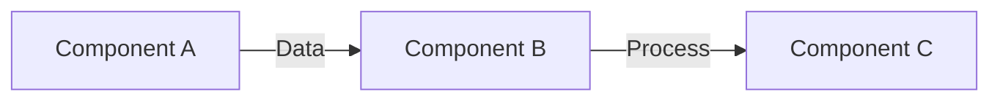
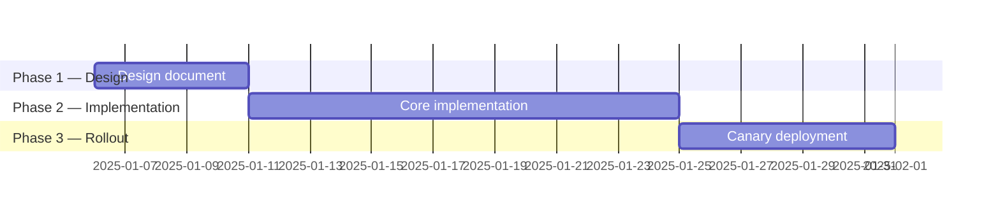

# RFC-[NUMBER]: [Title — Specific and Outcome-Oriented]

> [!NOTE]
> An RFC is required for changes that affect multiple teams, introduce new architectural patterns, or have significant performance or security implications. For smaller changes, use an ADR instead.

| Field               | Value                                               |
| ------------------- | --------------------------------------------------- |
| **Status**          | Draft / In Review / Accepted / Rejected / Withdrawn |
| **Author**          | [Name]                                              |
| **Date**            | [YYYY-MM-DD]                                        |
| **Review deadline** | [YYYY-MM-DD]                                        |
| **Stakeholders**    | [Names or teams who must respond]                   |
| **Related RFCs**    | [RFC-NNN if supersedes or depends on another]       |

---

## Problem Statement

> [!IMPORTANT]
> The problem statement must be written before any solution. Reviewers should evaluate whether the problem is real independently of the proposed solution.

### What problem are we solving?

[2-4 sentences describing the pain point, gap, or opportunity. Include metrics or user feedback that quantifies the problem.]

**Example:** Our checkout service makes 3 synchronous calls to inventory per request, contributing to p99 latency of 850ms (SLA: 500ms). This caused 4 SLA breaches in Q3, affecting ~12,000 users.

### Who is affected?

- **Users:** [How many, which segments, what impact]
- **Engineers:** [Which teams, what friction]
- **Systems:** [Which services, what load or risk]

### Why now?

[What makes this urgent? What happens if we do not act?]

---

## Proposed Approaches

> [!TIP]
> Always include at least 3 approaches: preferred solution, an alternative, and "do nothing." The comparison forces explicit tradeoff articulation.

### Approach A: [Name]

**Summary:** [1-2 sentences]

**How it works:**

**Pros:**

- [Benefit 1]
- [Benefit 2]

**Cons:**

- [Drawback 1]
- [Drawback 2]

**Effort:** [S/M/L] | **Risk:** [Low/Medium/High]

---

### Approach B: [Name]

**Summary:** [1-2 sentences]

**Pros:**

- [Benefit 1]
- [Benefit 2]

**Cons:**

- [Drawback 1]
- [Drawback 2]

**Effort:** [S/M/L] | **Risk:** [Low/Medium/High]

---

### Approach C: Do Nothing

**Pros:** No engineering cost, no regression risk

**Cons:** Problem continues; [specific consequences]

---

### Comparison Matrix

| Criterion              | Weight | Approach A | Approach B | Do Nothing |
| ---------------------- | ------ | ---------- | ---------- | ---------- |
| Solves the problem     | High   | ✅         | ⚠️         | ❌         |
| Implementation effort  | Medium | ⚠️         | ✅         | ✅         |
| Operational complexity | Medium | ⚠️         | ✅         | ✅         |
| Reversibility          | Low    | ⚠️         | ✅         | ✅         |

---

## Recommended Decision

> [!WARNING]
> Once accepted, an RFC becomes the authoritative record. Changes require a new RFC or amendment.

**Recommendation:** [Approach A / B / C]

[Rationale in 2-3 sentences. Why this approach over alternatives?]

### What we are NOT doing and why

- **[Alternative]:** [Why rejected]
- **Do Nothing:** [Why unacceptable]

---

## Implementation Plan

| Phase | Deliverable          | Owner  | Target |
| ----- | -------------------- | ------ | ------ |
| 1     | Design document      | [Team] | [Date] |
| 2     | Implementation       | [Team] | [Date] |
| 3     | Rollout + monitoring | [Team] | [Date] |

**Success criteria:** [Measurable outcomes that define completion]

---

## Open Questions

- [ ] [Question 1]
- [ ] [Question 2]
- [ ] [Question 3]

---

## Review Log

| Date   | Reviewer | Verdict  | Notes      |
| ------ | -------- | -------- | ---------- |
| [Date] | [Name]   | [Status] | [Feedback] |

---

## References

- [Related ADR](../adr/ADR-XXX.md)
- [Architecture Spec](./architecture_spec.md)
- [External reference](https://example.com)

---

_Last updated: [Date]_

---

## See Also

- [Architecture Decision Record (ADR)](../software/adr.md) — For smaller, team-level decisions
- [Architecture Specification](./architecture_spec.md) — For system architecture documentation
- [API Design](./api_design.md) — For API changes resulting from this RFC
- [Database Schema](./database_schema.md) — For data model changes
