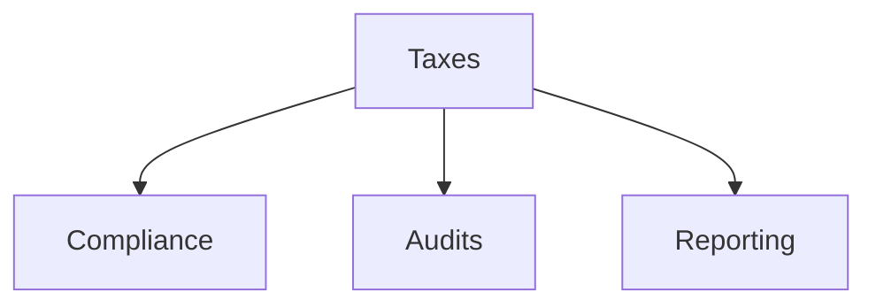

# Taxes

Tax compliance, reporting, and documentation templates.

## Templates

| Template                                                               | Description           |
| ---------------------------------------------------------------------- | --------------------- |
| [tax_compliance_checklist.md](tax_compliance_checklist.md)             | Compliance checklists |
| [tax_audit_preparation.md](tax_audit_preparation.md)                   | Audit preparation     |
| [transfer_pricing_documentation.md](transfer_pricing_documentation.md) | Transfer pricing      |
| [vat_gst_compliance.md](vat_gst_compliance.md)                         | VAT/GST compliance    |
| [tax_form_1099_guide.md](tax_form_1099_guide.md)                       | Form 1099             |

## Structure

See [Parent](../SKILL.md) for all categories.
