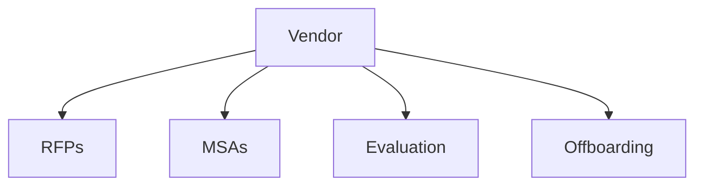

# Vendor

Vendor management, RFPs, and procurement templates.

## Templates

| Template                                                   | Description        |
| ---------------------------------------------------------- | ------------------ |
| [request_for_proposal.md](request_for_proposal.md)         | RFPs               |
| [master_service_agreement.md](master_service_agreement.md) | MSAs               |
| [vendor_evaluation.md](vendor_evaluation.md)               | Vendor evaluations |
| [statement_of_work.md](statement_of_work.md)               | SOWs               |
| [vendor_offboarding.md](vendor_offboarding.md)             | Offboarding        |

## Structure

See [Parent](../SKILL.md) for all categories.
