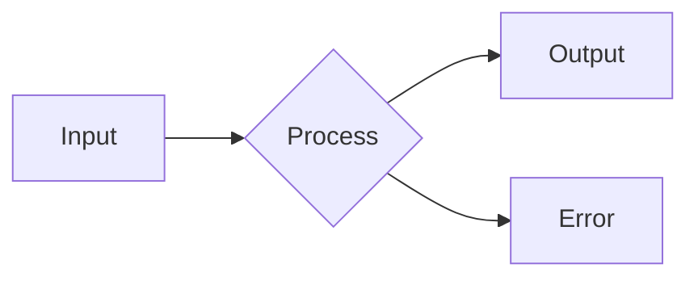
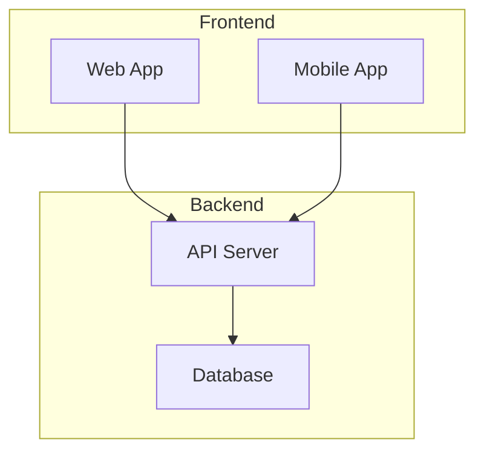
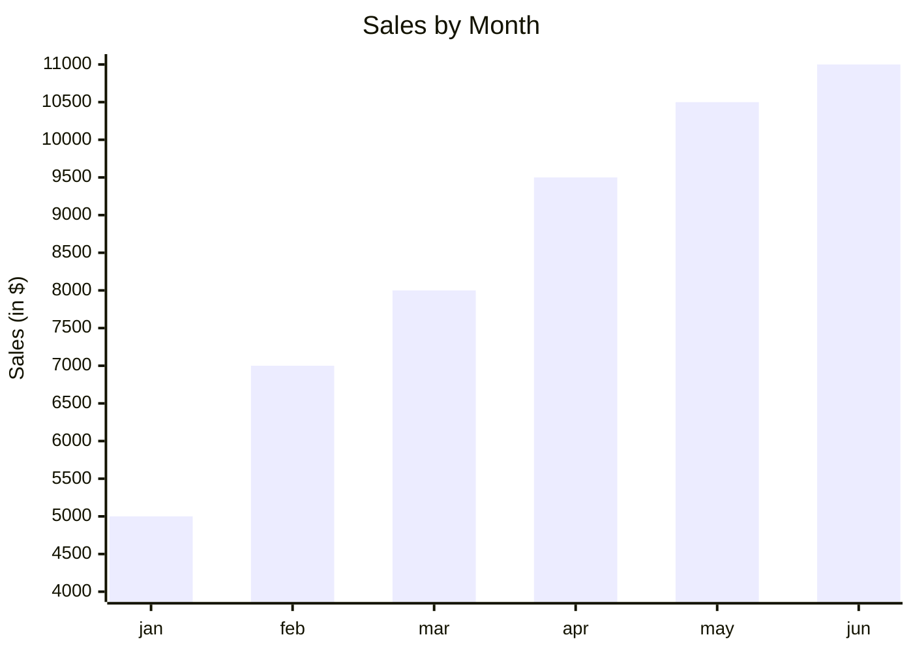

# Vector Format Hierarchy

## Decision Tree for Visualizations

```
Need a visualization?
│
├─ Can it be done in Mermaid?
│  ├─ YES → Use Mermaid
│  │         └─ Best for: Flowcharts, sequence diagrams, ER diagrams,
│  │                       Gantt charts, Git graphs, mind maps
│  └─ NO → Continue...
│
├─ Does it need custom styling/animation?
│  ├─ YES → Use SVG
│  │         └─ Best for: Custom diagrams, data viz, illustrations,
│  │                       logos, interactive graphics
│  └─ NO → Continue...
│
├─ Is it a photo/raster image?
│  ├─ YES → Use PNG/JPG (last resort)
│  └─ NO → Use Mermaid or SVG
│
└─ NEVER: AI-generated bitmaps for diagrams
```

## Format Priority

### 1. Mermaid (Preferred)

**When to use:**
- Flowcharts
- Sequence diagrams
- Class diagrams
- State diagrams
- ER diagrams
- Gantt charts
- Git graphs
- Mind maps

**Why first:**
- Text-based (version control friendly)
- Easy to edit
- Consistent styling
- Integrated with Markdown
- No external files needed

**Example:**


### 2. SVG (Fallback)

**When to use:**
- Custom visualizations
- Data charts beyond Mermaid
- Network diagrams
- Illustrations
- Terminal mockups
- Skill hierarchies
- Interactive elements

**Why second:**
- Scalable (infinite resolution)
- Text-based (version control)
- Customizable styling
- Animation support
- Smaller than PNG

**Example:**
```svg
<svg xmlns="http://www.w3.org/2000/svg" width="200" height="100">
  <rect width="100%" height="100%" fill="#4CAF50"/>
  <text x="50%" y="50%" text-anchor="middle" fill="white" dy=".3em">SVG</text>
</svg>
```

### 3. PNG/JPG (Last Resort)

**When to use:**
- Photographs
- Screenshots
- Raster-only content
- External assets

**Why last:**
- Fixed resolution
- Binary (not version control friendly)
- Larger file sizes
- Not editable

## Implementation Rules

### For WRIGHTER Skills

1. **Always try Mermaid first**
   - If diagram type exists in Mermaid, use it
   - Examples: flows, sequences, timelines

2. **Use SVG when:**
   - Mermaid doesn't support the diagram type
   - Need custom styling/colors
   - Need animation/interaction
   - Need pixel-perfect positioning
   - Downstream needs SVG manipulation

3. **Never use AI-generated bitmaps for:**
   - Diagrams
   - Charts
   - Architecture drawings
   - Process flows
   - System designs

4. **AI images only for:**
   - Photorealistic content
   - Concept art
   - When specifically requested
   - Phase 3 (last resort)

## Downstream Considerations

### If Downstream Needs...

**Web embedding:**
- Mermaid: Renders as SVG automatically
- SVG: Direct embed
- PNG: Use only for photos

**Print/PDF:**
- Mermaid: Export as SVG first
- SVG: Perfect for print
- PNG: May pixelate

**Customization:**
- Mermaid: Limited (themes only)
- SVG: Full CSS/JS control
- PNG: None

**Version control:**
- Mermaid: Perfect (text)
- SVG: Perfect (text)
- PNG: Poor (binary)

## Examples by Type

### System Architecture

**Mermaid (Preferred):**


**When to use SVG instead:**
- Need custom icons
- Need specific colors/branding
- Need animation
- Need interactive hotspots

### Data Visualization

**Mermaid (Preferred):**


**SVG (For custom):**
- Custom chart types
- Interactive tooltips
- Complex visualizations
- Animation

### Terminal Output

**SVG (Best choice):**
```svg
<svg xmlns="http://www.w3.org/2000/svg" width="600" height="300">
  <rect width="100%" height="100%" fill="#1e1e1e" rx="8"/>
  <text x="20" y="40" fill="#00ff00" font-family="monospace" font-size="14">$ omni status</text>
  <text x="20" y="65" fill="#66d9ef" font-family="monospace" font-size="14">Branch: main</text>
</svg>
```

(Not possible in Mermaid)

## Tooling

### Mermaid
- **Editor:** Live editor at mermaid.live
- **VSCode:** Mermaid extension
- **Markdown:** Native in GitHub/GitLab

### SVG
- **Editor:** Inkscape, Figma, Illustrator
- **Code:** Hand-written or D3.js
- **Python:** matplotlib, plotly (export SVG)
- **Optimization:** SVGO, SVGOMG

### Conversion

**Mermaid → SVG:**
```bash
# Use mermaid-cli
mmdc -i diagram.mmd -o diagram.svg
```

**SVG → PNG (avoid):**
```bash
# Only if absolutely necessary
inkscape diagram.svg --export-png=diagram.png
```

## Quality Checklist

Before committing visualizations:

- [ ] Can this be Mermaid instead?
- [ ] Is it text-based (Mermaid/SVG)?
- [ ] Will it scale properly?
- [ ] Is it under version control?
- [ ] Is it smaller than 100KB?
- [ ] Does it use CSS classes for styling?
- [ ] Is it accessible (alt text/title)?

## Audio/Music Format Hierarchy

### 4. MIDI (Preferred for Music)

**When to use:**
- Musical compositions
- Algorithmic music
- Procedural soundtracks
- Sheet music representation
- Interactive audio
- Music education
- Transcription

**Why first:**
- Extremely compressed (events vs samples)
- Infinitely scalable (tempo, key changes)
- Editable (notes, instruments, timing)
- Version control friendly (text/sm binary)
- No copyright issues (new compositions)
- 1000x smaller than MP3/WAV

**Example:**
```midi
# Simple melody in MIDI
Track 1: Piano
  NoteOn  C4  velocity=64  time=0
  NoteOff C4  velocity=0   time=480
  NoteOn  E4  velocity=64  time=480
  NoteOff E4  velocity=0   time=960
  NoteOn  G4  velocity=64  time=960
NoteOff G4  velocity=0   time=1440
```

### 5. MP3/WAV (Last Resort for Audio)

**When to use:**
- Recorded performances
- Sound effects
- Sample-based music
- Voice/audio recordings
- Final delivery (export from MIDI)

**Why last:**
- Fixed resolution (sample rate)
- Large file sizes
- Binary (not version control friendly)
- Copyright issues with samples
- Not editable (destructive)

## Format Priority Summary

| Domain | Phase 1 | Phase 2 | Phase 3 |
|--------|---------|---------|---------|
| **Text** | Markdown | LaTeX | PDF |
| **Diagrams** | Mermaid | SVG | PNG/JPG |
| **Music** | MIDI | - | MP3/WAV |
| **Images** | - | SVG | AI/PNG |

**The Rule:**
> If it can be done in Mermaid, do it in Mermaid.
> If not, use SVG.
> For music, use MIDI.
> Never use bitmaps for diagrams.

**Default:** Mermaid
**Fallback:** SVG
**Never for diagrams:** PNG/JPG
**AI images:** Phase 3 only

**The Rule:**
> If it can be done in Mermaid, do it in Mermaid.
> If not, use SVG.
> Never use bitmaps for diagrams.
