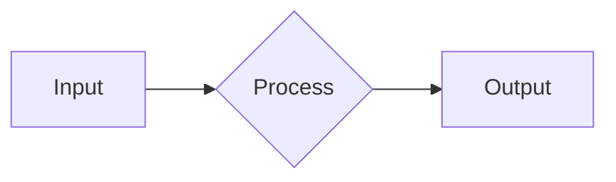

# Mermaid Diagrams

Create diagrams that render anywhere.

## When to Use

- Flowcharts
- Sequence diagrams
- Architecture diagrams
- Gantt charts
- Any structural visualization

## Resources

| Resource         | Path                                       |
| ---------------- | ------------------------------------------ |
| Style Guide      | [style-guide.md](style-guide.md)           |
| Color Palette    | [color-palette.md](color-palette.md)       |
| Emoji Reference  | [emoji-reference.md](emoji-reference.md)   |
| Complex Examples | [complex-examples.md](complex-examples.md) |
| Diagram Types    | [index.md](index.md)                       |

## Quick Start

## 24 Diagram Types

See [types/](types/) for detailed documentation on each diagram type.
