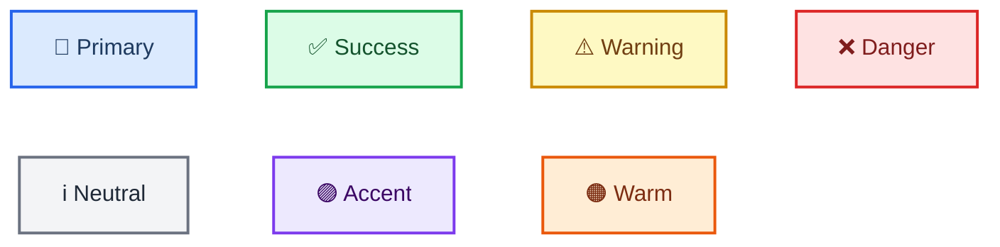
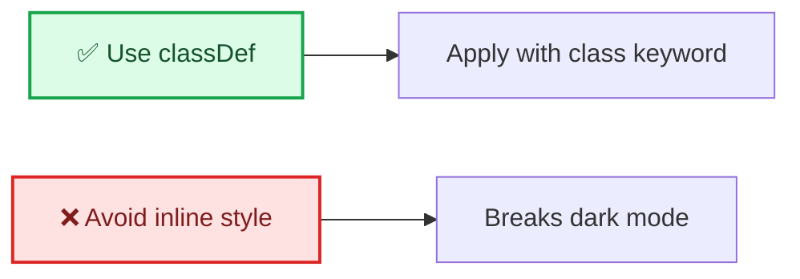

<!-- Source: https://github.com/SuperiorByteWorks-LLC/agent-project | License: Apache-2.0 | Author: Clayton Young / Superior Byte Works, LLC (Boreal Bytes) -->

# Mermaid Color Palette

**Approved palette — tested in both GitHub light and dark modes.**

Use **only** when you genuinely need color-coding (multi-actor diagrams, severity levels). Prefer shapes + emoji first.

---

## The 7 Approved Color Classes

| Semantic Use           | `classDef` Definition                                        | Visual                                             |
| ---------------------- | ------------------------------------------------------------ | -------------------------------------------------- |
| **Primary / action**   | `fill:#dbeafe,stroke:#2563eb,stroke-width:2px,color:#1e3a5f` | Light blue fill, blue border, dark navy text       |
| **Success / positive** | `fill:#dcfce7,stroke:#16a34a,stroke-width:2px,color:#14532d` | Light green fill, green border, dark forest text   |
| **Warning / caution**  | `fill:#fef9c3,stroke:#ca8a04,stroke-width:2px,color:#713f12` | Light yellow fill, amber border, dark brown text   |
| **Danger / critical**  | `fill:#fee2e2,stroke:#dc2626,stroke-width:2px,color:#7f1d1d` | Light red fill, red border, dark crimson text      |
| **Neutral / info**     | `fill:#f3f4f6,stroke:#6b7280,stroke-width:2px,color:#1f2937` | Light gray fill, gray border, near-black text      |
| **Accent / highlight** | `fill:#ede9fe,stroke:#7c3aed,stroke-width:2px,color:#3b0764` | Light violet fill, purple border, dark purple text |
| **Warm / commercial**  | `fill:#ffedd5,stroke:#ea580c,stroke-width:2px,color:#7c2d12` | Light peach fill, orange border, dark rust text    |

---

## Live Preview — All 7 Classes



---

## Copy-Paste Definitions

```
classDef primary fill:#dbeafe,stroke:#2563eb,stroke-width:2px,color:#1e3a5f
classDef success fill:#dcfce7,stroke:#16a34a,stroke-width:2px,color:#14532d
classDef warning fill:#fef9c3,stroke:#ca8a04,stroke-width:2px,color:#713f12
classDef danger fill:#fee2e2,stroke:#dc2626,stroke-width:2px,color:#7f1d1d
classDef neutral fill:#f3f4f6,stroke:#6b7280,stroke-width:2px,color:#1f2937
classDef accent fill:#ede9fe,stroke:#7c3aed,stroke-width:2px,color:#3b0764
classDef warm fill:#ffedd5,stroke:#ea580c,stroke-width:2px,color:#7c2d12
```

---

## Usage Rules

1. Always include `color:` (text color) — dark-mode backgrounds can hide default text
2. Use `classDef` + `class` — **never** inline `style` directives
3. Max **3–4 color classes** per diagram
4. **Never rely on color alone** — always pair with emoji, shape, or label text

---

## Semantic Guidance

| Class     | Use for                                                     | Example nodes                        |
| --------- | ----------------------------------------------------------- | ------------------------------------ |
| `primary` | Main actions, primary flow, user-facing steps               | `[🚀 Deploy app]`, `[👤 User login]` |
| `success` | Completed states, passing checks, positive outcomes         | `[✅ Tests passed]`, `[🏁 Done]`     |
| `warning` | Caution states, rate limits, degraded performance           | `[⚠️ Rate limited]`, `[🔄 Retry]`    |
| `danger`  | Failures, errors, blocked states, critical alerts           | `[❌ Build failed]`, `[🔒 Blocked]`  |
| `neutral` | Supporting steps, informational nodes, secondary actors     | `[📝 Log event]`, `[🔍 Inspect]`     |
| `accent`  | Highlights, special cases, AI/ML components, featured items | `[🧠 ML classifier]`, `[💡 Insight]` |
| `warm`    | Commercial, financial, customer-facing, marketing flows     | `[💰 Invoice]`, `[🎯 Campaign]`      |

---

## Anti-Patterns

```
%% ❌ NEVER do this — breaks dark mode
style my_node fill:#e8f5e9

%% ❌ NEVER do this — overrides GitHub theming
%%{init: {'theme':'base', 'themeVariables': {'primaryColor':'#ff0000'}}}%%

%% ❌ NEVER use more than 4 classes in one diagram
classDef c1 ...
classDef c2 ...
classDef c3 ...
classDef c4 ...
classDef c5 ...  %% Too many!
```


