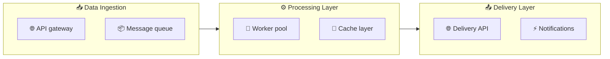
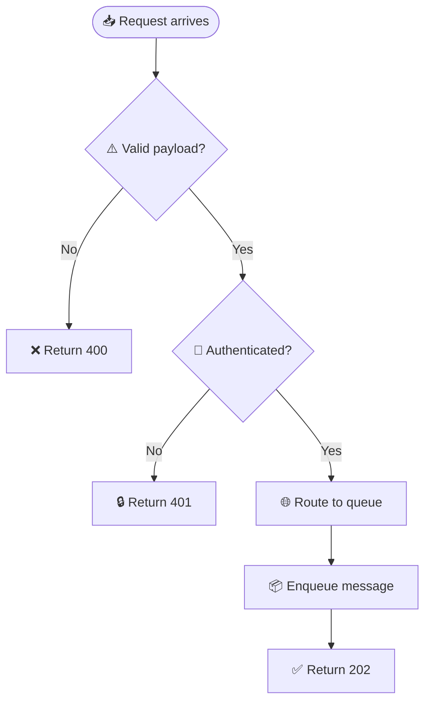
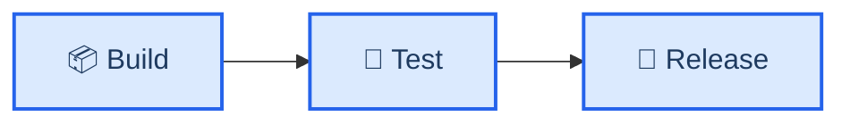
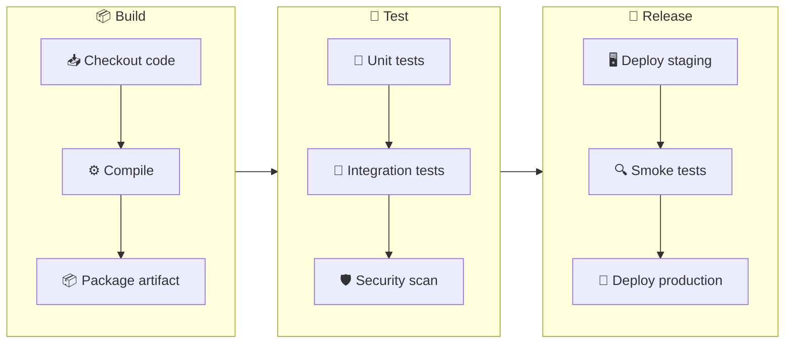
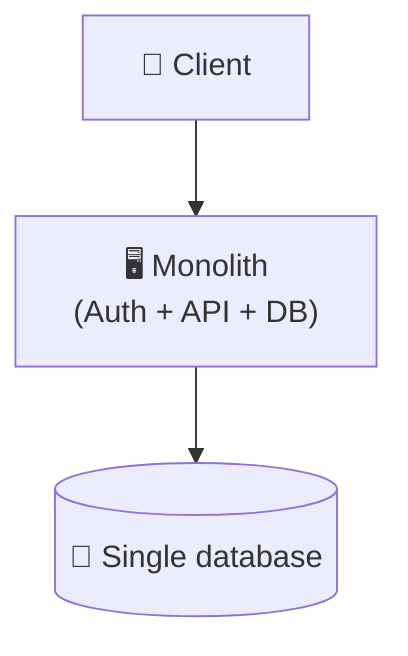
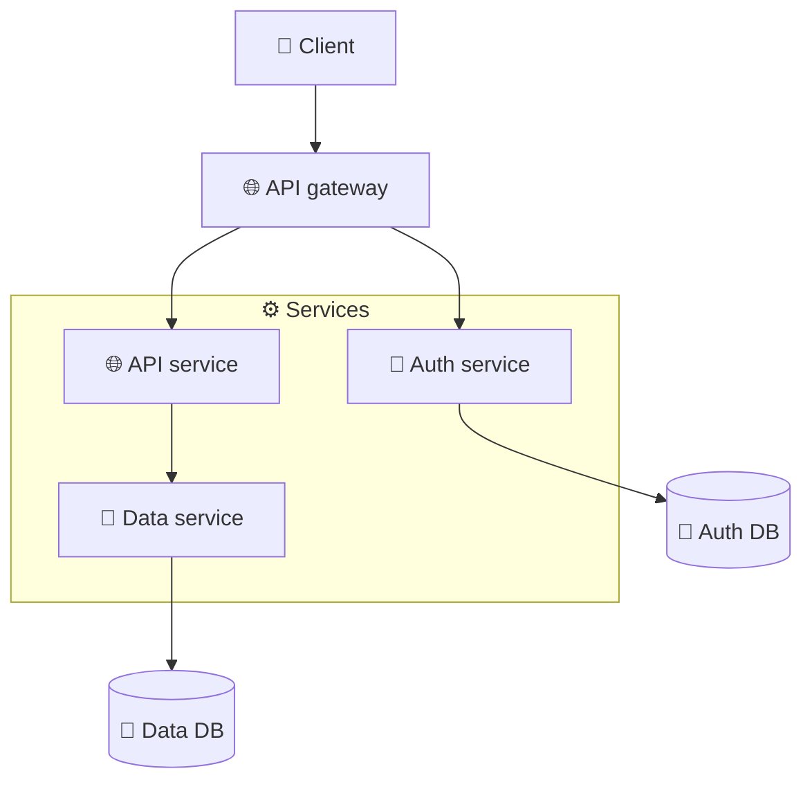
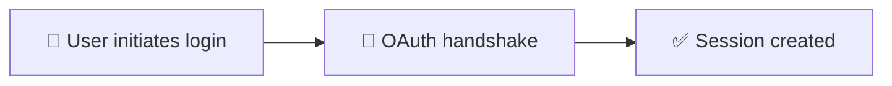
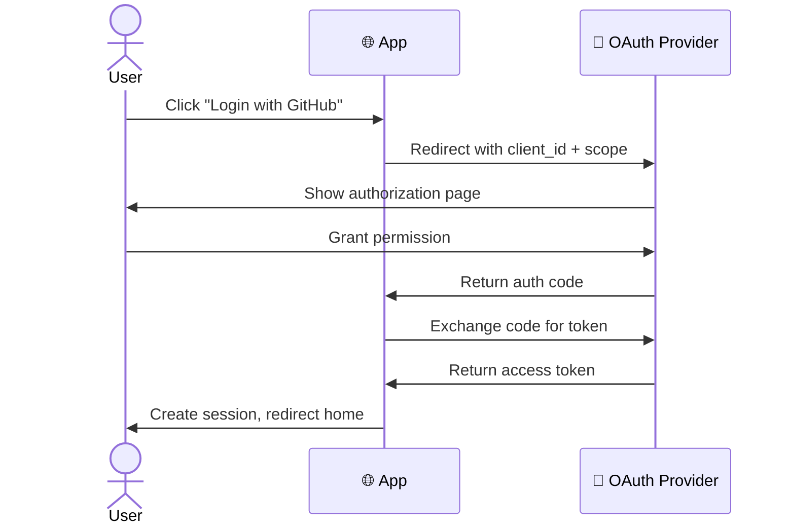
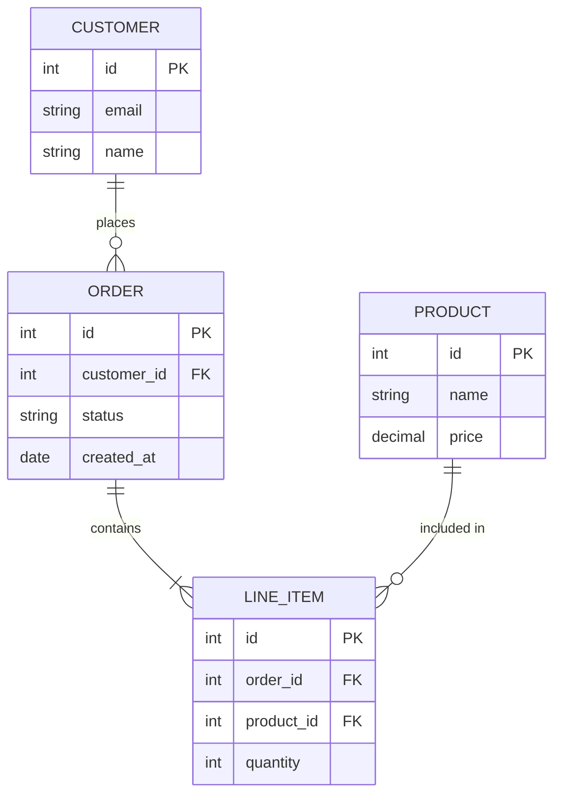
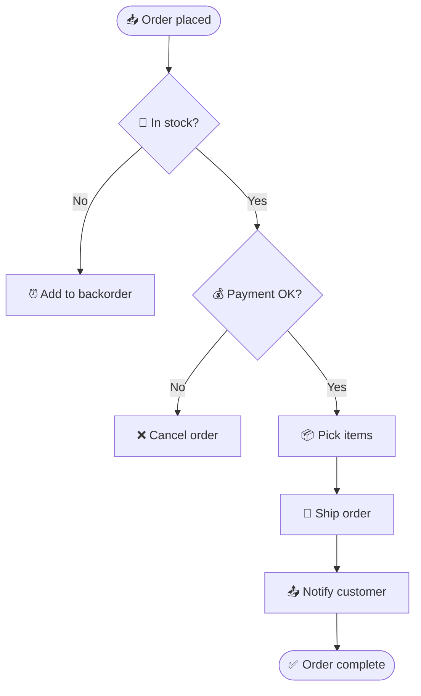

<!-- Source: https://github.com/SuperiorByteWorks-LLC/agent-project | License: Apache-2.0 | Author: Clayton Young / Superior Byte Works, LLC (Boreal Bytes) -->

# Composing Complex Diagram Sets

When a single diagram isn't enough — multiple audiences, overview + detail needs, or before/after migration docs — use these patterns to combine multiple Mermaid diagram types into cohesive documentation.

---

## Pattern 1: Overview + Detail

Use when you need both the big picture AND the details. The overview shows subgraph-level blocks; detail diagrams zoom into each subgraph.

### Overview Diagram



### Detail Diagram — Ingestion Layer



---

## Pattern 2: Multi-Audience Documentation

Create separate diagrams for different audiences from the same system.

### Leadership View (Flowchart — phases only)



### Engineering View (Flowchart — full detail)



---

## Pattern 3: Before/After Migration

Document system changes with paired diagrams.

### Before: Monolithic Architecture



### After: Microservices Architecture



---

## Pattern 4: Flowchart + Sequence Combo

Use a flowchart for the overall process, then a sequence diagram for the critical interaction.

### Process Overview (Flowchart)



### OAuth Handshake Detail (Sequence)



---

## Pattern 5: ER + Flowchart Combo

Use an ER diagram for the data model, then a flowchart for the business process that operates on it.

### Data Model (ER)



### Order Fulfillment Process (Flowchart)



---

## Linking Diagrams in Prose

When using multiple diagrams, link them explicitly in your prose:

```markdown
The system has three main layers (see [Overview](#overview-diagram) above).
For the ingestion layer internals, see [Ingestion Detail](#detail-diagram--ingestion-layer).
The OAuth handshake is detailed in the [sequence diagram](#oauth-handshake-detail-sequence) below.
```

---

## Complexity Management Summary

| Situation                           | Pattern                    | Diagrams needed |
| ----------------------------------- | -------------------------- | --------------- |
| Simple process, one audience        | Single flat diagram        | 1               |
| Complex process, one audience       | Subgraphs in one diagram   | 1               |
| Complex process, multiple audiences | Multi-audience             | 2–3             |
| System with data model + process    | ER + Flowchart combo       | 2               |
| System with interactions + flow     | Flowchart + Sequence combo | 2               |
| Very large system (30+ nodes)       | Overview + Detail          | 3–6             |
| Before/after documentation          | Migration pair             | 2               |
