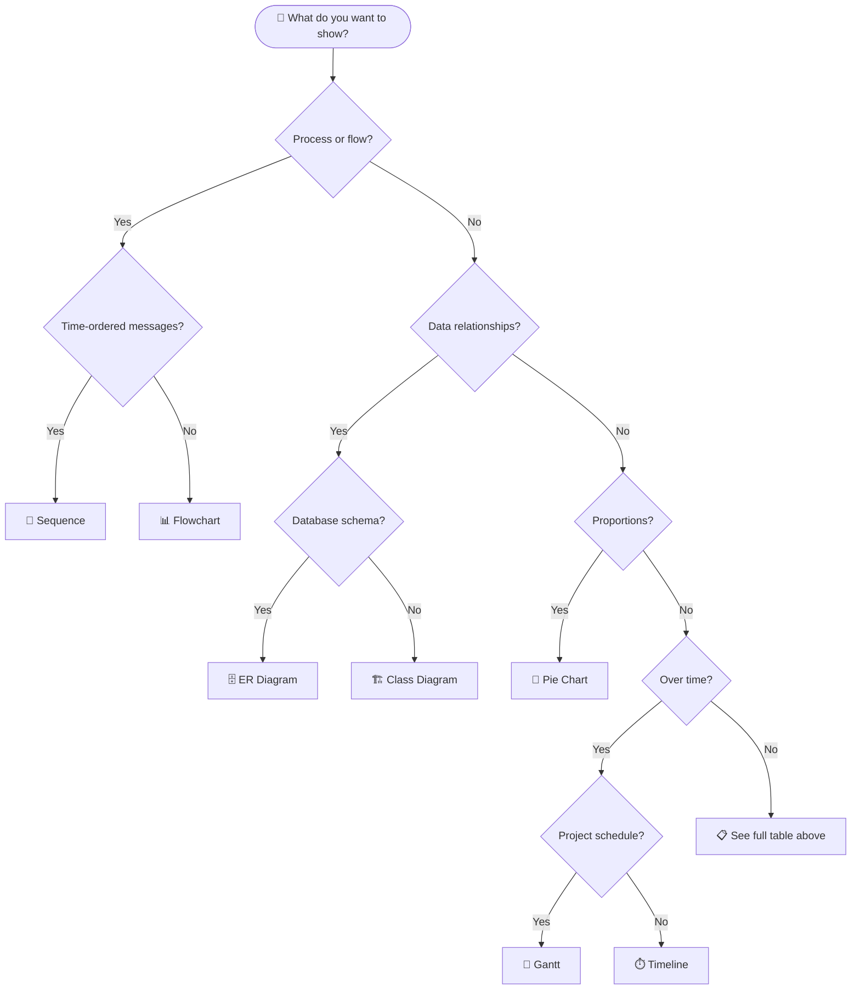

<!-- Source: https://github.com/SuperiorByteWorks-LLC/agent-project | License: Apache-2.0 | Author: Clayton Young / Superior Byte Works, LLC (Boreal Bytes) -->

# Mermaid Diagram Type Index

Read the "best for" column, then follow the link to the type directory for the exemplar diagram, tips, and template.

---

## Diagram Selection Table

| You want to show...                      | Type             | Directory                                          |
| ---------------------------------------- | ---------------- | -------------------------------------------------- |
| Steps in a process / decisions           | **Flowchart**    | [types/flowchart/](types/flowchart/index.md)       |
| Who talks to whom, when                  | **Sequence**     | [types/sequence/](types/sequence/index.md)         |
| Class hierarchy / type relationships     | **Class**        | [types/class/](types/class/index.md)               |
| Status transitions / lifecycle           | **State**        | [types/state/](types/state/index.md)               |
| Database schema / data model             | **ER**           | [types/er/](types/er/index.md)                     |
| Project timeline / roadmap               | **Gantt**        | [types/gantt/](types/gantt/index.md)               |
| Parts of a whole (proportions)           | **Pie**          | [types/pie/](types/pie/index.md)                   |
| Git branching / merge strategy           | **Git Graph**    | [types/git_graph/](types/git_graph/index.md)       |
| Concept hierarchy / brainstorm           | **Mindmap**      | [types/mindmap/](types/mindmap/index.md)           |
| Events over time (chronological)         | **Timeline**     | [types/timeline/](types/timeline/index.md)         |
| User experience / satisfaction map       | **User Journey** | [types/user_journey/](types/user_journey/index.md) |
| Two-axis prioritization / comparison     | **Quadrant**     | [types/quadrant/](types/quadrant/index.md)         |
| Requirements traceability                | **Requirement**  | [types/requirement/](types/requirement/index.md)   |
| System architecture (zoom levels)        | **C4**           | [types/c4/](types/c4/index.md)                     |
| Flow magnitude / resource distribution   | **Sankey**       | [types/sankey/](types/sankey/index.md)             |
| Numeric trends (bar + line charts)       | **XY Chart**     | [types/xy_chart/](types/xy_chart/index.md)         |
| Component layout / spatial arrangement   | **Block**        | [types/block/](types/block/index.md)               |
| Work item status board                   | **Kanban**       | [types/kanban/](types/kanban/index.md)             |
| Binary protocol / data format            | **Packet**       | [types/packet/](types/packet/index.md)             |
| Infrastructure topology                  | **Architecture** | [types/architecture/](types/architecture/index.md) |
| Multi-dimensional comparison / skills    | **Radar**        | [types/radar/](types/radar/index.md)               |
| Hierarchical proportions / budget        | **Treemap**      | [types/treemap/](types/treemap/index.md)           |
| Code-style sequence (programming syntax) | **ZenUML**       | [types/zenuml/](types/zenuml/index.md)             |
| Network topology / node relationships    | **Network**      | [types/network/](types/network/index.md)           |

**Pick the most specific type.** Don't default to flowcharts — match your content to the diagram type that was designed for it. A sequence diagram communicates service interactions better than a flowchart ever will.

---

## Quick Decision Guide

---

## Complexity Levels

Each diagram type directory contains files for four complexity levels:

| File              | Node count  | When to use                                  |
| ----------------- | ----------- | -------------------------------------------- |
| `simple.md`       | 1–10 nodes  | Quick illustrations, single concepts         |
| `intermediate.md` | 10–20 nodes | Multi-step processes, grouped workflows      |
| `advanced.md`     | 20–30 nodes | Full system views, complex multi-actor flows |

---

## Related Files

- [style-guide.md](style-guide.md) — Full styling rules and principles
- [color-palette.md](color-palette.md) — 7 approved color classes
- [emoji-reference.md](emoji-reference.md) — All approved emojis by category
- [complex-examples.md](complex-examples.md) — Multi-diagram composition patterns
