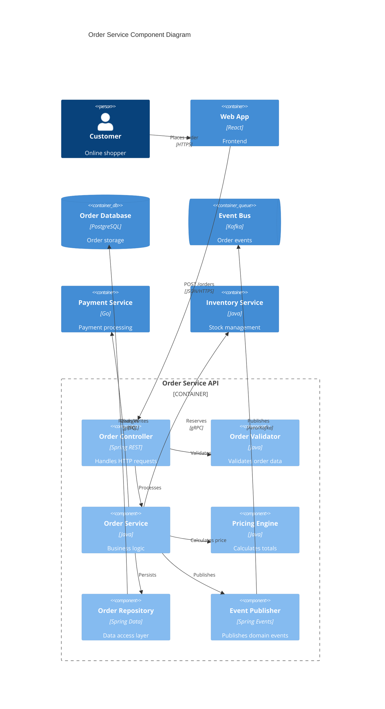
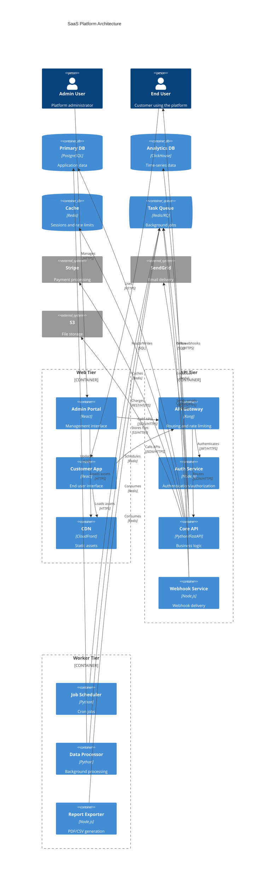
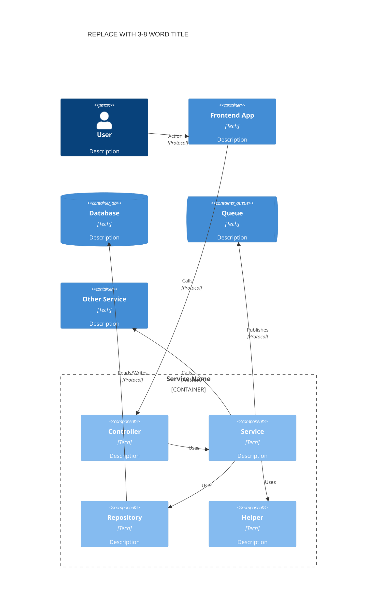

<!-- Source: https://github.com/SuperiorByteWorks-LLC/agent-project | License: Apache-2.0 | Author: Clayton Young / Superior Byte Works, LLC (Boreal Bytes) -->

# C4 Diagram — Advanced (12–20 elements)

Component level (C4 Level 3) with detailed boundaries. Shows internal structure of applications. Use for deep dives into specific services.

---

## Example: API Service Components

---

## Example: Full System with Multiple Boundaries

---

## Copy-Paste Template

---

## Tips

- Use Container_Boundary to group related components
- Show the full data flow from user to database
- Include external service calls at this level
- Component diagrams can get large — consider splitting by service
- Label internal relationships even without protocols
- Keep component names descriptive but concise
