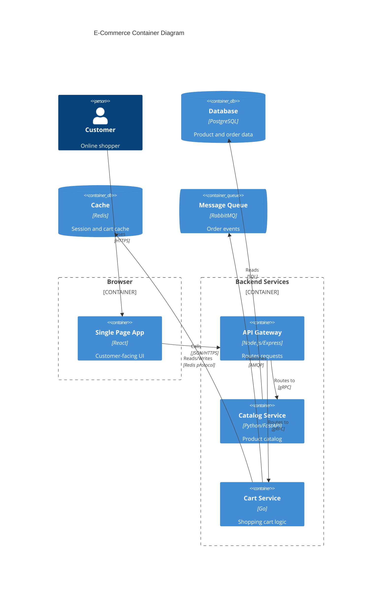
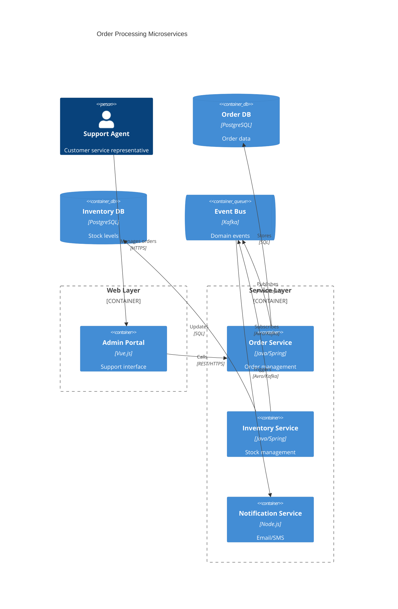
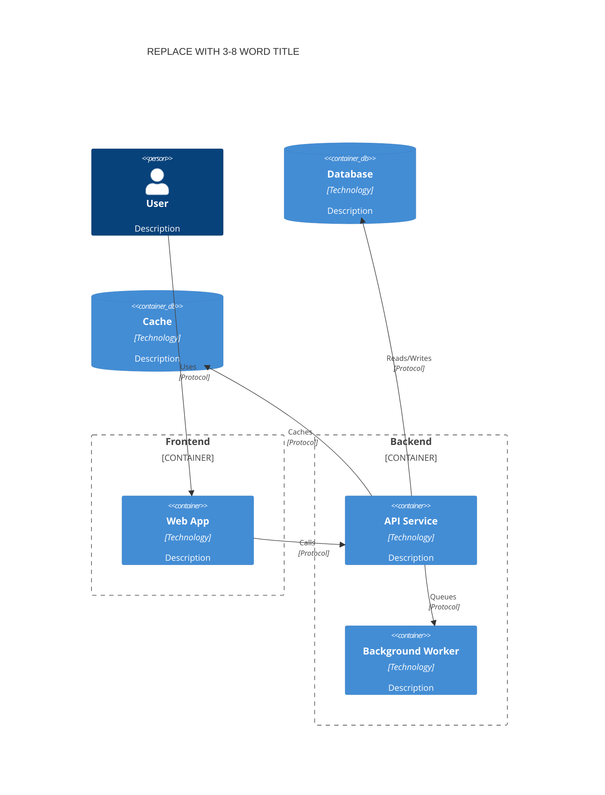

<!-- Source: https://github.com/SuperiorByteWorks-LLC/agent-project | License: Apache-2.0 | Author: Clayton Young / Superior Byte Works, LLC (Boreal Bytes) -->

# C4 Diagram — Intermediate (6–12 elements)

Container level (C4 Level 2). Shows applications, databases, and how they communicate. Use when you need to explain the technology stack.

---

## Example: Web Application Containers

---

## Example: Microservices Architecture

---

## Copy-Paste Template

---

## Tips

- Group containers into logical boundaries (frontend, backend, data)
- Include technology in container definitions
- Label relationships with protocol (HTTPS, gRPC, SQL, etc.)
- Show data flow direction clearly
- Databases and queues are containers too — include them
- 6–10 containers is the sweet spot
