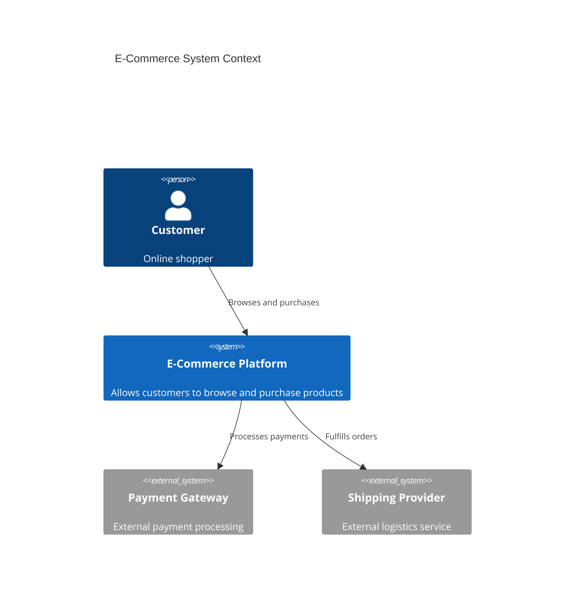
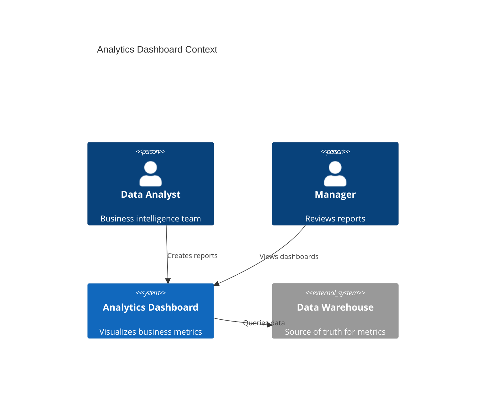
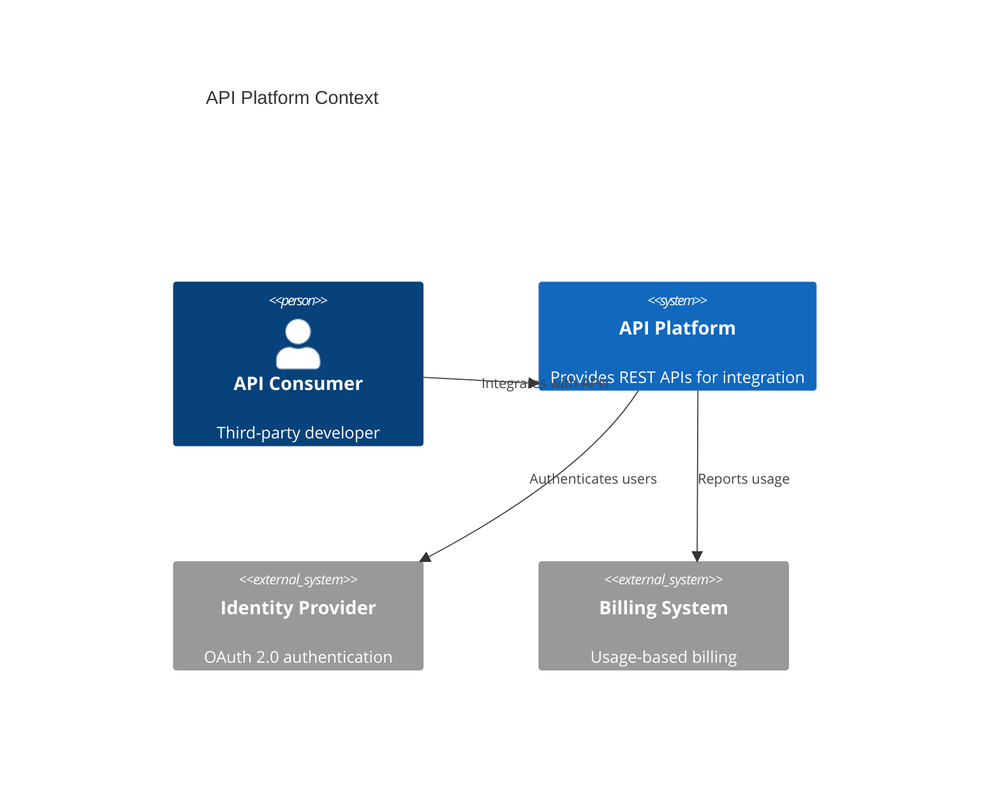
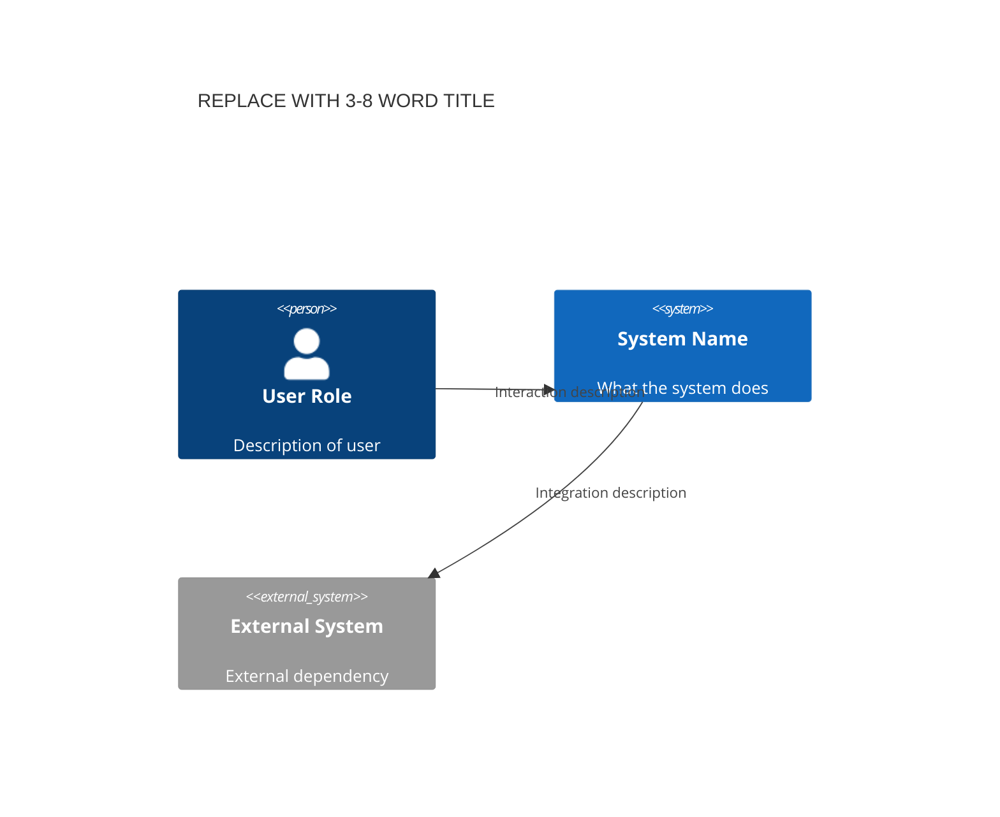

<!-- Source: https://github.com/SuperiorByteWorks-LLC/agent-project | License: Apache-2.0 | Author: Clayton Young / Superior Byte Works, LLC (Boreal Bytes) -->

# C4 Diagram — Simple (3–6 elements)

System Context level (C4 Level 1). Shows the big picture: what the system is, who uses it, and external dependencies.

---

## Example: E-Commerce System Context

---

## Example: Internal Tool Context

---

## Example: API Platform Context

---

## Copy-Paste Template

---

## Tips

- Focus on "what" not "how" — no implementation details at this level
- Keep to 3–5 elements for clarity
- External systems go on the right, users on the left
- Describe the value exchange in relationship labels
- This is your "elevator pitch" architecture view
