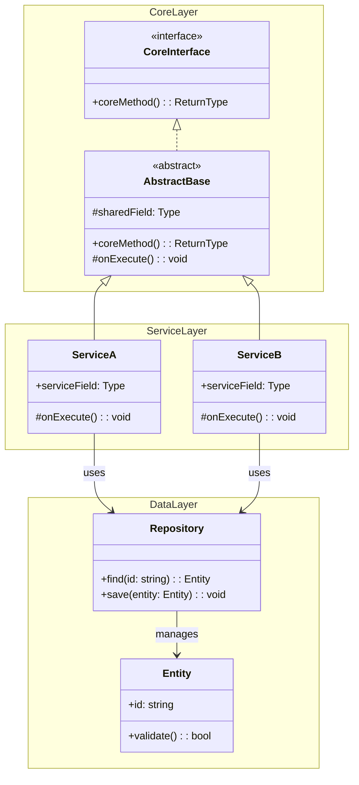

<!-- Source: https://github.com/SuperiorByteWorks-LLC/agent-project | License: Apache-2.0 | Author: Clayton Young / Superior Byte Works, LLC (Boreal Bytes) -->

# Class — Advanced (8–15 classes)

Full system class hierarchy. Use namespaces to group related classes.

---

## Example: Plugin Architecture

```mermaid
classDiagram
    accTitle: Plugin Architecture Class Hierarchy
    accDescr: Plugin system showing core interfaces, base classes, and concrete implementations with registry

    namespace Core {
        class Plugin {
            <<interface>>
            +name: string
            +version: string
            +initialize(config: Config): void
            +execute(context: Context): Result
            +teardown(): void
        }
        class BasePlugin {
            <<abstract>>
            +name: string
            +version: string
            #config: Config
            +initialize(config: Config): void
            #onExecute(context: Context): Result
            +execute(context: Context): Result
        }
        class PluginRegistry {
            -plugins: Map~string, Plugin~
            +register(plugin: Plugin): void
            +get(name: string): Plugin
            +executeAll(context: Context): Result[]
        }
    }

    namespace Plugins {
        class TransformPlugin {
            +transform(data: any): any
            #onExecute(context: Context): Result
        }
        class ValidatePlugin {
            +rules: ValidationRule[]
            +addRule(rule: ValidationRule): void
            #onExecute(context: Context): Result
        }
        class ExportPlugin {
            +format: ExportFormat
            +export(data: any): Buffer
            #onExecute(context: Context): Result
        }
    }

    namespace Config {
        class Config {
            +settings: Map~string, any~
            +get(key: string): any
            +set(key: string, value: any): void
        }
        class Context {
            +data: any
            +metadata: Map~string, any~
            +logger: Logger
        }
        class Result {
            +success: bool
            +data: any
            +errors: string[]
        }
    }

    Plugin <|.. BasePlugin
    BasePlugin <|-- TransformPlugin
    BasePlugin <|-- ValidatePlugin
    BasePlugin <|-- ExportPlugin
    PluginRegistry --> Plugin : manages
    Plugin --> Config : uses
    Plugin --> Context : receives
    Plugin --> Result : returns
```

---

## Copy-Paste Template



---

## Tips

- Use `namespace` blocks to group related classes visually
- Consider splitting into multiple diagrams if exceeding 15 classes
- Show only the most architecturally significant methods
- Link to detail diagrams for each namespace in prose
