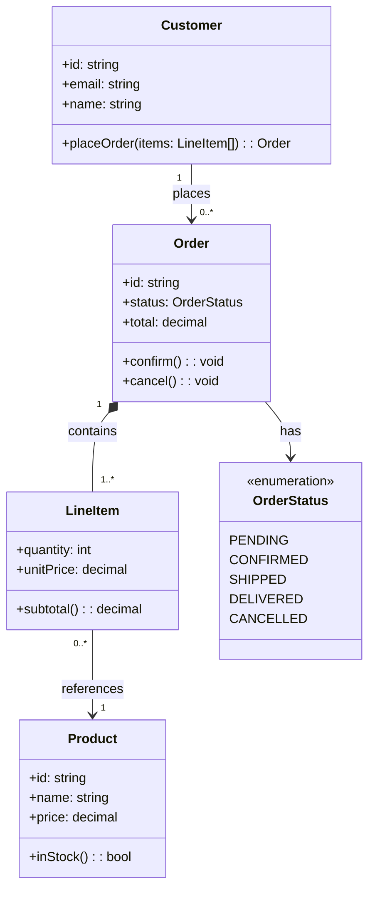
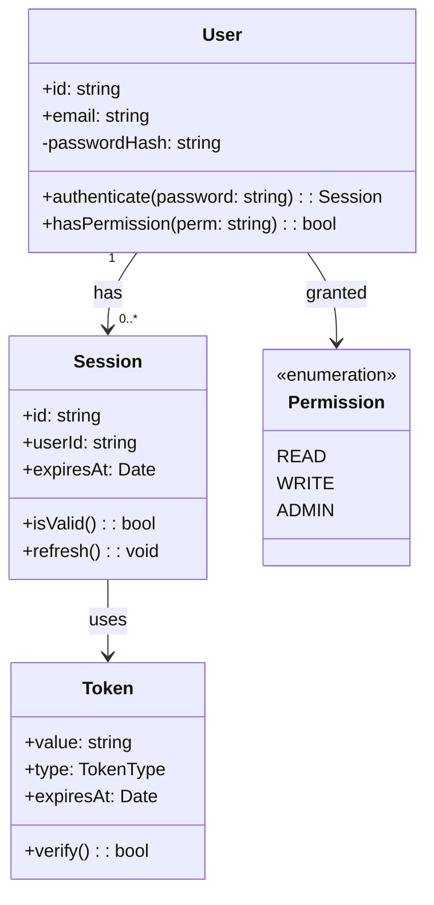
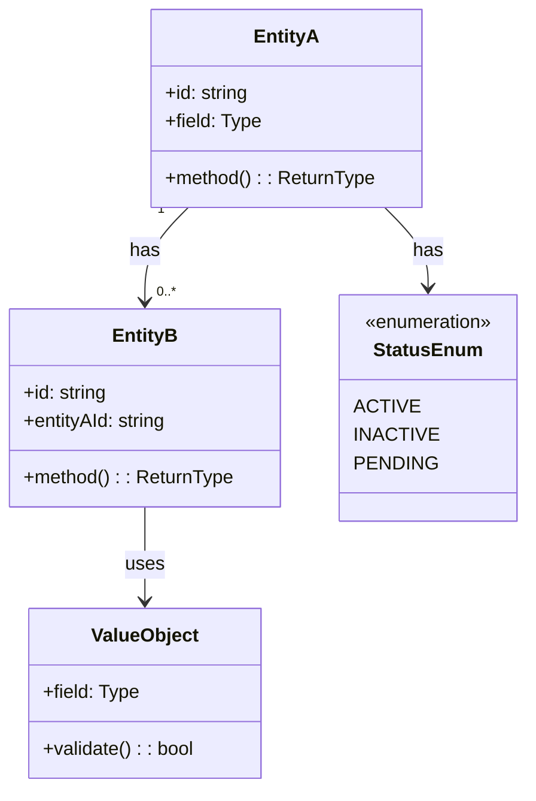

<!-- Source: https://github.com/SuperiorByteWorks-LLC/agent-project | License: Apache-2.0 | Author: Clayton Young / Superior Byte Works, LLC (Boreal Bytes) -->

# Class — Intermediate (4–8 classes)

Domain model with relationships. Use for documenting a bounded context or module.

---

## Example: E-Commerce Domain Model

---

## Example: Authentication System

---

## Copy-Paste Template

---

## Tips

- Use multiplicity labels: `"1"`, `"0..*"`, `"1..*"`
- `*--` for composition (strong ownership, child can't exist without parent)
- `o--` for aggregation (weak ownership, child can exist independently)
- `<<enumeration>>` for enum types
- `<<abstract>>` for abstract classes
