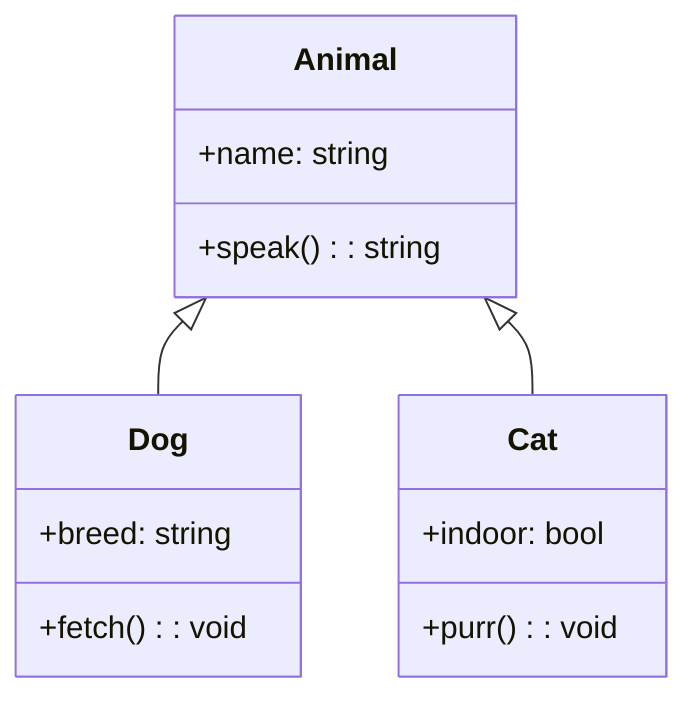
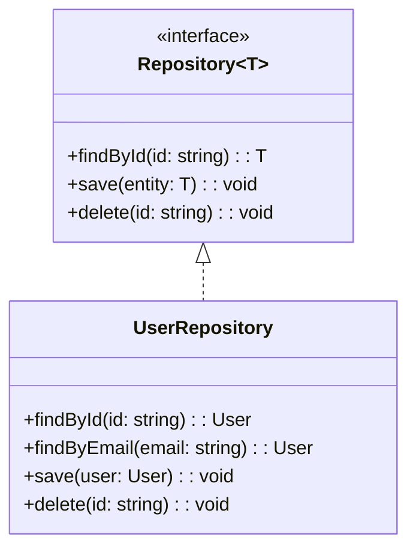
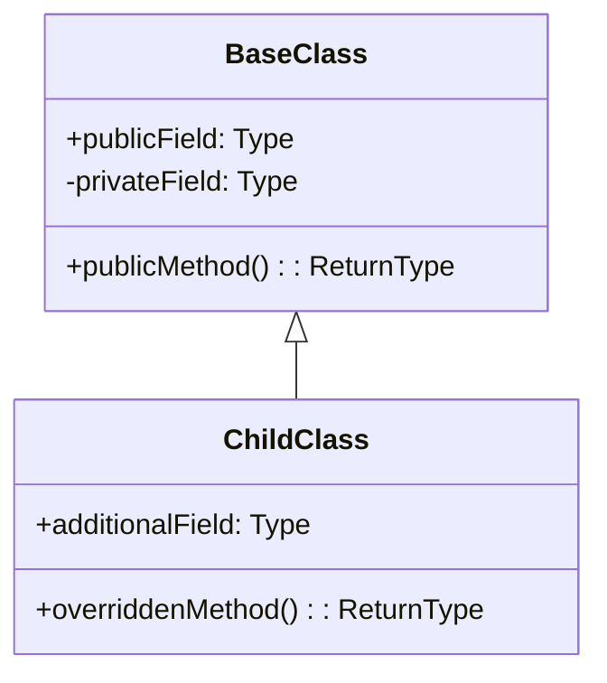

<!-- Source: https://github.com/SuperiorByteWorks-LLC/agent-project | License: Apache-2.0 | Author: Clayton Young / Superior Byte Works, LLC (Boreal Bytes) -->

# Class — Simple (2–4 classes)

Single hierarchy or interface. Use for quick type documentation.

---

## Example: Animal Hierarchy

---

## Example: Repository Interface

---

## Copy-Paste Template

---

## Tips

- Show only the most important fields and methods
- Use `<<interface>>` and `<<abstract>>` annotations for clarity
- `<|--` for inheritance (arrow points to parent)
- `..|>` for implementation (arrow points to interface)
