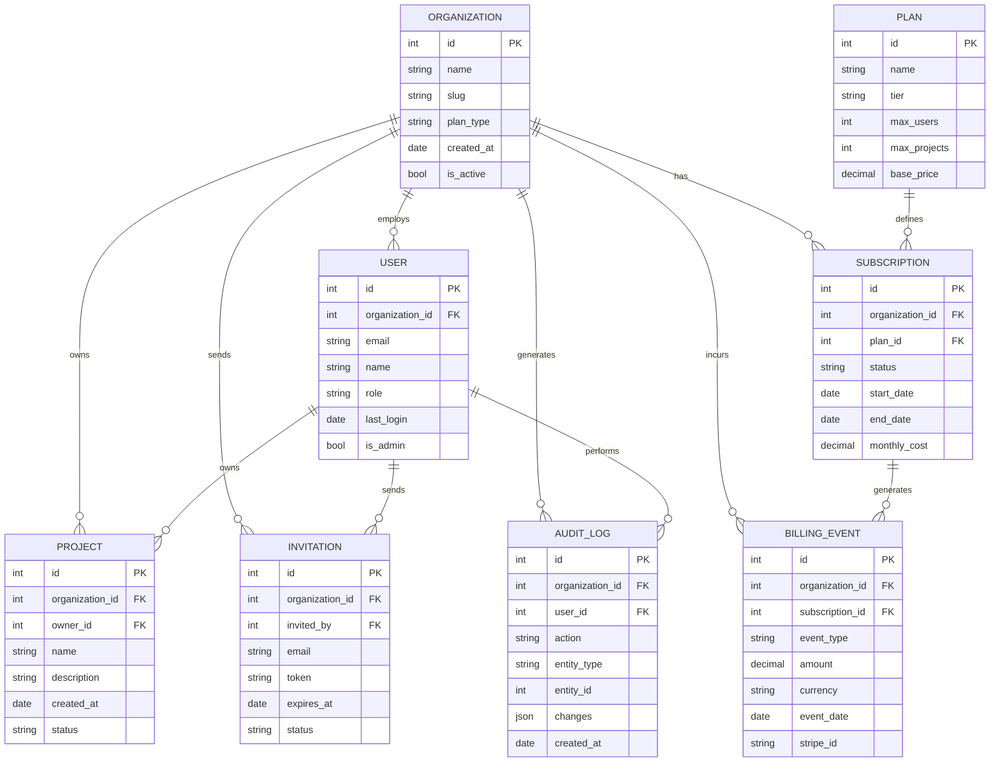
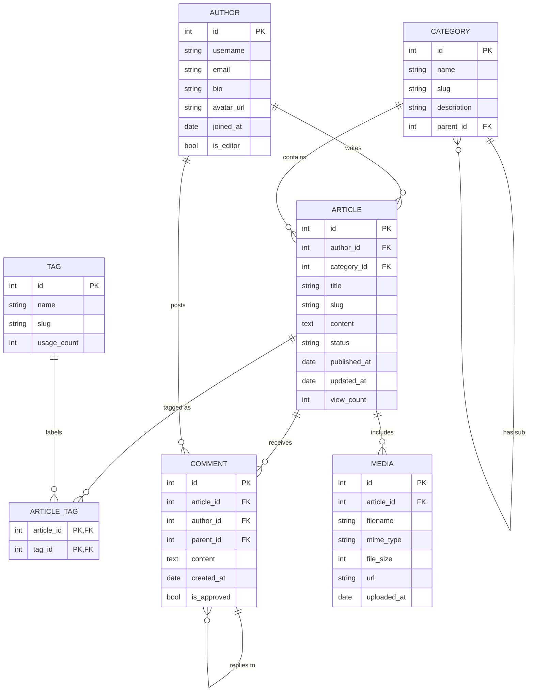
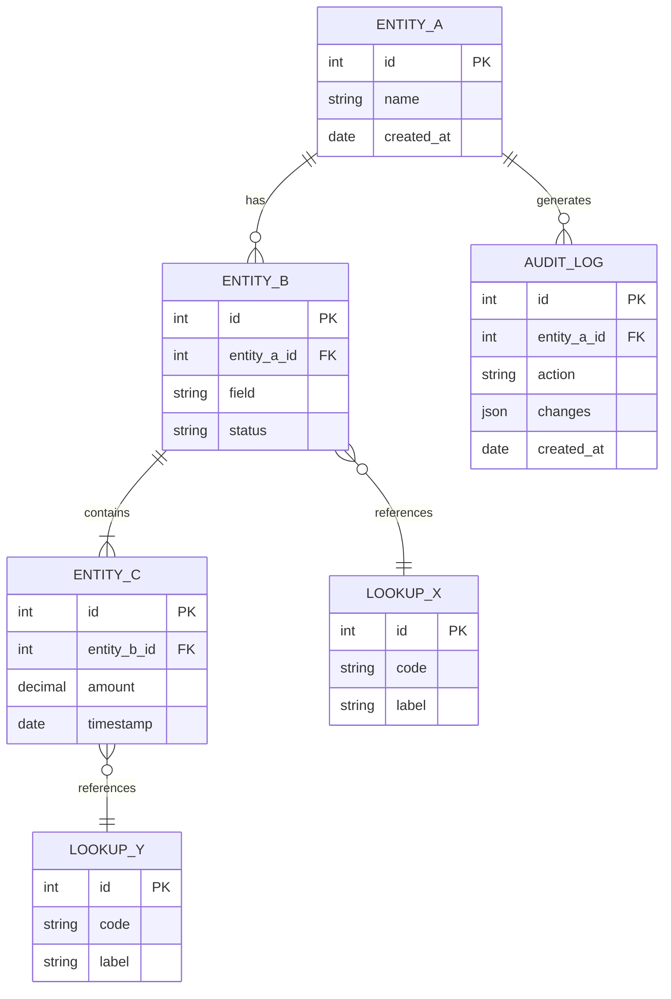

<!-- Source: https://github.com/SuperiorByteWorks-LLC/agent-project | License: Apache-2.0 | Author: Clayton Young / Superior Byte Works, LLC (Boreal Bytes) -->

# ER — Advanced (8–15 entities)

Full database schema. Use for documenting complete domain models with multiple relationships.

---

## Example: SaaS Platform Schema

---

## Example: Content Management System

---

## Copy-Paste Template

---

## Tips

- Group related entities visually by placing them near each other
- Use junction tables (like ARTICLE_TAG) for many-to-many relationships
- Consider splitting into multiple diagrams if exceeding 15 entities
- Show audit/tracking tables to demonstrate data lineage
- Use consistent naming: `snake_case` for fields, `UPPER_CASE` for entities
