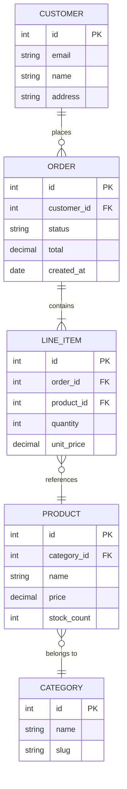
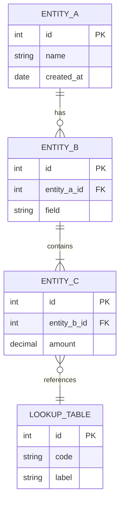

<!-- Source: https://github.com/SuperiorByteWorks-LLC/agent-project | License: Apache-2.0 | Author: Clayton Young / Superior Byte Works, LLC (Boreal Bytes) -->

# ER — Intermediate (4–8 entities)

Domain model. Use for documenting a bounded context's data model.

---

## Example: E-Commerce Schema

---

## Copy-Paste Template

---

## Tips

- Show only the most important fields — not every column
- Group related entities visually by placing them near each other
- Use consistent naming: `snake_case` for fields, `UPPER_CASE` for entities
- Mark all foreign keys with `FK`
