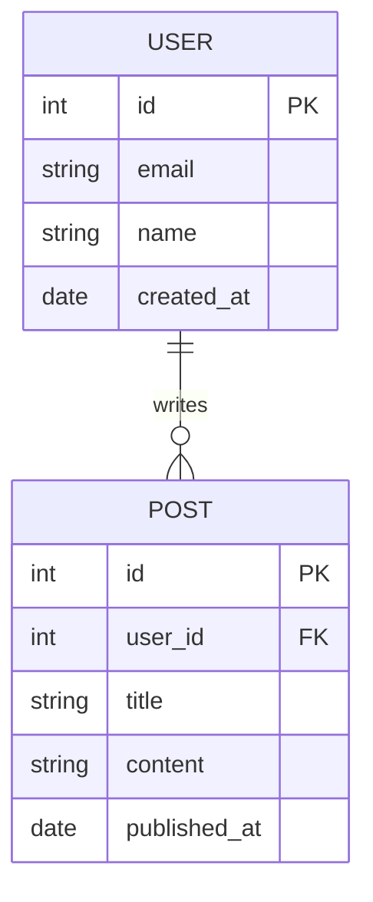
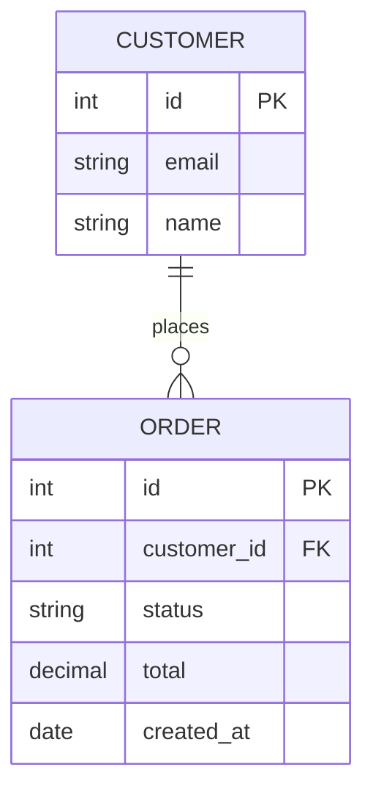
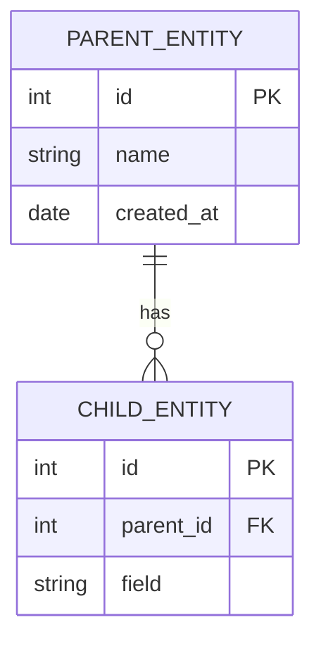

<!-- Source: https://github.com/SuperiorByteWorks-LLC/agent-project | License: Apache-2.0 | Author: Clayton Young / Superior Byte Works, LLC (Boreal Bytes) -->

# ER — Simple (2–4 entities)

Single relationship. Use for documenting a core entity pair.

---

## Example: User and Post

---

## Example: Order and Customer

---

## Copy-Paste Template

---

## Tips

- `||--o{` = one parent to zero-or-many children (most common)
- `||--|{` = one parent to one-or-many children (required relationship)
- Relationship labels are verb phrases: `"places"`, `"contains"`, `"belongs to"`
- Always mark `PK` and `FK` explicitly
