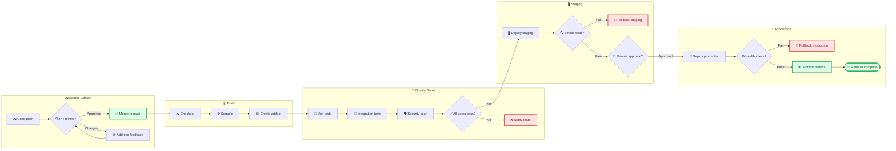
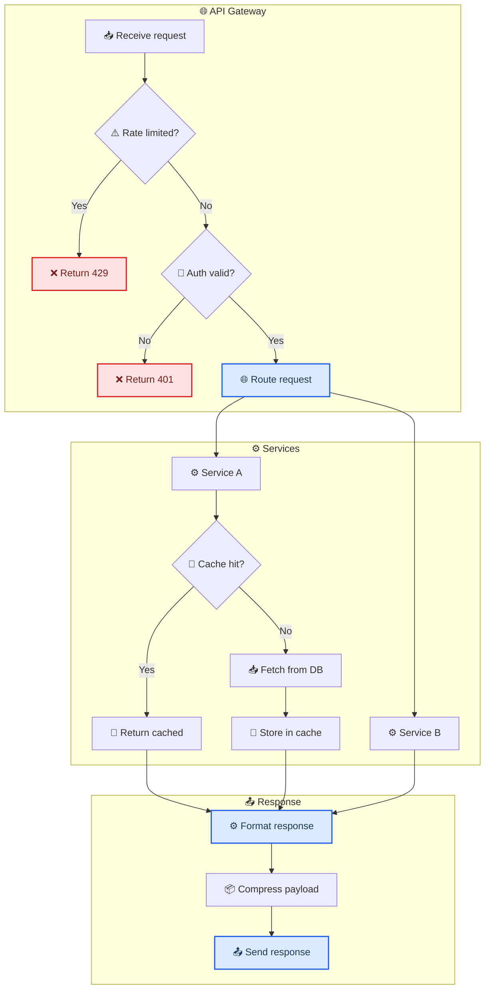
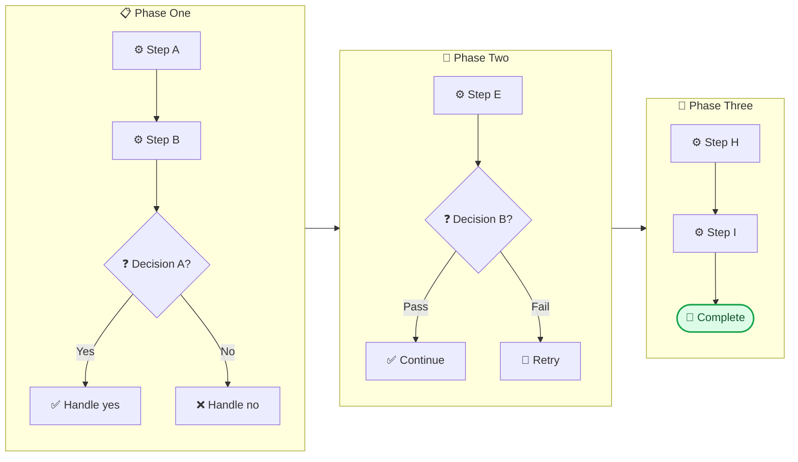

<!-- Source: https://github.com/SuperiorByteWorks-LLC/agent-project | License: Apache-2.0 | Author: Clayton Young / Superior Byte Works, LLC (Boreal Bytes) -->

# Flowchart — Advanced (20–30 nodes)

Subgraphs are mandatory. 3–6 subgraphs, each with a clear title and purpose. Consider overview + detail approach.

---

## Example: Full Deployment Pipeline with Rollback

---

## Example: Microservice Request Lifecycle

---

## Copy-Paste Template

---

## Tips

- Consider splitting into overview + detail if this exceeds 30 nodes
- Use `classDef` to color-code subgraph purposes (max 3–4 classes)
- One primary flow direction — don't mix `LR` and `TB` in the same diagram
- Link to detail diagrams in prose: _"See [detail diagram] for the full X flow."_
