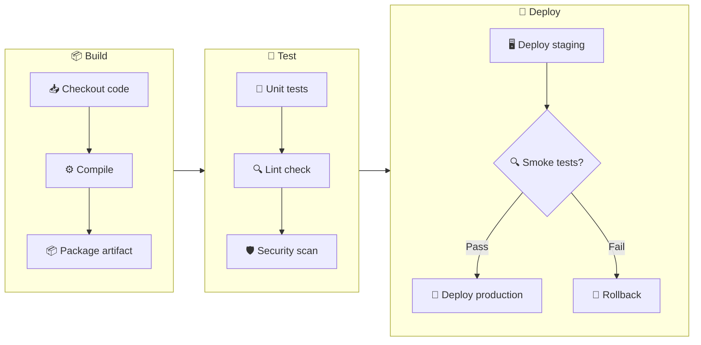
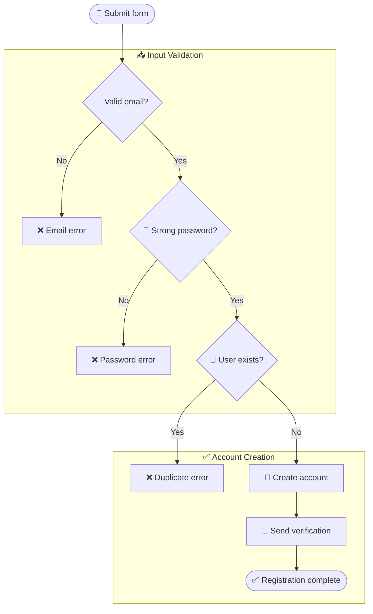
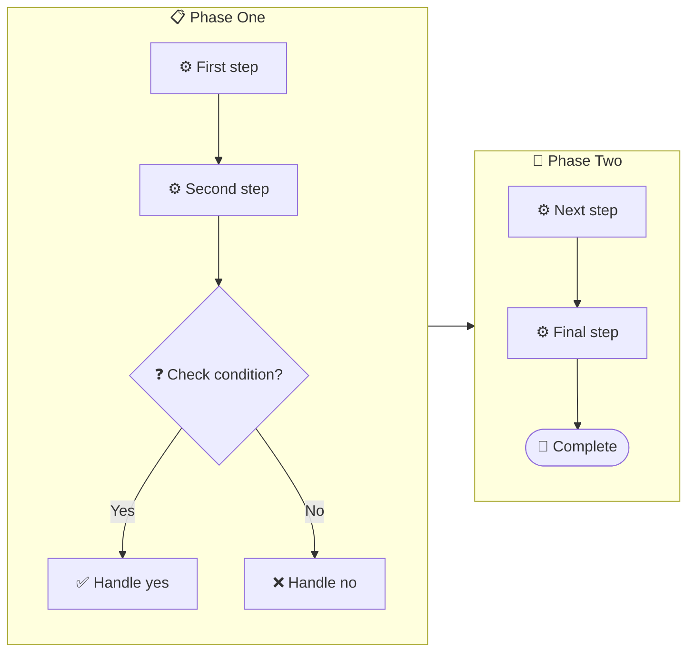

<!-- Source: https://github.com/SuperiorByteWorks-LLC/agent-project | License: Apache-2.0 | Author: Clayton Young / Superior Byte Works, LLC (Boreal Bytes) -->

# Flowchart — Intermediate (10–20 nodes)

Use subgraphs to group related nodes into 2–4 logical clusters.

---

## Example: CI/CD Pipeline

---

## Example: User Registration Flow

---

## Copy-Paste Template

---

## Tips

- Group by stage, domain, team, or layer — whatever creates the clearest mental model
- 2–6 nodes per subgraph is ideal
- Connect subgraphs at the subgraph level for leadership view, or at internal nodes for engineering view
- Keep ≤3 decision points per subgraph
