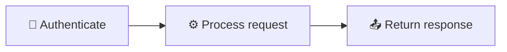
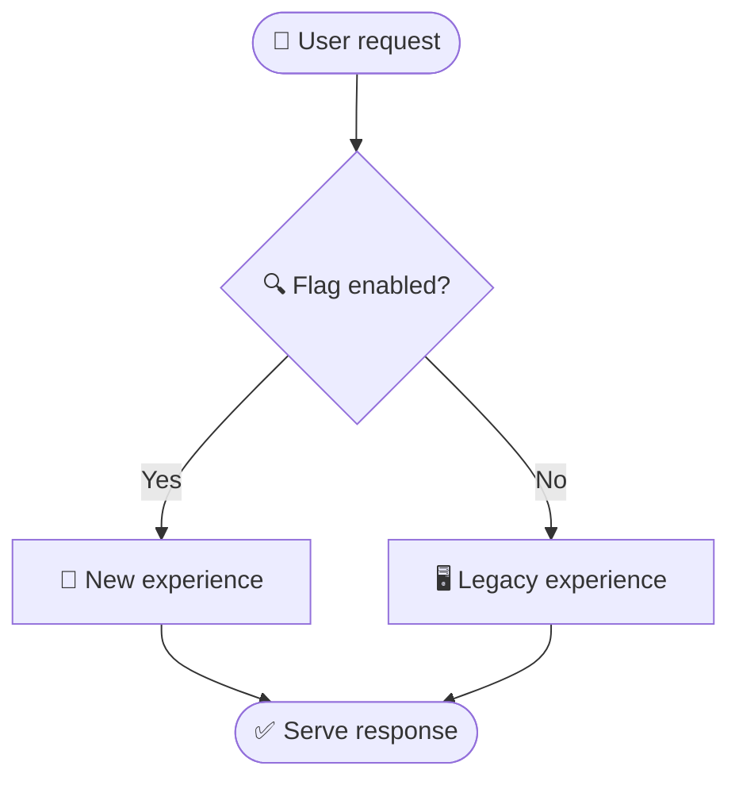
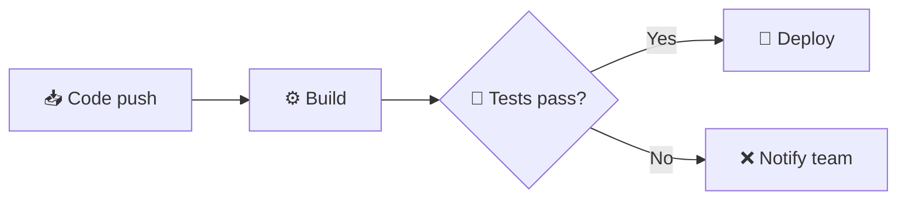
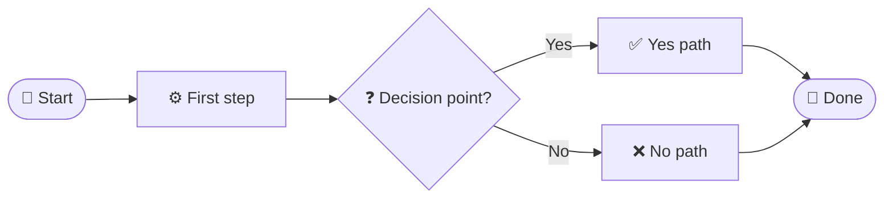

<!-- Source: https://github.com/SuperiorByteWorks-LLC/agent-project | License: Apache-2.0 | Author: Clayton Young / Superior Byte Works, LLC (Boreal Bytes) -->

# Flowchart — Simple (1–10 nodes)

Flat diagram, no subgraphs needed. Use for single concepts and quick illustrations.

---

## Example: API Request Flow

---

## Example: Feature Flag Decision

---

## Example: Build Pass/Fail

---

## Copy-Paste Template

---

## Tips

- Keep it flat — no subgraphs needed at this scale
- Use `LR` for left-to-right pipelines, `TB` for top-down decision trees
- Diamond `{text}` for decisions only — don't use for regular steps
- Start/end nodes use rounded rectangle `([text])`
