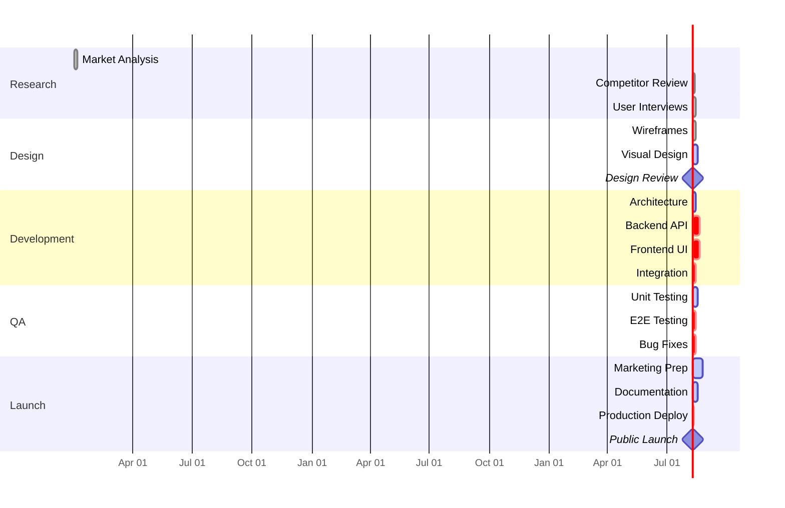
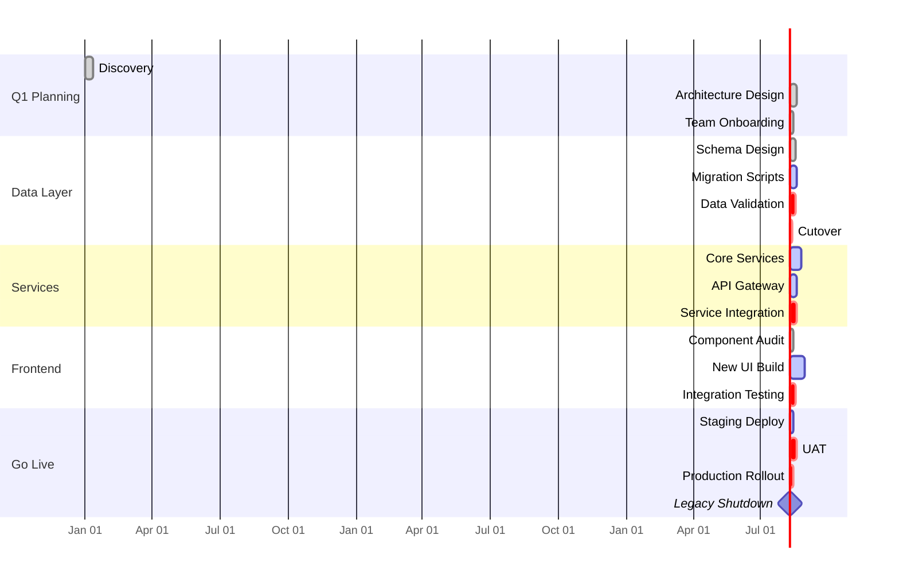
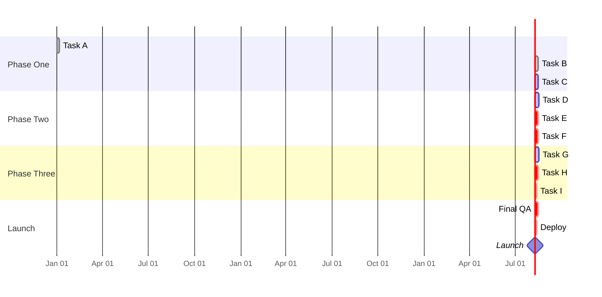

<!-- Source: https://github.com/SuperiorByteWorks-LLC/agent-project | License: Apache-2.0 | Author: Clayton Young / Superior Byte Works, LLC (Boreal Bytes) -->

# Gantt — Advanced (8–15 tasks)

Full roadmap with dependencies and critical path. Use for documenting complex projects with multiple work streams and interdependencies.

---

## Example: Product Launch Roadmap

---

## Example: Multi-Quarter Initiative

---

## Copy-Paste Template

---

## Tips

- Use `crit` liberally to show the critical path through the project
- Cross-section dependencies: `after SectionName` references last task in that section
- Consider splitting into multiple diagrams if exceeding 15 tasks
- Use milestones (0d duration) for key decision points
- Link to detailed breakdowns in prose for complex phases
