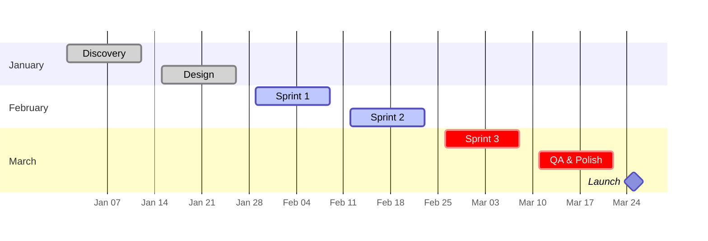
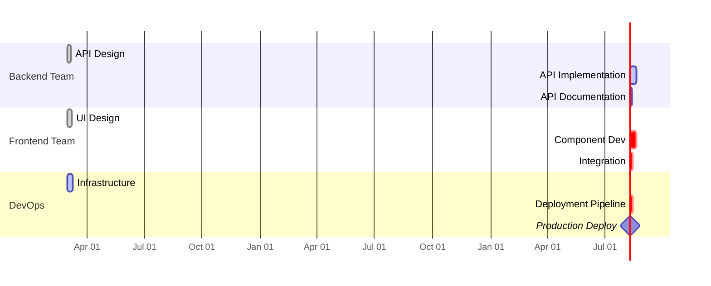
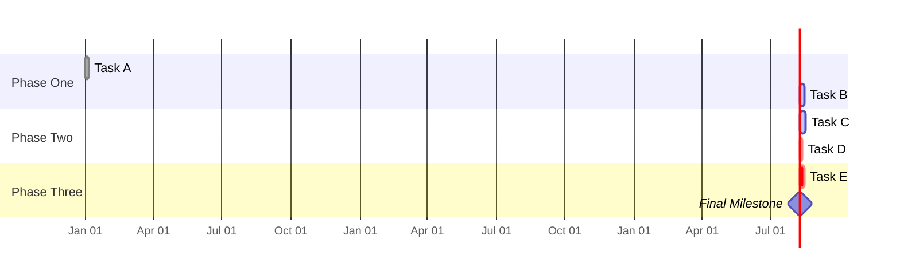

<!-- Source: https://github.com/SuperiorByteWorks-LLC/agent-project | License: Apache-2.0 | Author: Clayton Young / Superior Byte Works, LLC (Boreal Bytes) -->

# Gantt — Intermediate (4–8 tasks)

Multi-phase project with sections. Use for documenting projects with distinct phases or team handoffs.

---

## Example: Quarterly Roadmap

---

## Example: Cross-Team Project

---

## Copy-Paste Template

---

## Tips

- Use sections to group by phase, team, or epic
- `after prev` chains tasks within a section
- `after TaskName` creates cross-section dependencies
- `crit` highlights tasks on the critical path
- Keep 2–4 tasks per section for readability
