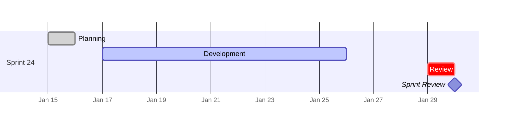
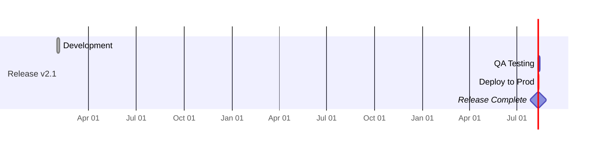
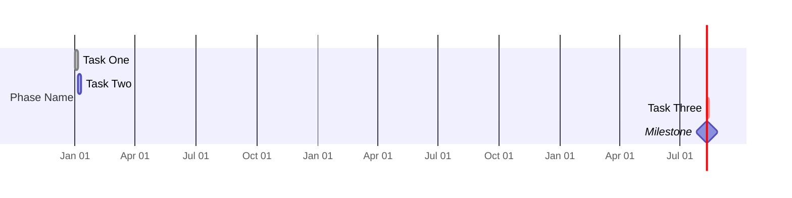

<!-- Source: https://github.com/SuperiorByteWorks-LLC/agent-project | License: Apache-2.0 | Author: Clayton Young / Superior Byte Works, LLC (Boreal Bytes) -->

# Gantt — Simple (2–4 tasks)

Single sprint or quick timeline. Use for documenting a brief iteration or simple schedule.

---

## Example: Two-Week Sprint

---

## Example: Feature Release

---

## Copy-Paste Template

---

## Tips

- Keep it flat — no need for multiple sections at this scale
- Use `after prev` to chain tasks with dependencies
- `crit` marks tasks on the critical path
- Milestones show as diamonds with zero duration
