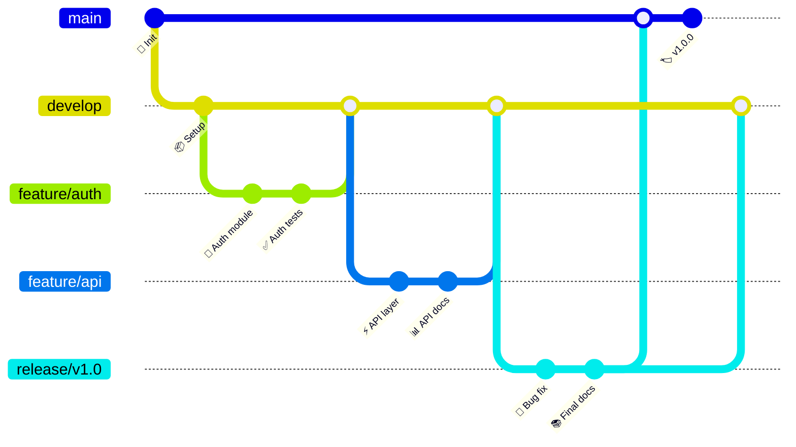
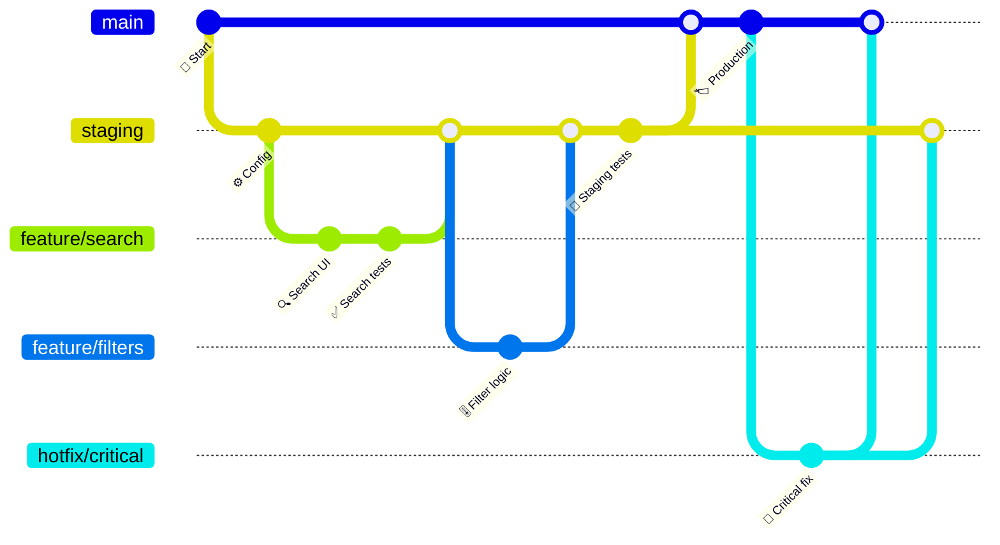
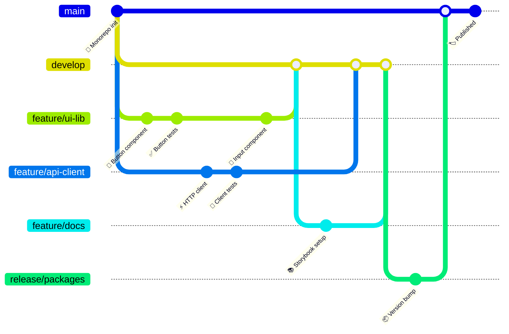
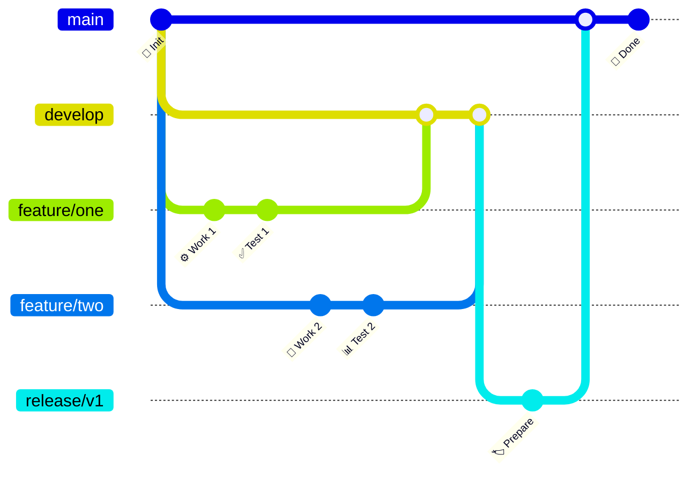

<!-- Source: https://github.com/SuperiorByteWorks-LLC/agent-project | License: Apache-2.0 | Author: Clayton Young / Superior Byte Works, LLC (Boreal Bytes) -->

# Git Graph — Advanced (12–20 commits)

Full GitFlow or complex branching strategy. Use for documenting team standards.

---

## Example: GitFlow Workflow

---

## Example: Multi-Environment Deployment

---

## Example: Monorepo Workflow

---

## Copy-Paste Template

---

## Tips

- Use consistent branch naming (feature/, hotfix/, release/)
- Show the full lifecycle from creation to merge
- Include version tags on main branch
- Demonstrate hotfix workflow if applicable
- Consider splitting very complex workflows into multiple diagrams
