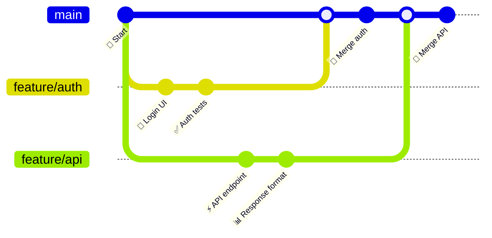
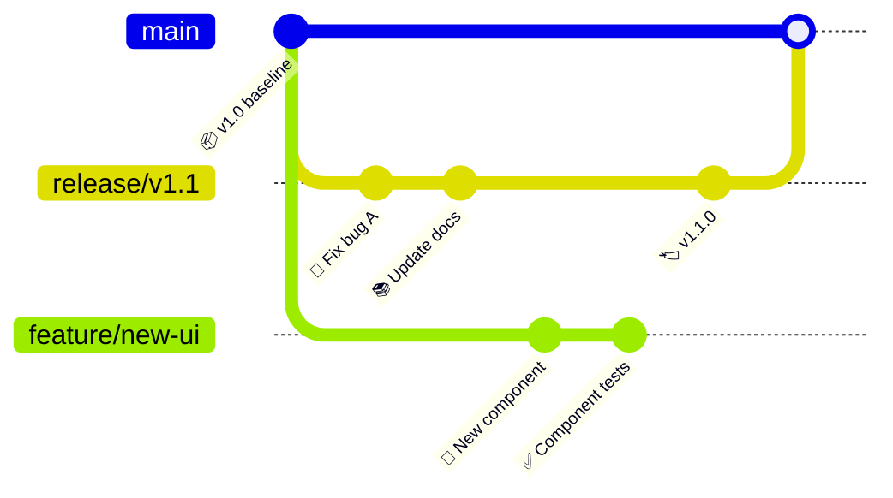
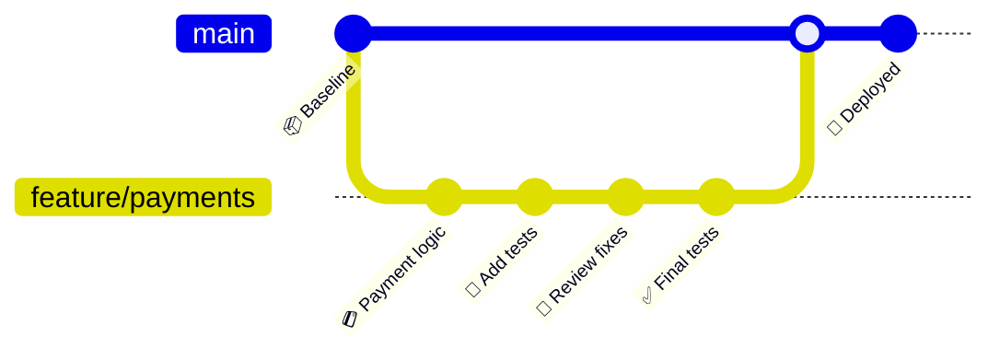
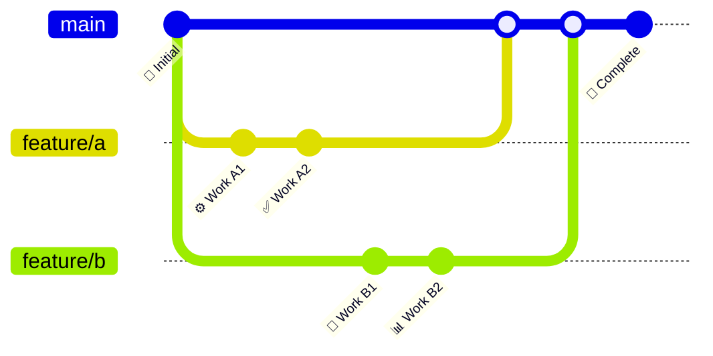

<!-- Source: https://github.com/SuperiorByteWorks-LLC/agent-project | License: Apache-2.0 | Author: Clayton Young / Superior Byte Works, LLC (Boreal Bytes) -->

# Git Graph — Intermediate (6–12 commits)

Multi-branch workflow with parallel development. Use for team collaboration patterns.

---

## Example: Parallel Feature Development

---

## Example: Release Branch Workflow

---

## Example: Code Review Workflow

---

## Copy-Paste Template

---

## Tips

- Show 2–3 parallel branches maximum
- Demonstrate the merge order clearly
- Use checkout before every branch switch
- Tag release commits with version numbers
