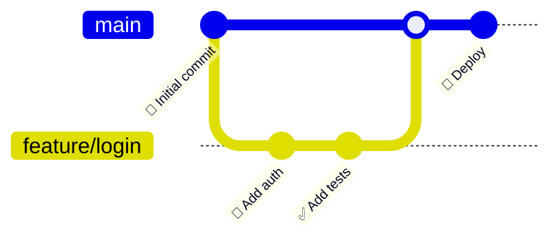
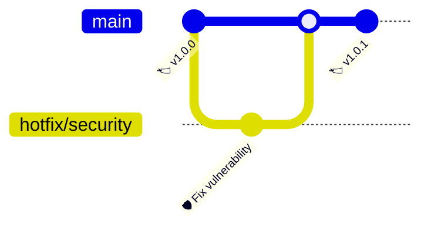
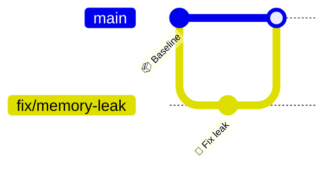
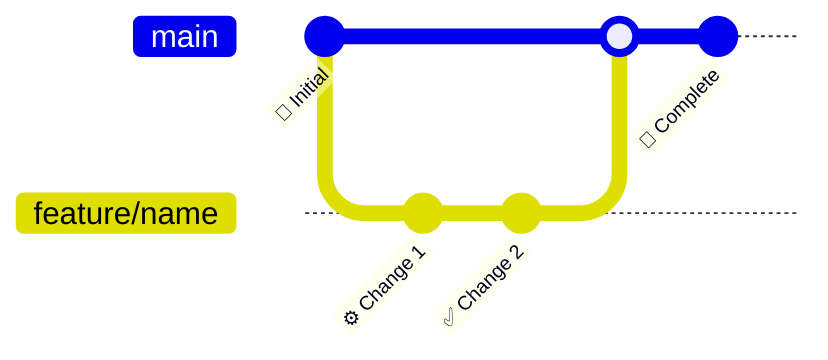

<!-- Source: https://github.com/SuperiorByteWorks-LLC/agent-project | License: Apache-2.0 | Author: Clayton Young / Superior Byte Works, LLC (Boreal Bytes) -->

# Git Graph — Simple (3–6 commits)

Single feature branch workflow. Use for basic branching examples and quick illustrations.

---

## Example: Feature Branch Workflow

---

## Example: Hotfix Workflow

---

## Example: Bug Fix Branch

---

## Copy-Paste Template

---

## Tips

- Keep main branch commits minimal (2–3)
- Feature branches should show 2–4 commits
- Use emojis in commit messages for quick scanning
- Always show the merge back to main
