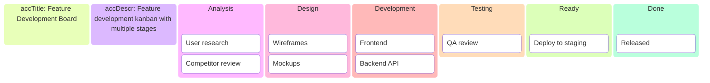

<!-- Source: https://github.com/SuperiorByteWorks-LLC/agent-project | License: Apache-2.0 | Author: Clayton Young / Superior Byte Works, LLC (Boreal Bytes) -->

# Kanban — Intermediate (6–12 cards)

Sprint board with assignments. Use for team sprint planning.

---

## Example: Sprint Board

```mermaid
kanban
 accTitle: Sprint 24 Board
 accDescr: Sprint kanban with task assignments and status

 Backlog
  [API docs]{assigned: 'Alice'}
  [Unit tests]{assigned: 'Bob'}

 Todo
  [Auth UI]{assigned: 'Carol'}
  [Database schema]{assigned: 'Dave'}
  [Email templates]{assigned: 'Alice'}

 In Progress
  [Login form]{assigned: 'Carol'}
  [Setup Redis]{assigned: 'Dave'}

 Review
  [Dark mode]{assigned: 'Bob'}

 Done
  [Project setup]{assigned: 'Alice'}
  [CI pipeline]{assigned: 'Dave'}
```

---

## Example: Feature Board



---

## Example: Support Board

```mermaid
kanban
 accTitle: Support Ticket Board
 accDescr: Support ticket tracking with priority and status

 New
  [Login issue]{assigned: 'Support'}
  [Billing question]{assigned: 'Support'}

 Triaged
  [API error]{assigned: 'Dev Team'}
  [UI bug]{assigned: 'Frontend'}

 In Progress
  [Performance issue]{assigned: 'Backend'}
  [Mobile crash]{assigned: 'Mobile'}

 Waiting
  [Customer response]{assigned: 'Support'}

 Resolved
  [Fixed auth bug]
  [Updated docs]
```

---

## Copy-Paste Template

```mermaid
kanban
 accTitle: REPLACE WITH 3-8 WORD TITLE
 accDescr: REPLACE WITH 1-2 sentences describing what this board shows

 Todo
  [Task 1]{assigned: 'Name'}
  [Task 2]{assigned: 'Name'}
  [Task 3]{assigned: 'Name'}

 In Progress
  [Task 4]{assigned: 'Name'}
  [Task 5]{assigned: 'Name'}

 Review
  [Task 6]{assigned: 'Name'}

 Done
  [Task 7]{assigned: 'Name'}
  [Task 8]{assigned: 'Name'}
```

---

## Tips

- Use assignments to show ownership
- 6–12 cards provides good coverage
- Consider additional columns (Review, Waiting)
- Group related tasks
