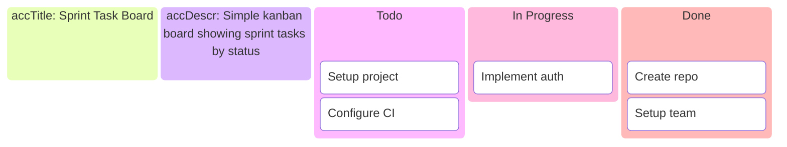
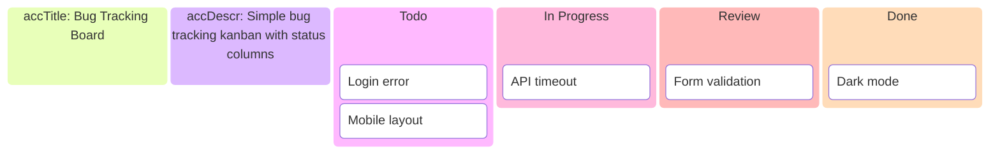
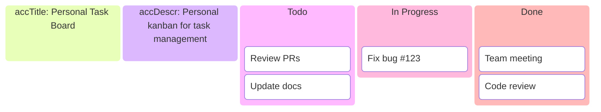
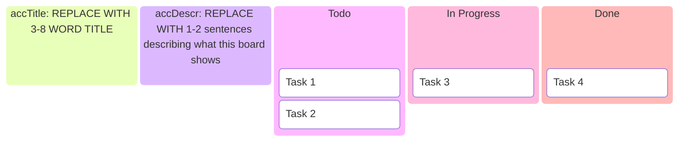

<!-- Source: https://github.com/SuperiorByteWorks-LLC/agent-project | License: Apache-2.0 | Author: Clayton Young / Superior Byte Works, LLC (Boreal Bytes) -->

# Kanban — Simple (3–6 cards)

Basic task board. Use for simple task tracking.

---

## Example: Sprint Tasks

---

## Example: Bug Tracking

---

## Example: Personal Tasks

---

## Copy-Paste Template

---

## Tips

- 3–6 cards is ideal for simple boards
- Use standard columns (Todo, In Progress, Done)
- Keep task names concise
- Consider adding IDs for tracking
