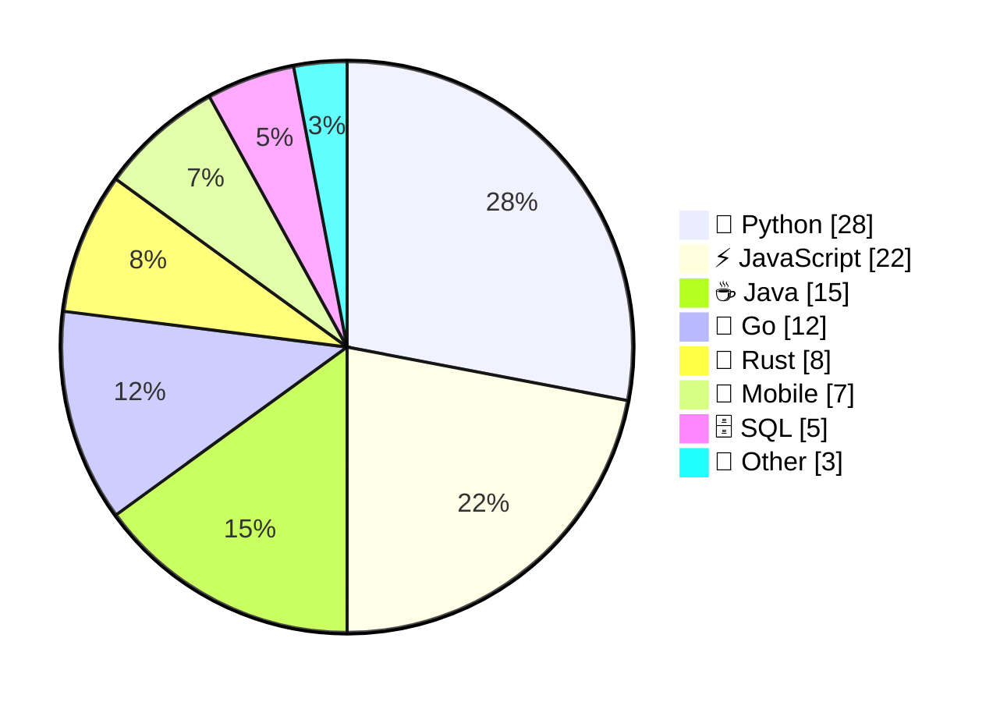
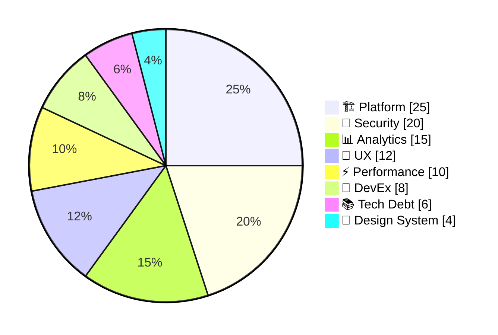
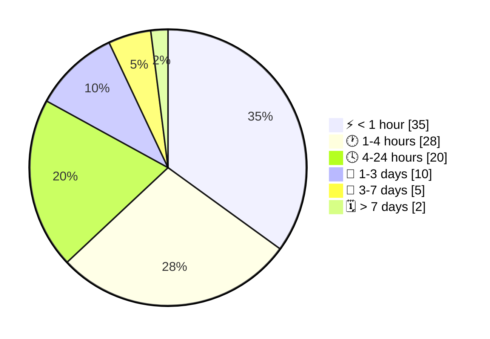
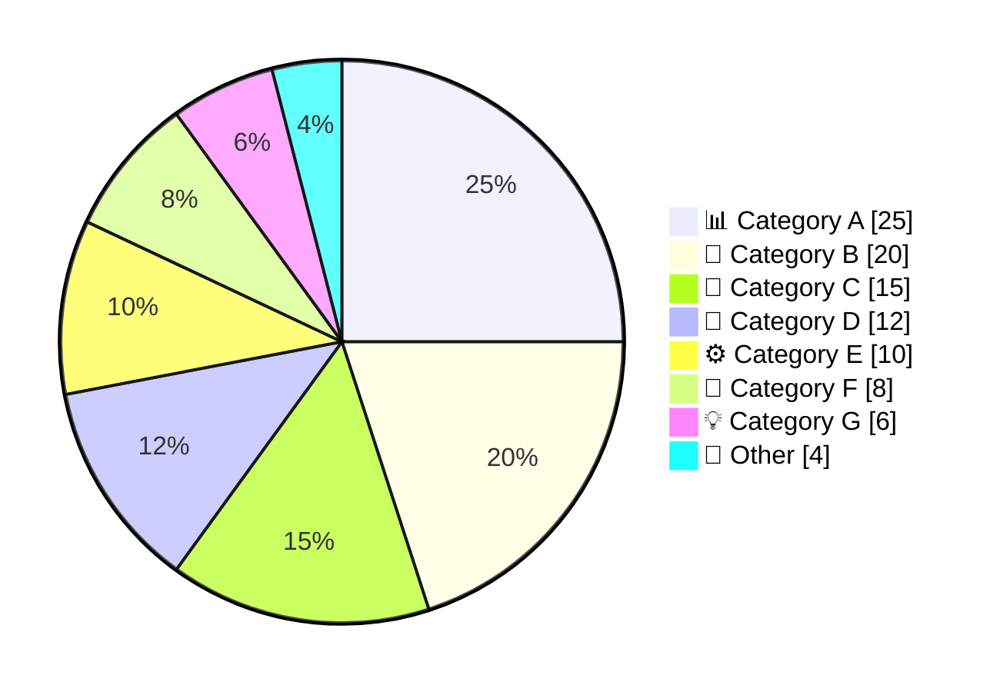

<!-- Source: https://github.com/SuperiorByteWorks-LLC/agent-project | License: Apache-2.0 | Author: Clayton Young / Superior Byte Works, LLC (Boreal Bytes) -->

# Pie Chart — Advanced (6–8 slices)

Complex distributions with detailed breakdown. Maximum complexity before considering alternatives.

---

## Example: Team Skill Distribution

---

## Example: Project Resource Allocation

---

## Example: Incident Response Time

---

## Copy-Paste Template

---

## Tips

- At 6–8 slices, consider if a bar chart would be clearer
- Always combine small slices (< 3%) into "Other"
- Use descriptive labels that include both category and meaning
- Consider alphabetical ordering if no natural size ordering exists
