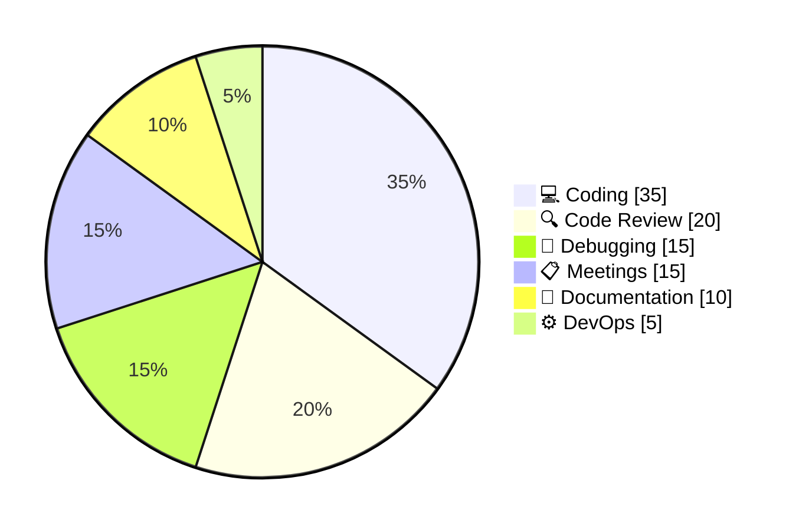
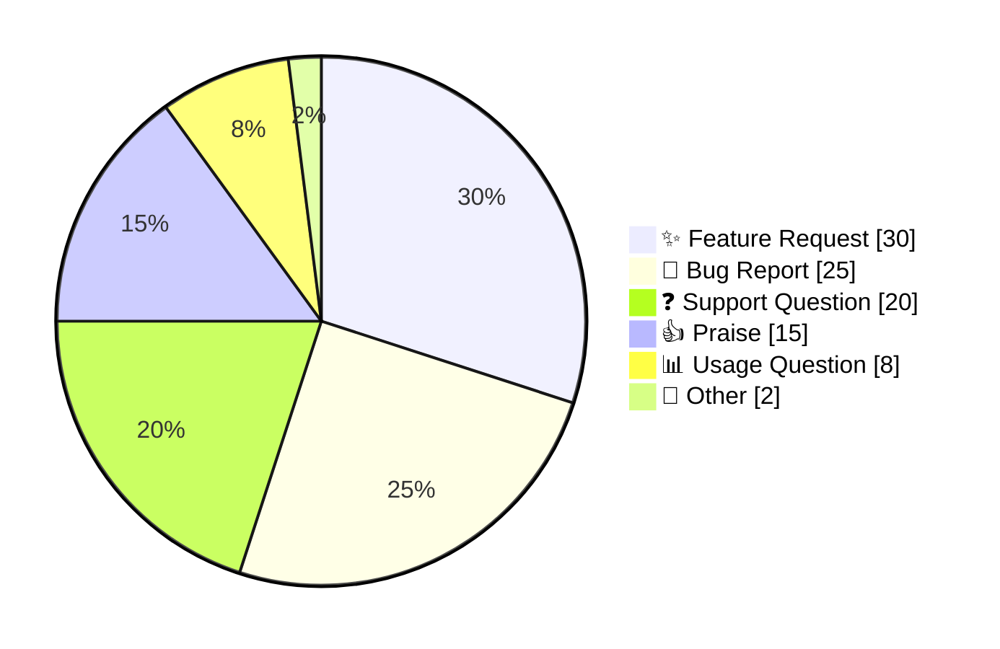
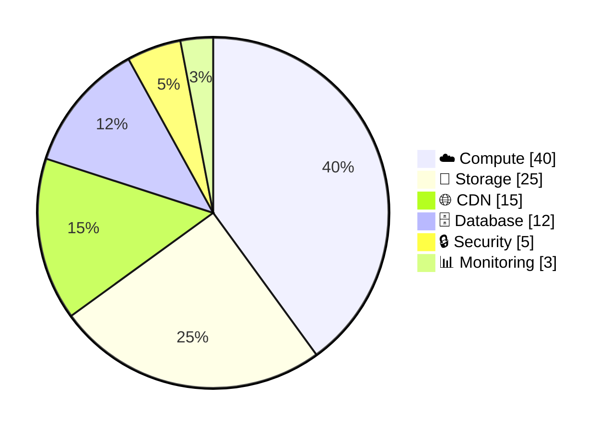
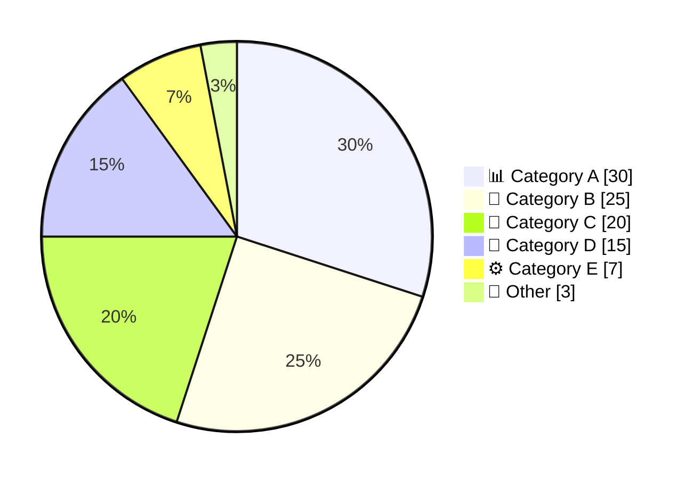

<!-- Source: https://github.com/SuperiorByteWorks-LLC/agent-project | License: Apache-2.0 | Author: Clayton Young / Superior Byte Works, LLC (Boreal Bytes) -->

# Pie Chart — Intermediate (4–6 slices)

Use for multi-category breakdowns. Consider combining small values into "Other".

---

## Example: Development Time by Activity

---

## Example: Customer Feedback Categories

---

## Example: Infrastructure Costs

---

## Copy-Paste Template

---

## Tips

- Combine slices under 5% into an "Other" category
- Use `showData` for percentage visibility
- 4–6 slices is the sweet spot for readability
- Group related categories with consistent emoji themes
