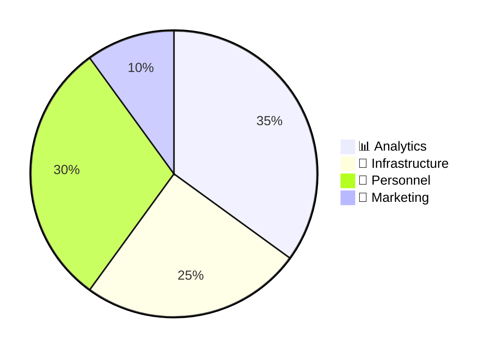
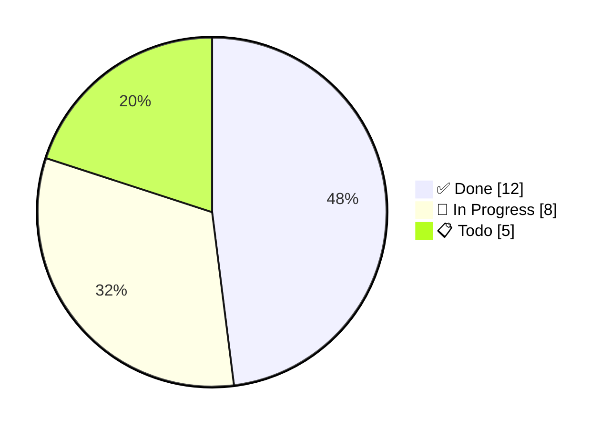
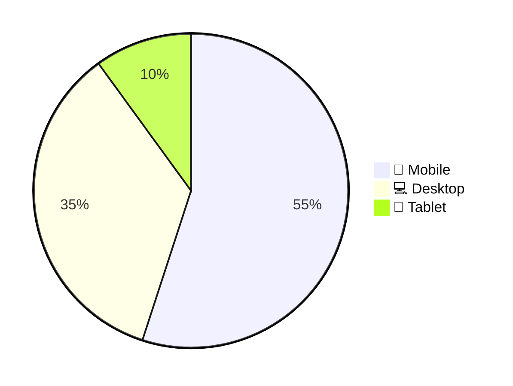
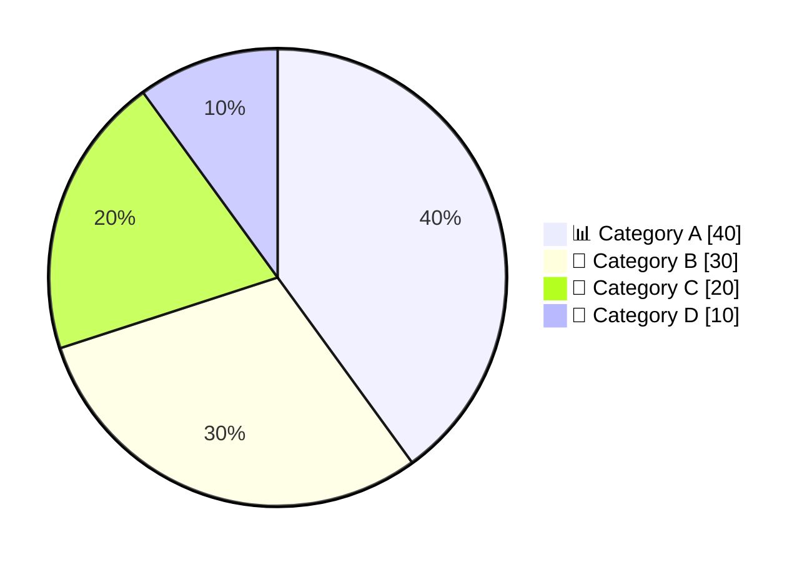

<!-- Source: https://github.com/SuperiorByteWorks-LLC/agent-project | License: Apache-2.0 | Author: Clayton Young / Superior Byte Works, LLC (Boreal Bytes) -->

# Pie Chart — Simple (2–4 slices)

Flat chart, no styling needed. Use for quick proportions and single metrics.

---

## Example: Budget Allocation

---

## Example: Task Status Distribution

---

## Example: User Device Types

---

## Copy-Paste Template

---

## Tips

- Use `showData` to display percentages on the chart
- 2–4 slices is ideal for simple charts
- Order by size (largest first) for visual clarity
- Emojis help distinguish categories at a glance
