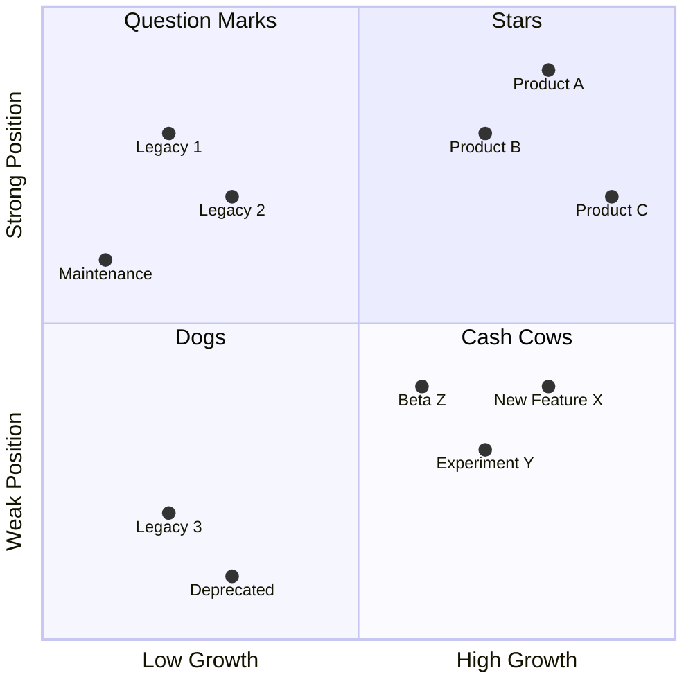
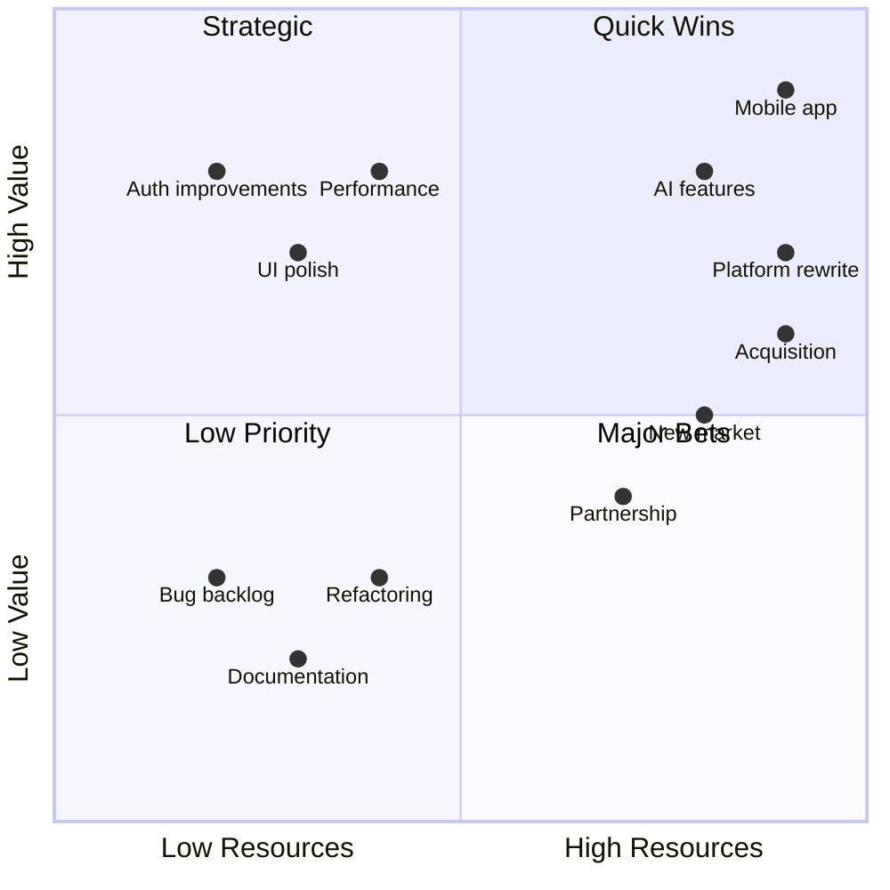
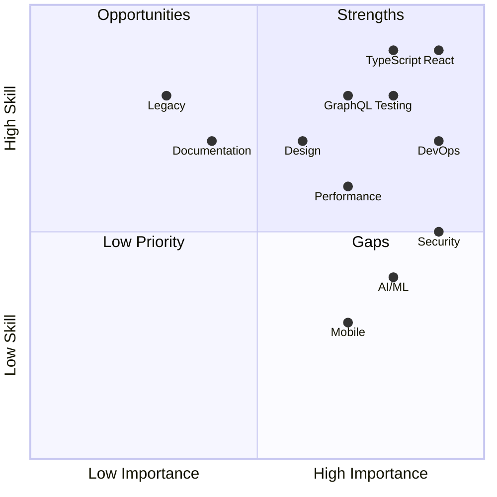
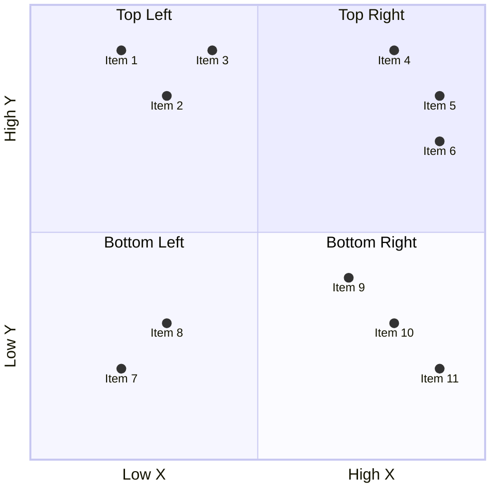

<!-- Source: https://github.com/SuperiorByteWorks-LLC/agent-project | License: Apache-2.0 | Author: Clayton Young / Superior Byte Works, LLC (Boreal Bytes) -->

# Quadrant Chart — Advanced (8–12 points)

Complex strategic analysis. Use for comprehensive planning and multi-dimensional analysis.

---

## Example: Product Portfolio

---

## Example: Initiative Planning

---

## Example: Team Skills

---

## Copy-Paste Template

---

## Tips

- At 8+ points, consider grouping by category
- Use consistent positioning logic
- Review positions with stakeholders
- Consider creating multiple focused charts instead
- Document the rationale for each position
