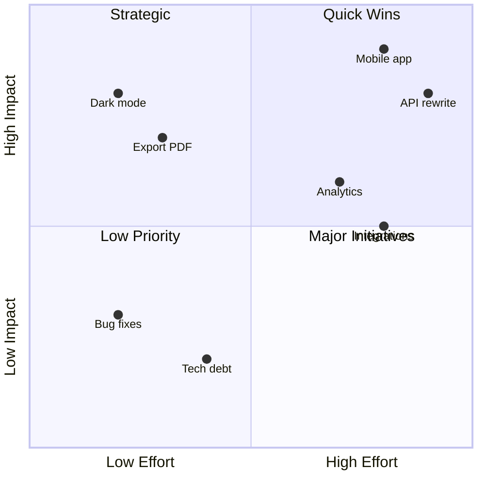
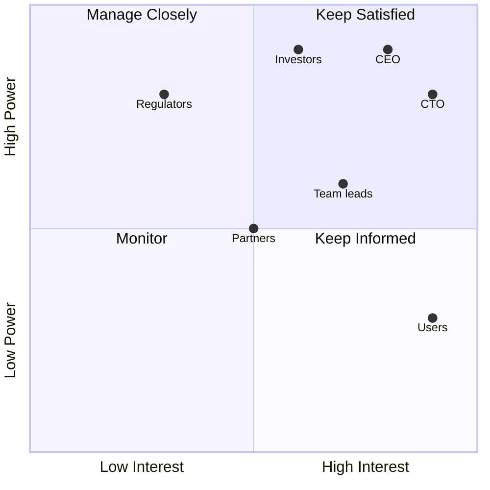
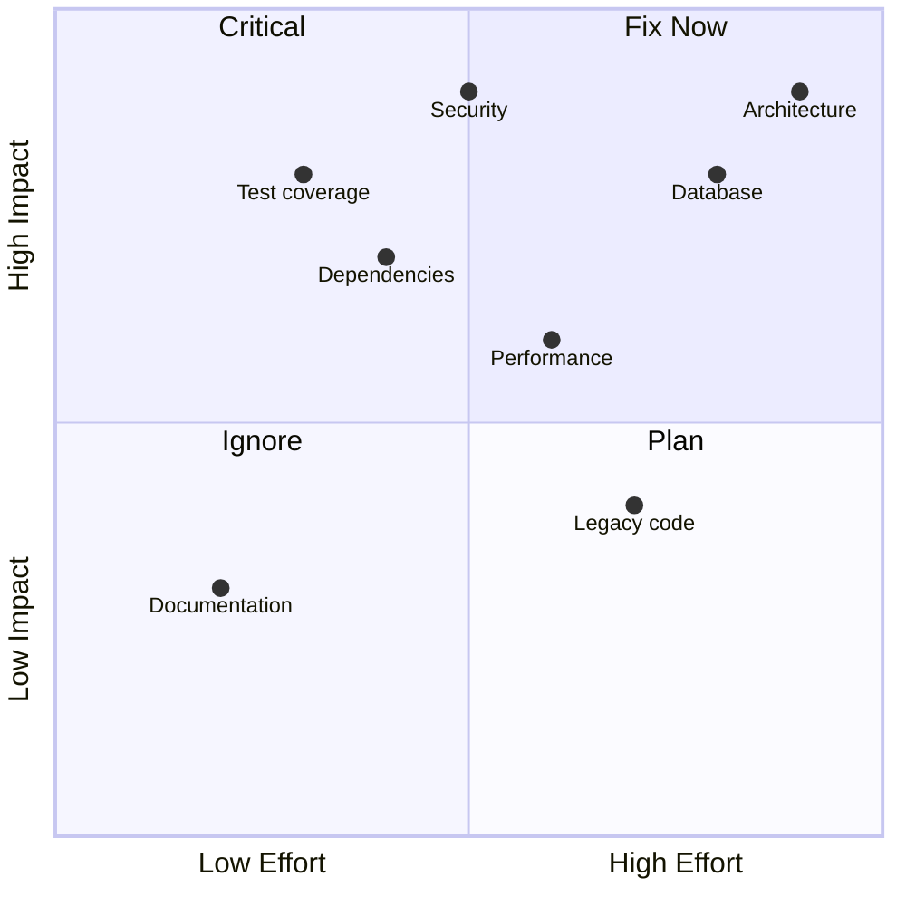
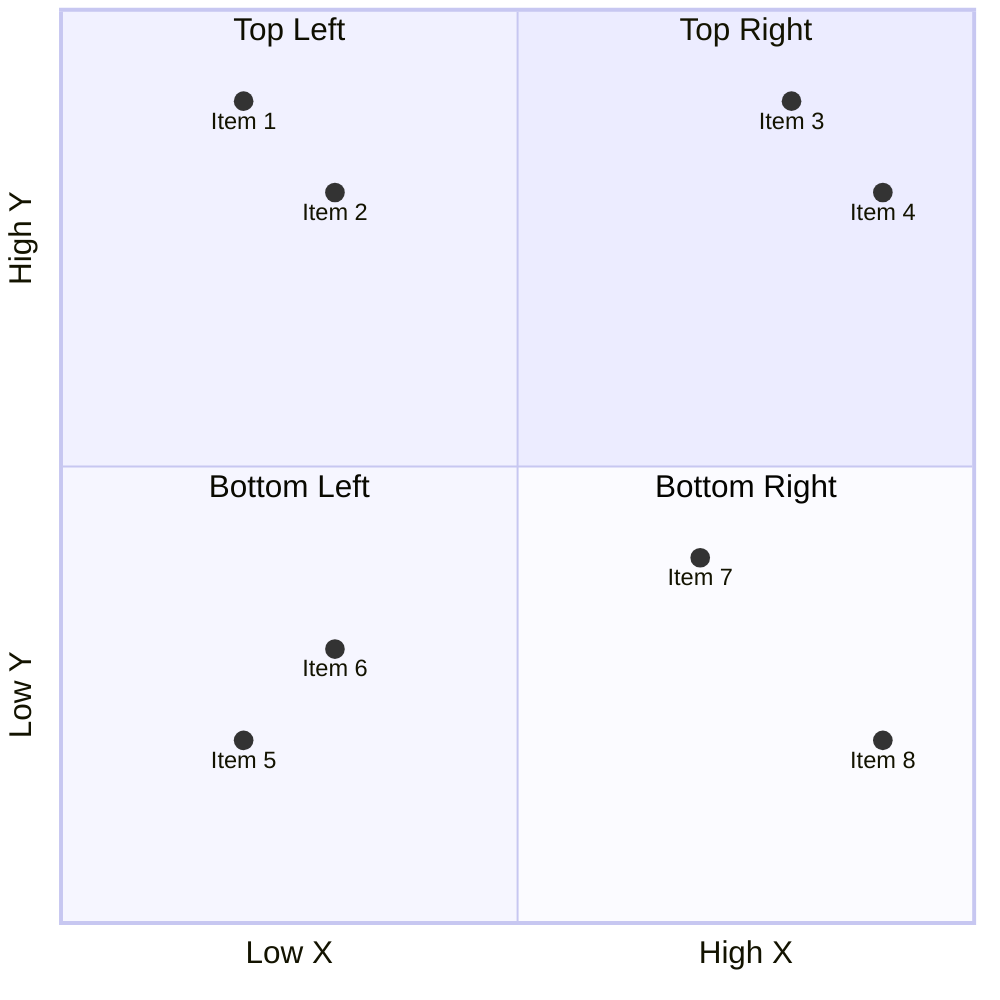

<!-- Source: https://github.com/SuperiorByteWorks-LLC/agent-project | License: Apache-2.0 | Author: Clayton Young / Superior Byte Works, LLC (Boreal Bytes) -->

# Quadrant Chart — Intermediate (4–8 points)

Multi-item prioritization. Use for team planning and strategic analysis.

---

## Example: Feature Roadmap

---

## Example: Stakeholder Mapping

---

## Example: Technical Debt

---

## Copy-Paste Template

---

## Tips

- Group related items in the same quadrant
- Use consistent naming conventions
- 4–8 points provides good coverage
- Consider color coding by category if supported
- Review and adjust positions based on team input
