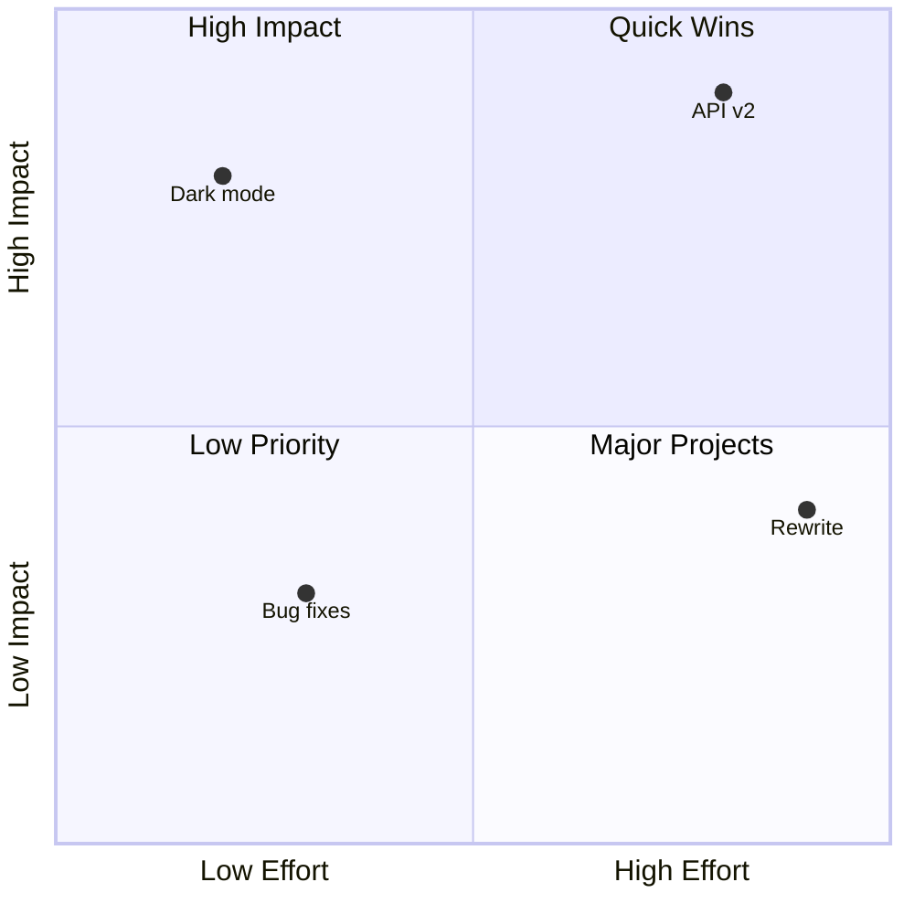
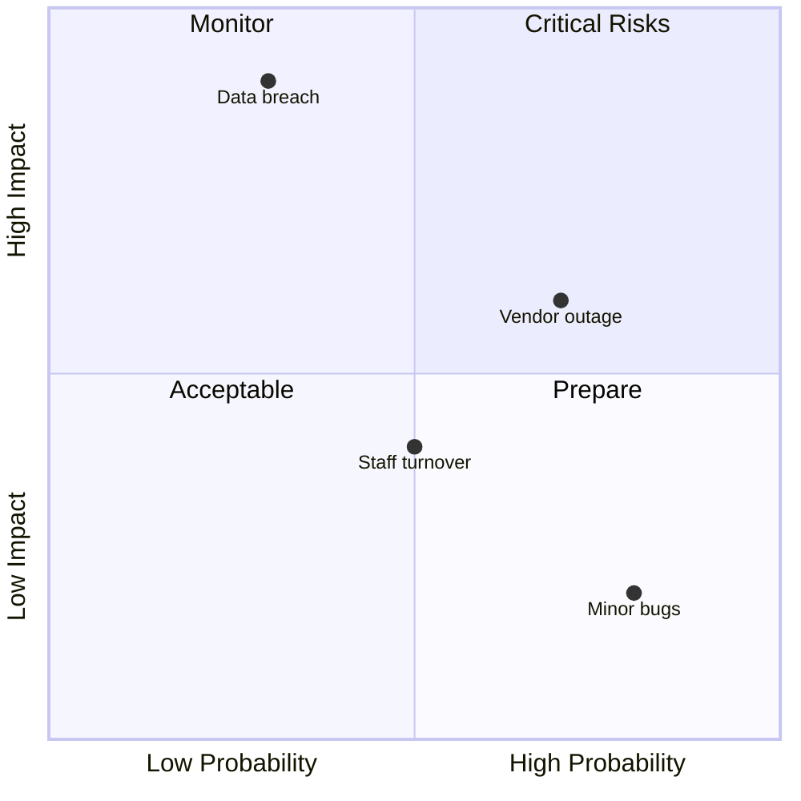
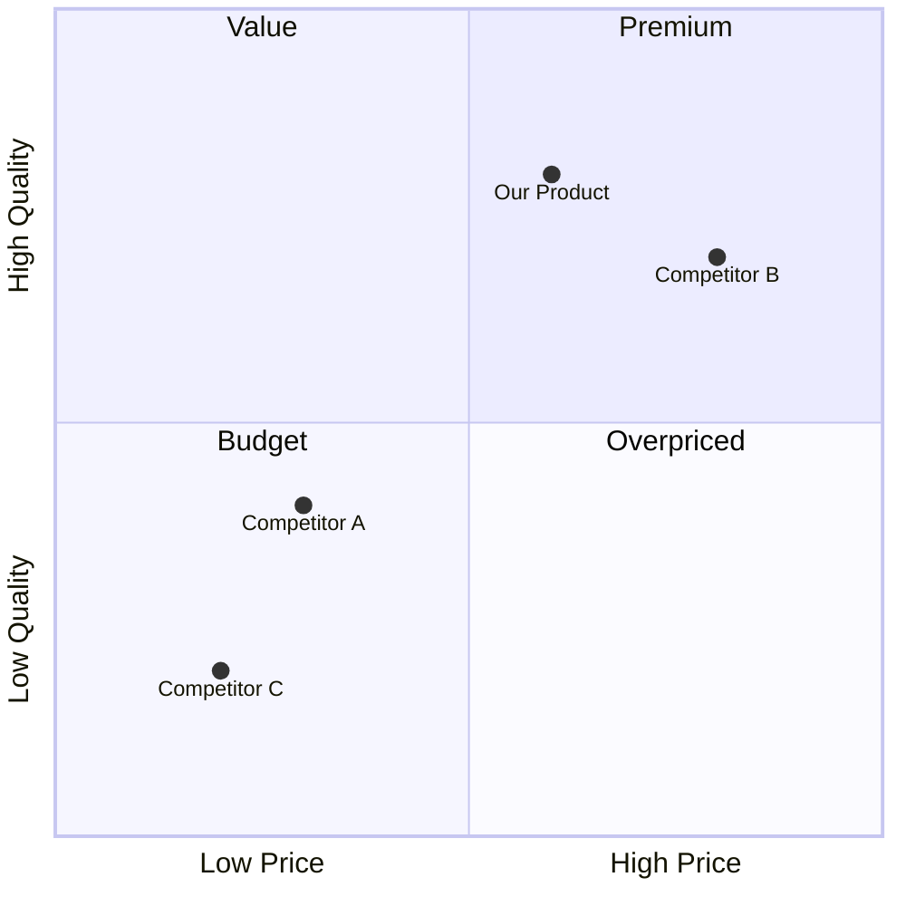
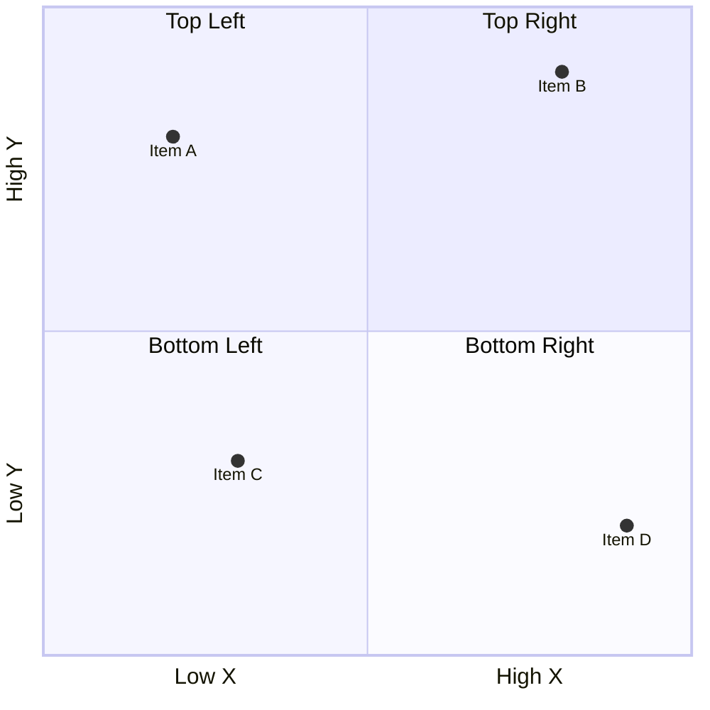

<!-- Source: https://github.com/SuperiorByteWorks-LLC/agent-project | License: Apache-2.0 | Author: Clayton Young / Superior Byte Works, LLC (Boreal Bytes) -->

# Quadrant Chart — Simple (2–4 points)

Basic 2x2 positioning. Use for simple prioritization and strategic positioning.

---

## Example: Effort vs Impact

---

## Example: Risk Assessment

---

## Example: Price vs Quality

---

## Copy-Paste Template

---

## Tips

- 2–4 points is ideal for simple charts
- Use descriptive point names
- Label axes with what they measure
- Give quadrants meaningful names
- Keep coordinates between 0 and 1
