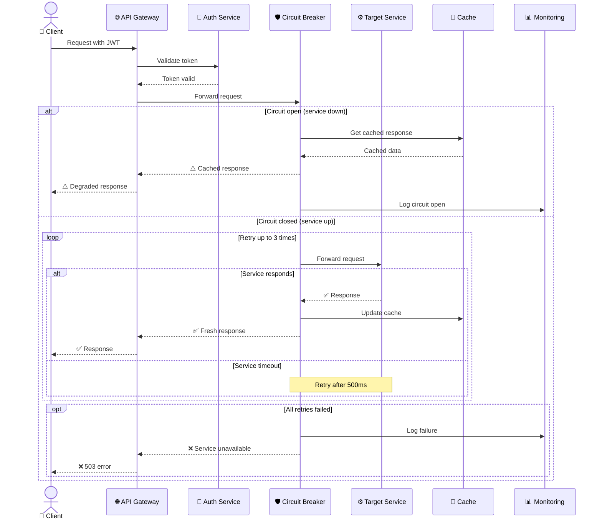
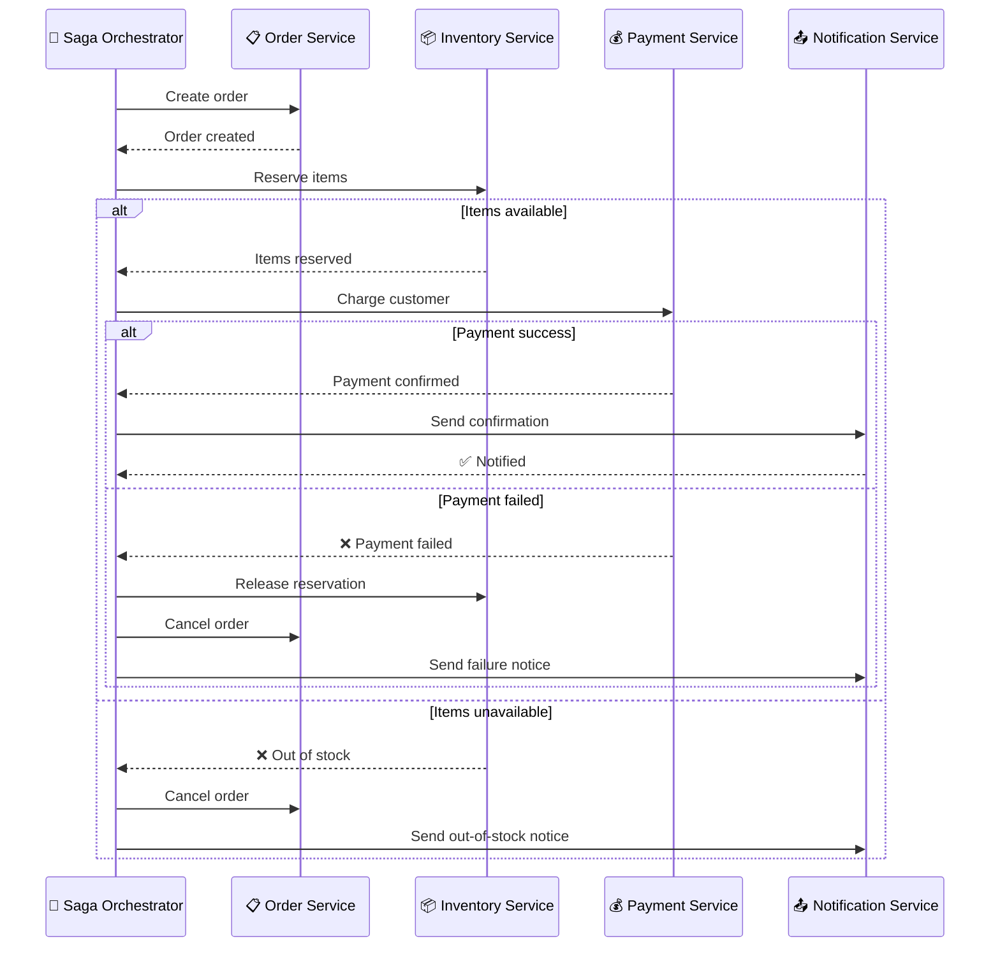
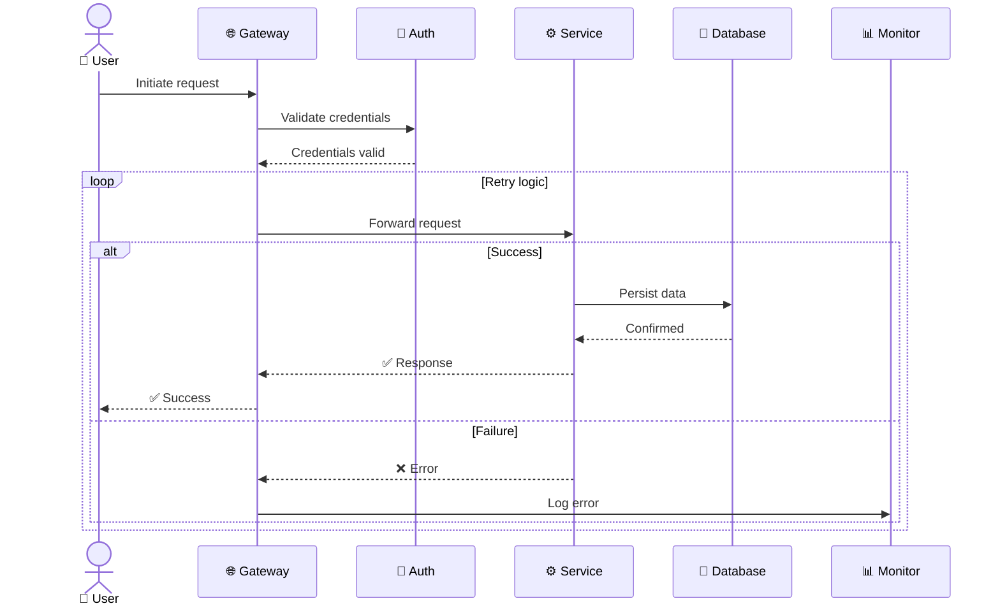

<!-- Source: https://github.com/SuperiorByteWorks-LLC/agent-project | License: Apache-2.0 | Author: Clayton Young / Superior Byte Works, LLC (Boreal Bytes) -->

# Sequence — Advanced (5–8 participants)

Full protocol documentation with loops, parallel operations, and complex branching.

---

## Example: Microservice Request with Circuit Breaker

---

## Example: Distributed Transaction (Saga Pattern)

---

## Copy-Paste Template

---

## Tips

- Consider splitting into multiple diagrams if this exceeds 8 participants
- Use `Note over A,B:` for annotations spanning multiple participants
- `par`/`and` blocks for truly parallel operations
- `critical`/`option` blocks for critical sections
- Link to simpler overview diagram in prose
