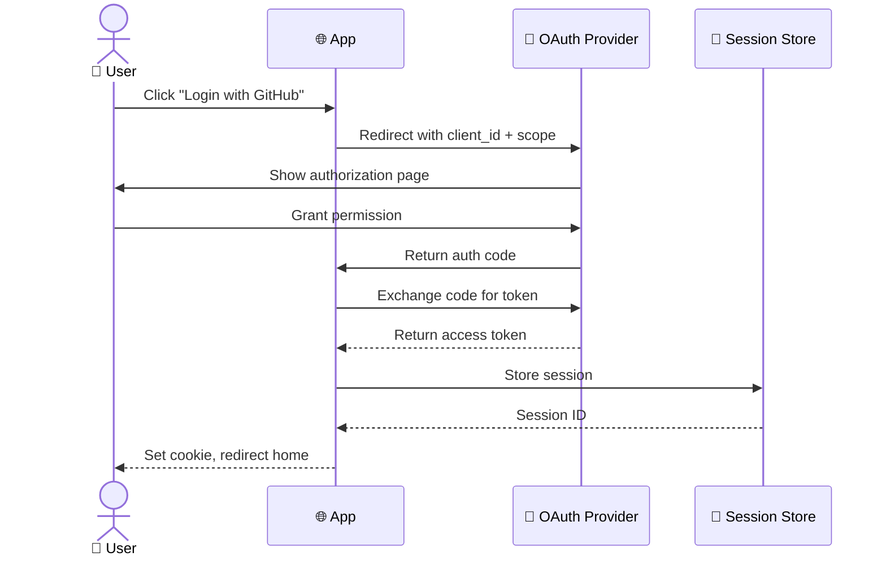
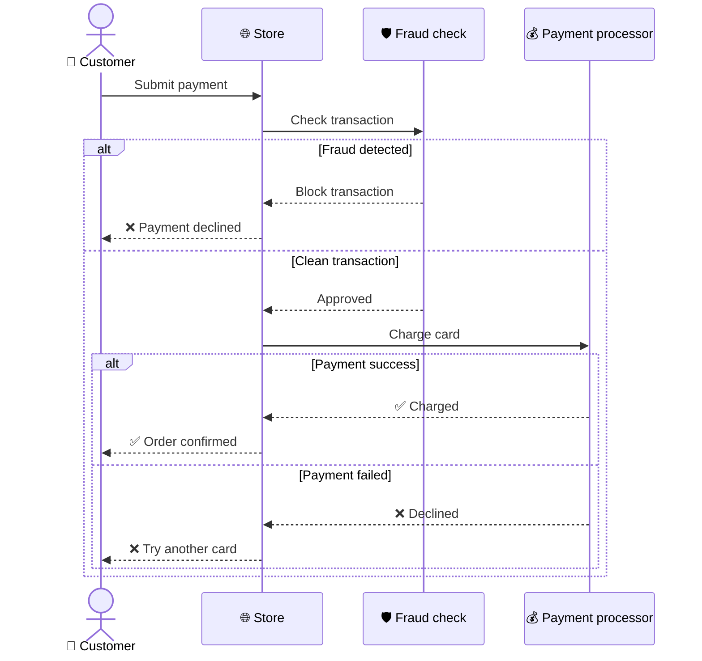
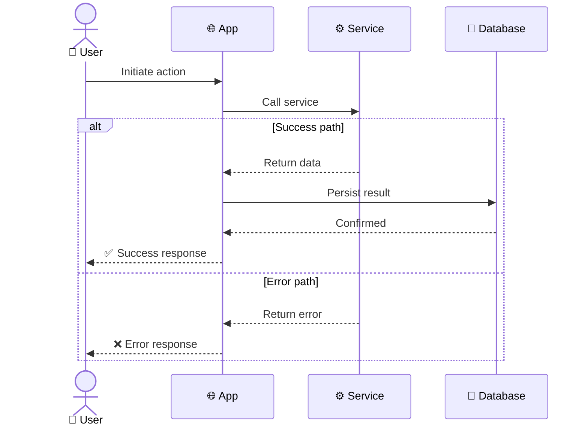

<!-- Source: https://github.com/SuperiorByteWorks-LLC/agent-project | License: Apache-2.0 | Author: Clayton Young / Superior Byte Works, LLC (Boreal Bytes) -->

# Sequence — Intermediate (3–5 participants)

Multi-service flows with branching. Use `alt`/`opt` blocks for conditional paths.

---

## Example: OAuth Authorization Code Flow

---

## Example: Payment Processing

---

## Copy-Paste Template

---

## Tips

- `alt`/`else` for mutually exclusive paths
- `opt` for optional steps (single branch)
- `loop` for retry logic
- `par` for parallel operations
- Keep ≤5 participants — split into multiple diagrams if more needed
