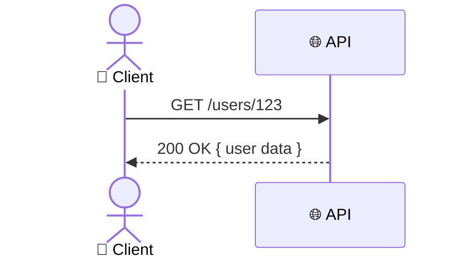
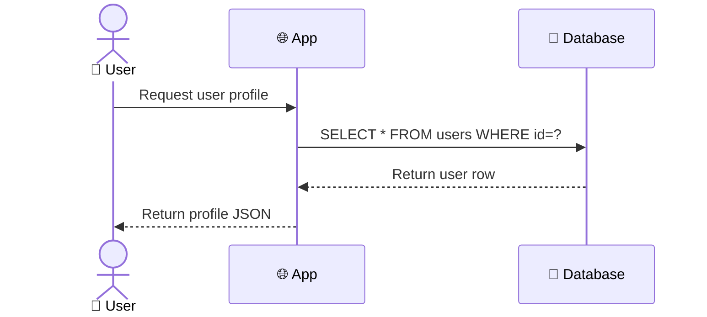
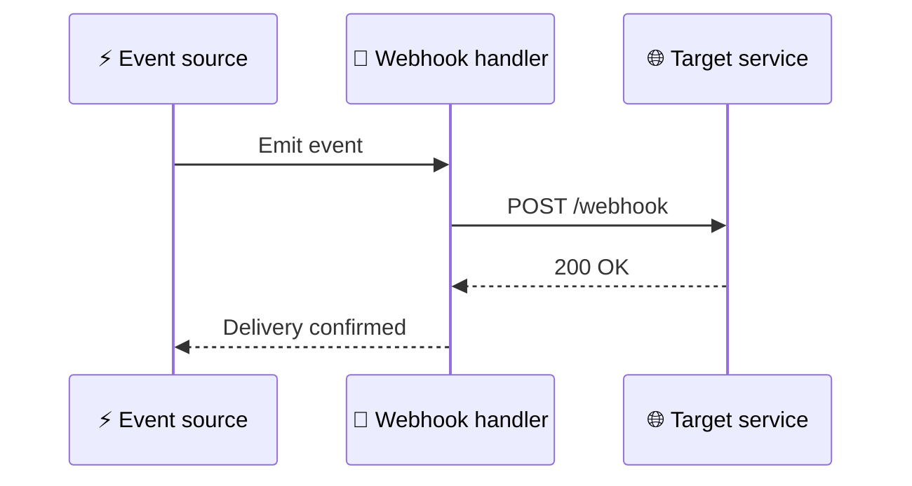
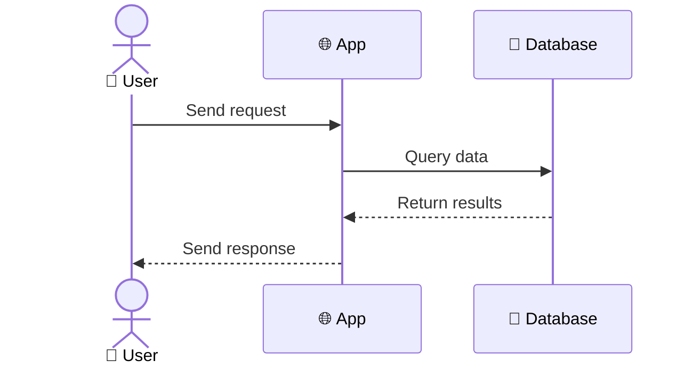

<!-- Source: https://github.com/SuperiorByteWorks-LLC/agent-project | License: Apache-2.0 | Author: Clayton Young / Superior Byte Works, LLC (Boreal Bytes) -->

# Sequence — Simple (2–3 participants)

Single request/response flows. Use for basic API calls and simple interactions.

---

## Example: API Request

---

## Example: Database Query

---

## Example: Webhook Delivery

---

## Copy-Paste Template

---

## Tips

- `->>` for requests (solid), `-->>` for responses (dashed)
- Use `actor` for humans, `participant` for systems
- Alias with `as` to add emoji: `participant App as 🌐 App`
- Keep it simple — 2–3 participants, 4–8 messages
