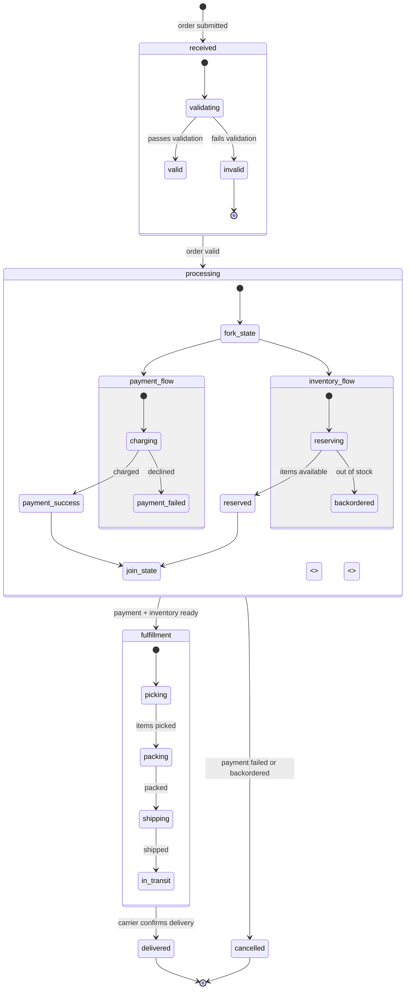
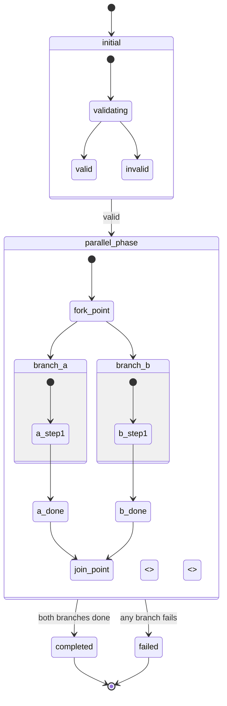

<!-- Source: https://github.com/SuperiorByteWorks-LLC/agent-project | License: Apache-2.0 | Author: Clayton Young / Superior Byte Works, LLC (Boreal Bytes) -->

# State — Advanced (10–20 states)

Full state machine with forks, joins, and parallel states.

---

## Example: Order Fulfillment State Machine

---

## Copy-Paste Template

---

## Tips

- `<<fork>>` and `<<join>>` for parallel execution paths
- `<<choice>>` for conditional branching
- Consider splitting into multiple diagrams if exceeding 20 states
- Link to simpler overview diagram in prose
- Use compound states to hide complexity at the top level
