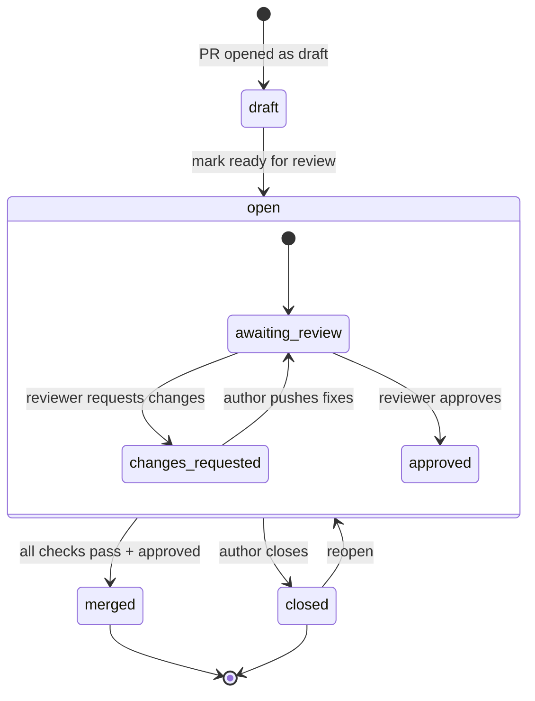
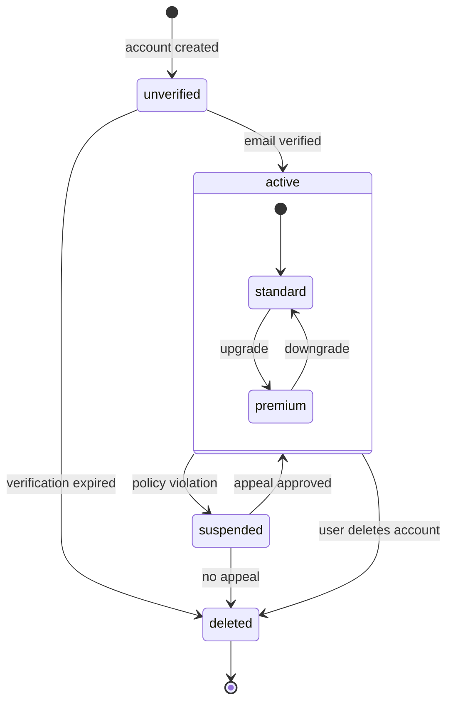
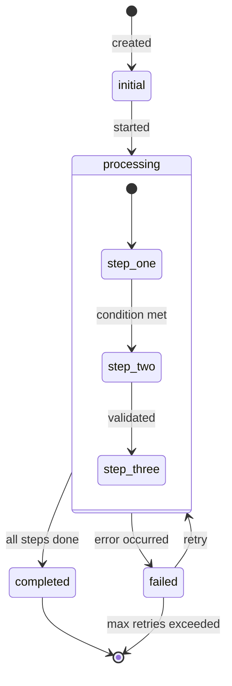

<!-- Source: https://github.com/SuperiorByteWorks-LLC/agent-project | License: Apache-2.0 | Author: Clayton Young / Superior Byte Works, LLC (Boreal Bytes) -->

# State — Intermediate (5–10 states)

Multi-path with compound states. Use for workflows with sub-states.

---

## Example: Pull Request Lifecycle

---

## Example: User Account Lifecycle

---

## Copy-Paste Template

---

## Tips

- Compound states group related sub-states visually
- Label all transitions with triggering events
- Use compound states when a state has its own internal lifecycle
- Keep compound states to 1 level of nesting
