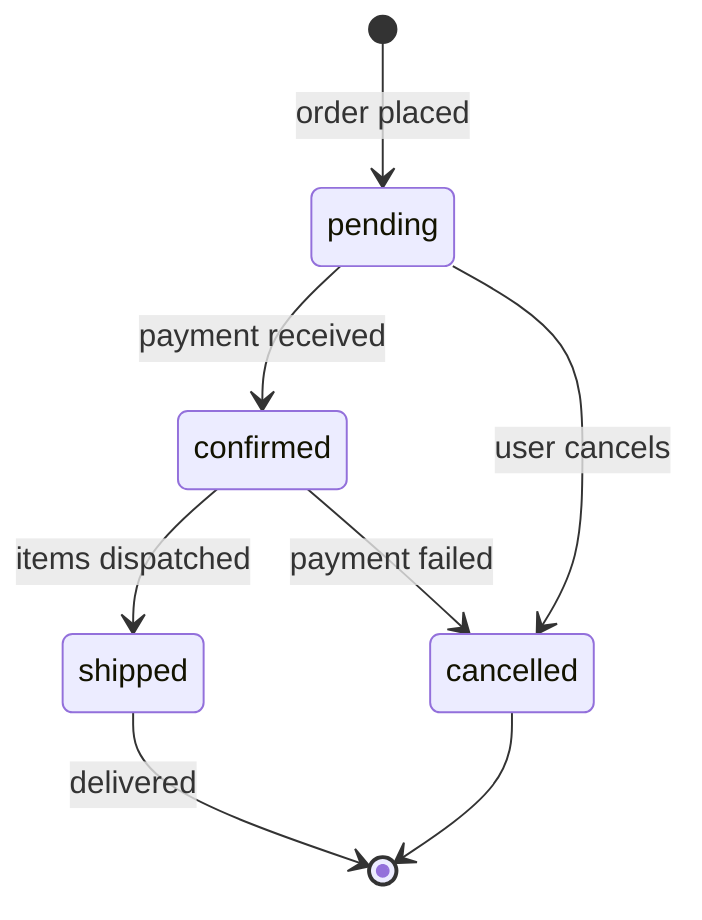
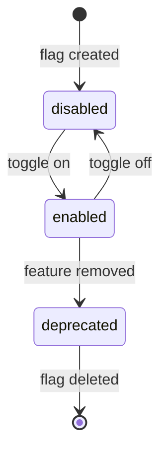
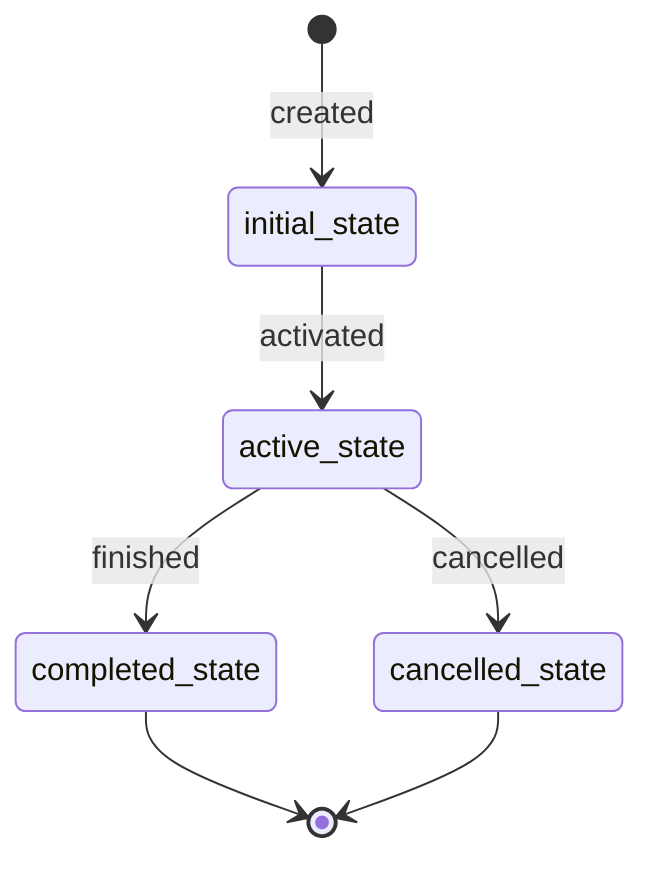

<!-- Source: https://github.com/SuperiorByteWorks-LLC/agent-project | License: Apache-2.0 | Author: Clayton Young / Superior Byte Works, LLC (Boreal Bytes) -->

# State — Simple (2–5 states)

Simple lifecycle. Use for basic status transitions.

---

## Example: Order Status

---

## Example: Feature Flag States

---

## Copy-Paste Template

---

## Tips

- Use `stateDiagram-v2` for better rendering
- Label every transition with the triggering event
- `[*]` at start = initial state, `[*]` at end = terminal state
- Keep it flat — no compound states needed at this scale
