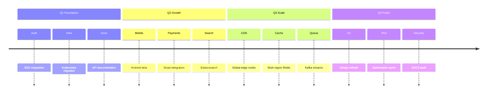
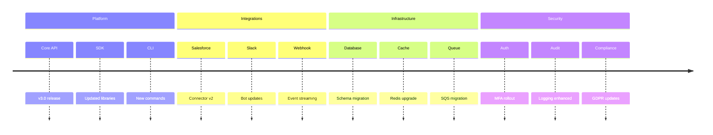
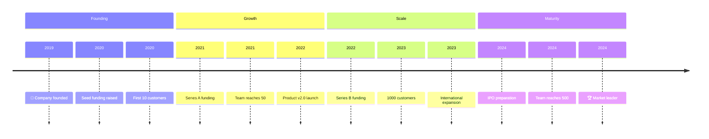
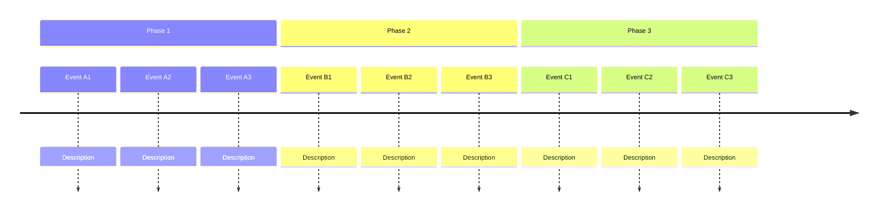

<!-- Source: https://github.com/SuperiorByteWorks-LLC/agent-project | License: Apache-2.0 | Author: Clayton Young / Superior Byte Works, LLC (Boreal Bytes) -->

# Timeline — Advanced (12–20 events)

Complex roadmap with multiple parallel tracks. Use for comprehensive project planning.

---

## Example: Annual Product Roadmap

---

## Example: Multi-Team Release

---

## Example: Company Milestones

---

## Copy-Paste Template

---

## Tips

- At 12+ events, consider if a Gantt chart would be clearer
- Use consistent section naming (quarters, teams, phases)
- Limit to 4–6 sections maximum
- Consider splitting very complex timelines into multiple diagrams
- Use emojis to highlight major milestones
