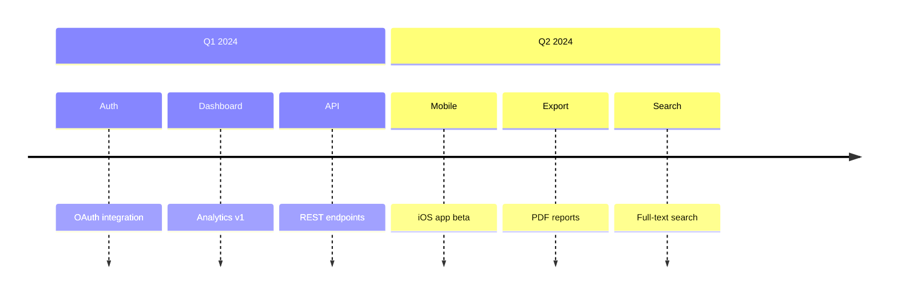
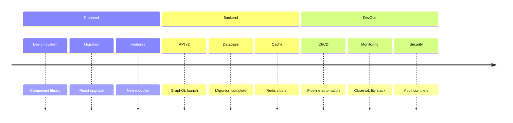
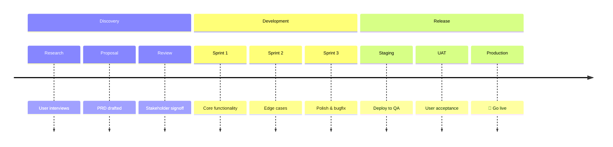
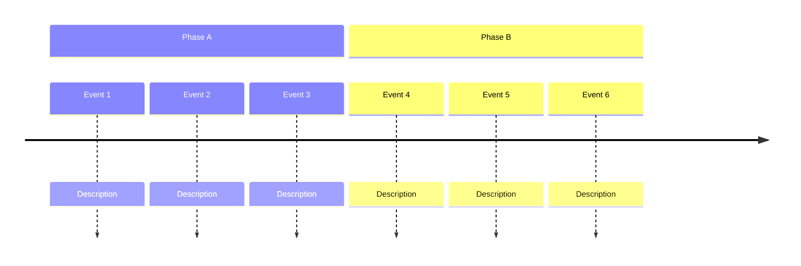

<!-- Source: https://github.com/SuperiorByteWorks-LLC/agent-project | License: Apache-2.0 | Author: Clayton Young / Superior Byte Works, LLC (Boreal Bytes) -->

# Timeline — Intermediate (6–12 events)

Multi-section timeline. Use for roadmaps with parallel tracks or grouped events.

---

## Example: Quarterly Roadmap

---

## Example: Team Parallel Tracks

---

## Example: Feature Development

---

## Copy-Paste Template

---

## Tips

- Use sections to group by quarter, team, or phase
- 2–4 events per section is ideal
- Keep section names short (1–2 words)
- Parallel sections help compare tracks
