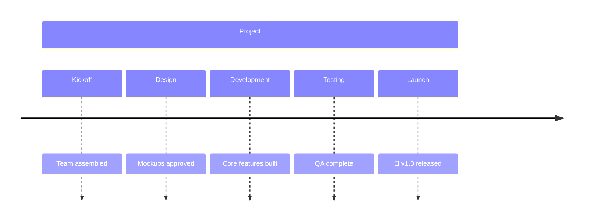
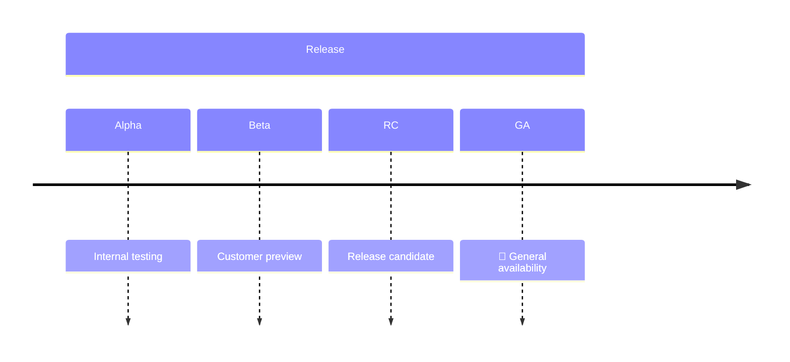
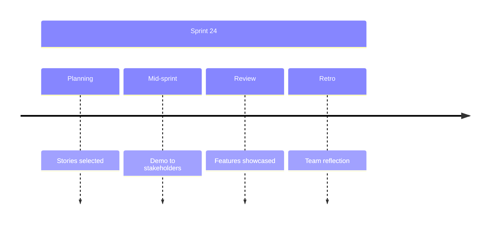
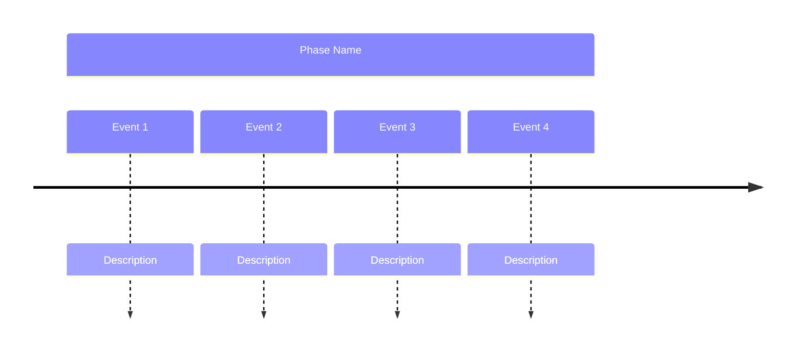

<!-- Source: https://github.com/SuperiorByteWorks-LLC/agent-project | License: Apache-2.0 | Author: Clayton Young / Superior Byte Works, LLC (Boreal Bytes) -->

# Timeline — Simple (3–6 events)

Single section timeline. Use for basic chronologies and quick event sequences.

---

## Example: Project Milestones

---

## Example: Product Release

---

## Example: Sprint Events

---

## Copy-Paste Template

---

## Tips

- Single section is ideal for simple timelines
- 3–6 events provides good coverage without clutter
- Use emojis on milestone events
- Keep descriptions to 2–4 words
